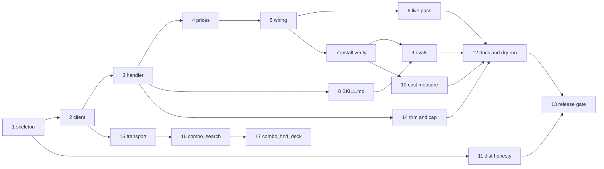

# Manabase Dev Roadmap — Phase 1 Action Plan

> **Reading this cold?** This document owns *sequencing only*. Every behavior, decision, and
> constraint it mentions is specified in `docs/MCP-PRD.md` or `docs/PLUGIN-PRD.md`, referenced
> by section. If this document and a PRD ever disagree, **the PRD wins** — fix this file.
> The boundary rule in `PLUGIN-PRD.md` [§1](./PLUGIN-PRD.md#1-overview) still governs which PRD owns which question.

**Document status:** created 2026-08-03; **Track A closed 2026-08-04** — and reopened twice since,
by [Slice 14](./slices/TrackA-Slice14.md) and [Slice 15](./slices/TrackA-Slice15.md). Covers
Phase 1 of both PRDs as **14** slices (1–14; the count read 13 until
[Slice 14](./slices/TrackA-Slice14.md) was added 2026-08-10) plus Phase 2's three in
[§7](#7-phase-2-slices--combo-discovery), **17 in all**, and unscheduled slice packs for everything
queued. Update slice statuses in place as work lands.

---

## 1. How to use this document

- **One roadmap, not two.** The PRDs split *specification* by the [§1](./PLUGIN-PRD.md#1-overview) boundary rule, but the
  *work* is one sequence: one repo ([P-02](./PLUGIN-PRD.md#p-02--one-repo-manifest-at-the-root)), plugin slices that cannot be verified until server
  slices exist, and two Phase 1s that were deliberately aligned (`PLUGIN-PRD.md` [§6](./PLUGIN-PRD.md#6-roadmap)).
- **A slice is one bounded work session** — roughly an afternoon, matching both PRDs' stated
  success criterion that "adding the next capability is an afternoon." Each slice has a goal,
  the work, checkable done-when items (mapped to PRD acceptance criteria where they exist),
  and the traps already recorded in the research records so they are not rediscovered.
- **Slices that resolve an open question must update the owning PRD in the same session** —
  its §7 entry and a §9 revision-log row. This roadmap's status column is a progress tracker,
  not a substitute for the PRDs' own records.
- **Do not reorder past a dependency.** [§5](#5-order-and-parallelism) has the graph. Within a track, order is the
  default; across tracks, parallelism is allowed where the graph permits it.

## 2. Current state (verified 2026-08-04)

**Track A is complete.** Slices [1](./slices/TrackA-Slice1.md)–[6](./slices/TrackA-Slice6.md) landed as PRs #2–#7, delivering
[CAP-01](./MCP-PRD.md#cap-01--card-search) end to end against **criteria 1–12**: all twelve are
verified, nine of them live against real Scryfall ([`docs/slices/TrackA-Slice6-results.md`](./slices/TrackA-Slice6-results.md)).
**That standing line is discharged as of 2026-08-10.** Criterion 13 was added 2026-08-04, after
that delivery, and went unimplemented until [Slice 14](./slices/TrackA-Slice14.md) shipped both of
[OQ-02](./MCP-PRD.md#oq-02--how-verbose-should-a-search-result-be)'s levers — the `legalities` trim
and an 88-card page cap — closing that question and fixing issue #25.
**[CAP-01](./MCP-PRD.md#cap-01--card-search) is now delivered against criteria 1–14**, criterion 14
having been added for the cap ([`docs/slices/TrackA-Slice14-results.md`](./slices/TrackA-Slice14-results.md)).

**Track B has started.** [Slice 7](./slices/TrackB-Slice7.md) landed 2026-08-04: the plugin **has** now been installed from a
marketplace, on a cold profile, and six of
[PC-02](./PLUGIN-PRD.md#pc-02--bundled-mcp-server)'s ten acceptance criteria (1, 2, 3, 4, 6, 7)
are verified against a real harness, with criterion 9 explicitly not met — see
[`docs/slices/TrackB-Slice7-results.md`](./slices/TrackB-Slice7-results.md). [Slice 8](./slices/TrackB-Slice8.md) landed 2026-08-04 as PR #19
(`ab51393`): `SKILL.md` and its two `reference/` files are written, and
[PC-01](./PLUGIN-PRD.md#pc-01--scryfall-query-craft)'s static criteria 1, 3 and 4 are verified —
764 of 1,536 listing characters, 2,169 of 5,000 body tokens, and a no-card-facts review run by a
fresh reviewer with no authoring context, zero flags
([`docs/slices/TrackB-Slice8-results.md`](./slices/TrackB-Slice8-results.md)).

**A [Slice 8](./slices/TrackB-Slice8.md) follow-up, 2026-08-04, corrects that record.**
`SKILL.md`'s YAML frontmatter did not parse — both `description` and `when_to_use` contained the
unquoted string `Magic: The Gathering`, and an unquoted YAML plain scalar cannot contain a
colon-space — so **the skill never loaded in any harness**: `/reload-plugins` reported `0 skills`
for an installed plugin whose three skill files were all present on disk. Fixed by quoting both
values on branch `fix/skill-frontmatter-yaml` (`ed82ceb`, PR #22). Line endings were tested
and ruled out as the cause. Two consequences for this document's record: the listing measurement
is restated below, and **[PC-01](./PLUGIN-PRD.md#pc-01--scryfall-query-craft)'s criteria 1, 3 and
4 were all satisfiable by reading and measuring the file** — none required the skill to load, so
a skill that never loaded passed all three. Whether that warrants a criterion or an open question
is [`PLUGIN-PRD.md`](./PLUGIN-PRD.md)'s call, raised in its
[§9](./PLUGIN-PRD.md#9-revision-log) and not answered here; the harness behavior itself is
recorded as a dated addendum in [§4.1](./PLUGIN-PRD.md#41-harness-features-relied-on).

**[Slice 9](./slices/TrackB-Slice9.md) landed 2026-08-04**, and it is the first measurement of
[PC-01](./PLUGIN-PRD.md#pc-01--scryfall-query-craft) that required the skill to actually load: it
was invoked by name as `manabase:scryfall-query-craft` in 11 independent fresh subagents, which
satisfies the precondition [§4](#4-phase-1-slices) added after the frontmatter defect. Criteria
5–11 and 13 each carry a with-skill result and a without-skill baseline; **criterion 12 is recorded
*not measured* with the skill** (4/4 in the baseline) because its probe hands over
`illustrationtag:`, which `SKILL.md` names as unreal, so no error was produced to retry from. The
only family-level delta is `otag:`/`function:`, 3/3 versus 2/3. Both trigger rates were 10/10, so
the description was not tuned and is unchanged.
[`MCP-PRD.md`](./MCP-PRD.md) [OQ-01](./MCP-PRD.md#oq-01--how-should-scryfall-syntax-be-surfaced-to-the-model)
is answered — the compact-description split holds and
[`src/tools/register.ts`](../src/tools/register.ts) is unchanged
([`docs/slices/TrackB-Slice9-results.md`](./slices/TrackB-Slice9-results.md)).

**Unplanned work landed 2026-08-04 that this document did not schedule: the MCPB / Chat-tab
distribution work.** It arose from a bug report, not from the slice sequence, and it is recorded
here as a status note rather than given a slice number — **no slice number is assigned by this
entry**, and see the proposal at the end of [§5](#5-order-and-parallelism). Two things came out of
it. First, PR #24 (`49edd8b`) changed
[PC-01](./PLUGIN-PRD.md#pc-01--scryfall-query-craft)'s three skill files: a **no-fallback rule**,
the hardcoded scoped tool name replaced by a role-based reference, and `${CLAUDE_SKILL_DIR}/`
dropped from the reference paths. Frontmatter is byte-identical, so
[Slice 9](./slices/TrackB-Slice9.md)'s measurements stand and **no
[PC-01](./PLUGIN-PRD.md#pc-01--scryfall-query-craft) criterion changed status.** Second,
[`PLUGIN-PRD.md`](./PLUGIN-PRD.md) adopted a second distribution target
([P-14](./PLUGIN-PRD.md#p-14--two-distribution-targets-one-source)) and specified
[PC-03](./PLUGIN-PRD.md#pc-03--mcpb-bundle-for-the-chat-tab), an MCPB bundle for the Claude Desktop
Chat tab, with criteria 1, 2, 3, 4 and 6 verified live. The sequencing facts that follow from it:
**[PC-03](./PLUGIN-PRD.md#pc-03--mcpb-bundle-for-the-chat-tab) was assigned to
[Slice 11](./slices/TrackC-Slice11.md) later the same day**, once
[PQ-09](./PLUGIN-PRD.md#pq-09--how-does-the-mcpb-manifest-version-relate-to-p-08) was answered and
implemented and [PQ-06](./PLUGIN-PRD.md#pq-06--what-keeps-the-committed-dist-honest) had a
mechanism for both of its halves — the two things
[`PLUGIN-PRD.md` §6](./PLUGIN-PRD.md#6-roadmap) said had to be settled first. It is still **not**
a Phase 1 dependency — Phase 1 is still
[PC-01](./PLUGIN-PRD.md#pc-01--scryfall-query-craft) and
[PC-02](./PLUGIN-PRD.md#pc-02--bundled-mcp-server), so nothing in
[§4](#4-phase-1-slices) moves. One correction to carry: PR #24's commit message says the stale
scoped tool string is what let the model conclude "tool limitations" and route around it. **The
spike disproved that** — the root cause was the tool being *absent*, and with the tool present the
model resolves the real one regardless of the stale string. De-hardcoding the name is right and
was not causal; the no-fallback rule is the fix, and it is what criterion 6 verifies.

**[Slice 10](./slices/TrackC-Slice10.md) landed 2026-08-08 — the context-cost measurement exists
now** (verified 2026-08-08). It changed no code: measurement only, on Claude Code 2.1.226 with
model `claude-opus-5[1m]`, against the installed plugin `be2839453a11` under the author's full
two-plugin load. Evidence:
[`docs/slices/TrackC-Slice10-results.md`](./slices/TrackC-Slice10-results.md).
[PC-02](./PLUGIN-PRD.md#pc-02--bundled-mcp-server)'s **criterion 10 is verified**, and its
always-on cost — [`PLUGIN-PRD.md` §5](./PLUGIN-PRD.md#5-components)'s one genuine unknown — is
**0**, because MCP tool schemas are *deferred* on this surface (0 resident, ~398 on demand for
`card_search`). **[PC-01](./PLUGIN-PRD.md#pc-01--scryfall-query-craft)'s criterion 2 is measured
and not met, and is not a clean fail either:** ~260 and ~270 against a ≤250 gate, verdict
**ambiguous-because-scaled** — no instrument reports it under the gate, none reports a precise
figure, and the skill text was deliberately not shortened because
[Slice 9](./slices/TrackB-Slice9.md) measured 10/10 trigger accuracy on this exact frontmatter.
Both of the slice's open questions are answered in
[`PLUGIN-PRD.md` §7](./PLUGIN-PRD.md#7-open-questions):
[PQ-01](./PLUGIN-PRD.md#pq-01--do-an-mcp-servers-tool-schemas-count-toward-the-always-on-cost-that-claude-plugin-details-reports)
(schemas do not count, because they are deferred — which **retires** the question's stake that an
untrimmable resident schema would constrain every future capability) and
[PQ-02](./PLUGIN-PRD.md#pq-02--what-is-this-plugins-measured-always-on-cost-and-does-it-fit-alongside-what-the-author-already-has-installed)
(the listing is 4.2k of a ~10,000-token budget across 47 skills, nothing trimmed; Manabase ~270,
~2.7%). **That headroom is model-dependent and must never be quoted without the model:**
[`PLUGIN-PRD.md` §3.1](./PLUGIN-PRD.md#31-context-budget)'s budget is 1% of the *context window*,
so the same install would face certain trimming on a 200k-context model.

What remains of the cost work:
[PC-02](./PLUGIN-PRD.md#pc-02--bundled-mcp-server)'s criteria 5 and 8 are still unverified.

**A decision-only session landed 2026-08-07 — no slice, no PR, no code change.** Eight open
questions were settled at a desk and written into their owning PRDs, and four live measurements
were appended to [`MCP-PRD.md` §4.1.1](./MCP-PRD.md#411-search-endpoint) and
[§4.6](./MCP-PRD.md#46-comprehensive-rules-wizards-of-the-coast) as dated addenda. **No slice
status changed and no acceptance criterion of
[CAP-01](./MCP-PRD.md#cap-01--card-search), [PC-01](./PLUGIN-PRD.md#pc-01--scryfall-query-craft),
[PC-02](./PLUGIN-PRD.md#pc-02--bundled-mcp-server) or
[PC-03](./PLUGIN-PRD.md#pc-03--mcpb-bundle-for-the-chat-tab) changed status** — every item below is
decided and unwritten. Three of them reach work this document schedules:

- [OQ-02](./MCP-PRD.md#oq-02--how-verbose-should-a-search-result-be) is **answered in full** and
  now carries **two** levers, not one — the queried-format `legalities` default plus a
  server-enforced page cap near 120 cards, because a full 175-card page was finally measured at
  169,504 characters and the best available trim still lands in the same order of magnitude as the
  payload that already failed. Whoever fixes issue #25 is implementing both, and that work is still
  unscheduled here.
- [PQ-06](./PLUGIN-PRD.md#pq-06--what-keeps-the-committed-dist-honest)'s remaining commit-half has a
  **decided remedy** — a `ci.yml` on `pull_request` and `push: main` running typecheck → test →
  build → `git diff --exit-code -- dist/`. [Slice 11](./slices/TrackC-Slice11.md) implements it
  rather than choosing it, so that slice's "recommended" wording now reads as its assignment. Its
  user-facing half stays open and CI cannot close it.
- [PQ-04](./PLUGIN-PRD.md#pq-04--how-would-the-author-detect-that-a-friends-skill-listing-has-been-budget-trimmed)
  is **answered** with drafted README wording that names invoking the skill by name before it names
  `/doctor`. [Slice 12](./slices/TrackC-Slice12.md) already owns writing it; the line does not exist
  yet.

The other five bind queued packs in [§6](#6-beyond-phase-1--queued-slice-packs) rather than Phase 1:
[OQ-03](./MCP-PRD.md#oq-03--what-is-the-bulk-data-storage-strategy-and-when-is-it-introduced) (cache
location recorded as already shipped; refresh trigger still open) and
[PQ-03](./PLUGIN-PRD.md#pq-03--what-triggers-a-refresh-of-the-bulk-data-and-the-comprehensive-rules-cache-and-should-it-ever-be-a-sessionstart-hook)
(**never** a `SessionStart` hook) both land on the tag-discovery pack;
[OQ-08](./MCP-PRD.md#oq-08--does-the-cr-landing-page-ever-offer-more-than-one-date-stamped-txt-and-how-are-mid-cycle-corrections-handled)
(one `.txt` observed; most-recent-by-date rule still required) on the rules-lookup pack;
[OQ-09](./MCP-PRD.md#oq-09--should-price-resolution-fall-back-to-eur-when-no-usd-price-exists) (no
EUR fallback; a distinct `no-usd-price` reason instead) on pricing; and
[OQ-12](./MCP-PRD.md#oq-12--what-is-the-normalized-deck-shape-and-does-one-tool-serve-both-platforms-or-two)
(**one tool, `deck_read`**, over one thin shape) on the Archidekt deck-reading pack, which still
owns the CAP block and the missing `deckFormat` table.

**[Slice 11](./slices/TrackC-Slice11.md) landed 2026-08-09 — PR #32, plus the doc commit that
follows it.** `.github/workflows/ci.yml` runs `npm ci` → typecheck → test → rebuild-and-compare on
every pull request and every push to `main`, with `.nvmrc` pinning the toolchain Node for both
workflows and a `.gitattributes` carrying the single `dist/index.js text eol=lf` rule. **The
comparison shipped is `git status --porcelain -- dist/`, not the `git diff --exit-code` the
2026-08-07 bullet above named** — an absent `dist/index.js` is recreated by the rebuild as an
untracked file `git diff` never reports; `release.yml`'s gate was upgraded to match. The check was
observed failing on a deliberately stale `dist/` and green on the rebuild, same branch and same
workflow. [PQ-06](./PLUGIN-PRD.md#pq-06--what-keeps-the-committed-dist-honest)'s **commit half is
answered; its user-facing half stays open** and CI cannot close it. **No
[PC-01](./PLUGIN-PRD.md#pc-01--scryfall-query-craft),
[PC-02](./PLUGIN-PRD.md#pc-02--bundled-mcp-server) or
[PC-03](./PLUGIN-PRD.md#pc-03--mcpb-bundle-for-the-chat-tab) acceptance criterion changed status**,
and [PC-03](./PLUGIN-PRD.md#pc-03--mcpb-bundle-for-the-chat-tab) was **reassigned from
[Slice 11](./slices/TrackC-Slice11.md) to [Slice 13](./slices/TrackC-Slice13.md) later the same
day** (`86769ca`), which moved no criterion — the MCPB row in the table below carries it. An
earlier form of this sentence said the assignment was kept; that was written before the
reassignment and is corrected here 2026-08-10. The slice's scope was narrowed with the author
and four items deferred rather than dropped — see its entry in [§4](#4-phase-1-slices). Evidence:
[`docs/slices/TrackC-Slice11-results.md`](./slices/TrackC-Slice11-results.md).

**Unscheduled work landed 2026-08-10 that this document did not sequence: the doc-link checker.**
It is the item [Slice 11](./slices/TrackC-Slice11.md) deferred as *unscheduled*, and **no slice
number is assigned by this entry**. Attribute it to that deferral rather than to the branch it
landed on — `docs/slice12-link-and-disclaimer-recheck` was opened for unrelated
[Slice 12](./slices/TrackC-Slice12.md) re-checks and reused, so its name misstates the work. PR #36
(`e6b2279`) adds [`scripts/check-doc-links.mjs`](../scripts/check-doc-links.mjs), an
`npm run lint:docs` script, and one step in
[`.github/workflows/ci.yml`](../.github/workflows/ci.yml) between `npm ci` and the typecheck; the
`dist/` gate still runs last. It resolves every relative link in [`README.md`](../README.md) and in
every markdown file under this directory except [`prompts/`](./prompts), which carry zero links by
design, and every heading anchor those links target; it also fails any file under
[`skills/`](../skills) that links outside its own skill directory — the one link defect this repo
could never observe on its own, because such a path works for the author forever and is dead in
every installed copy. Node builtins, no network. CI run 31400938254 was green on Linux in 14 s —
23 navigable files, 2,666 relative links, 0 broken — byte-identical to the local Windows run, which
rules out a case-sensitivity split between the two platforms. Three failure classes were each
observed failing with the right file and line and then reverted to green, and the script exits
non-zero if it extracts zero links, so it cannot go green by breaking its own parser. **Nothing
else moved:** no acceptance criterion of [CAP-01](./MCP-PRD.md#cap-01--card-search),
[PC-01](./PLUGIN-PRD.md#pc-01--scryfall-query-craft),
[PC-02](./PLUGIN-PRD.md#pc-02--bundled-mcp-server) or
[PC-03](./PLUGIN-PRD.md#pc-03--mcpb-bundle-for-the-chat-tab) changed status; no open question was
resolved and [PQ-06](./PLUGIN-PRD.md#pq-06--what-keeps-the-committed-dist-honest) is untouched in
both halves; [Slice 11](./slices/TrackC-Slice11.md) stays landed and closed and
[Slice 12](./slices/TrackC-Slice12.md) is unmoved.

**[Slice 13](./slices/TrackC-Slice13.md)'s
[PC-03](./PLUGIN-PRD.md#pc-03--mcpb-bundle-for-the-chat-tab) half was executed 2026-08-10, ahead of
[Slice 12](./slices/TrackC-Slice12.md): a release exists.** Tag `v0.1.0` on `2c7196c` (PR #37) ran
[`.github/workflows/release.yml`](../.github/workflows/release.yml) for the first time it has ever
executed, and published a Release carrying `manabase.mcpb` at 111,760 bytes — the first artifact
this project has produced that a user downloads rather than builds, installed on Claude Desktop
from that artifact and observed calling the tool.
[PC-03](./PLUGIN-PRD.md#pc-03--mcpb-bundle-for-the-chat-tab) criteria **7 and 10 are verified**,
which leaves criterion 8 as its only unverified one. The slice bundles two items **by schedule,
not by dependency**, and only the half that does not need [Slice 12](./slices/TrackC-Slice12.md)
was run; attribution was decided with the author as
[Slice 13](./slices/TrackC-Slice13.md) *partially executed* — not unscheduled work, and **no new
slice number**. **[Slice 13](./slices/TrackC-Slice13.md) is not closed and Phase 1 is not closed:**
the [P-08](./PLUGIN-PRD.md#p-08--version-scheme) switchover did not happen,
`.claude-plugin/plugin.json` still carries no `version`, `claude plugin validate . --strict` still
fails on that one warning ([PC-02](./PLUGIN-PRD.md#pc-02--bundled-mcp-server) criterion 9), and
[PQ-05](./PLUGIN-PRD.md#pq-05--should-the-plugin-be-submitted-to-the-community-marketplace-once-it-is-stable)
has no disposition. The tag names the **bundle**, not the plugin
([PQ-09](./PLUGIN-PRD.md#pq-09--how-does-the-mcpb-manifest-version-relate-to-p-08)). **Nothing else
moved:** no [CAP-01](./MCP-PRD.md#cap-01--card-search),
[PC-01](./PLUGIN-PRD.md#pc-01--scryfall-query-craft) or
[PC-02](./PLUGIN-PRD.md#pc-02--bundled-mcp-server) criterion changed status, and
[PQ-06](./PLUGIN-PRD.md#pq-06--what-keeps-the-committed-dist-honest) is untouched in both halves.
Evidence: [`docs/slices/TrackC-Slice13-results.md`](./slices/TrackC-Slice13-results.md).

**Phase 2 opened 2026-08-24 — specification and scoping only, nothing built.**
[CAP-02](./MCP-PRD.md#cap-02--combo-discovery), combo discovery, is specified against **fourteen**
acceptance criteria and served by two tools, `combo_search` and `combo_find_deck`;
[D-16](./MCP-PRD.md#d-16--no-npm-commander-spellbook-client-dependency) and
[OQ-14](./MCP-PRD.md#oq-14--how-should-commander-spellbook-query-syntax-be-surfaced-to-the-model)
came with it. Four live probes on the same date discharged
[CAP-02](./MCP-PRD.md#cap-02--combo-discovery)'s unverified-ordering caveat and landed the
Commander Spellbook fixtures. [§7](#7-phase-2-slices--combo-discovery) scopes the three build
slices, [15](./slices/TrackA-Slice15.md)–[17](./slices/TrackA-Slice17.md). **No `src/` file has
been touched and no [CAP-02](./MCP-PRD.md#cap-02--combo-discovery) criterion is verified** — the
row below still lists seven server source files and 27 suites / 101 tests, and both figures are
current. **Nothing in Phase 1 moved:** no
[CAP-01](./MCP-PRD.md#cap-01--card-search), [PC-01](./PLUGIN-PRD.md#pc-01--scryfall-query-craft),
[PC-02](./PLUGIN-PRD.md#pc-02--bundled-mcp-server) or
[PC-03](./PLUGIN-PRD.md#pc-03--mcpb-bundle-for-the-chat-tab) criterion changed status,
[12](./slices/TrackC-Slice12.md) is still the open gate, and
[PQ-06](./PLUGIN-PRD.md#pq-06--what-keeps-the-committed-dist-honest) is untouched in both halves.

**[Slice 15](./slices/TrackA-Slice15.md) landed 2026-08-25 — Phase 2's first code, and none of the
capability.** Commit `d08777b`: `src/http/client.ts` is
[`src/scryfall/client.ts`](../src/scryfall/client.ts)'s transport lifted onto a plain-data source
spec, that file drops to a spec plus a thin factory keeping every export,
`src/spellbook/client.ts` gives Commander Spellbook its own lane at 500 ms, a **POST** verb this
codebase did not have rides the same queue and 429 backoff, and
[`src/config.ts`](../src/config.ts) gains `spellbookBaseUrl`.
[CAP-02](./MCP-PRD.md#cap-02--combo-discovery) **criteria 11 and 12 are verified, and criterion 3
in its client half only** — the handler half is [16](./slices/TrackA-Slice16.md)'s, so 3 is not
verified outright. **That supersedes two claims in the paragraph above and nothing else in it:**
`src/` has been touched, and the source-file and 27 suites / 101 tests figures are no longer
current — the rows below carry today's. **That paragraph's "seven server source files" was already
wrong when written**: the row it points at listed eight, and `src/` holds **ten** `.ts` files today.
Count the row, not the prose. **The capability is still not built.**
[CAP-02](./MCP-PRD.md#cap-02--combo-discovery)'s `Status` is still `specified`, no tool is
registered, [`src/index.ts`](../src/index.ts) and
[`src/tools/register.ts`](../src/tools/register.ts) show no diff, and `spellbookBaseUrl` and
`createSpellbookClient` are read by no production code until [16](./slices/TrackA-Slice16.md) —
deliberately, the shape `cacheDir` has had since [Slice 1](./slices/TrackA-Slice1.md).
**No open question was resolved**, and
[OQ-05](./MCP-PRD.md#oq-05--do-commander-spellbook-or-archidekt-impose-rate-limits) is unmoved in
particular: the 500 ms lane is
[§3.7](./MCP-PRD.md#37-undocumented-and-bot-protected-third-party-apis)'s conservative
strictest-lane rule applied, not a measured fit. No
[CAP-01](./MCP-PRD.md#cap-01--card-search), [PC-01](./PLUGIN-PRD.md#pc-01--scryfall-query-craft),
[PC-02](./PLUGIN-PRD.md#pc-02--bundled-mcp-server) or
[PC-03](./PLUGIN-PRD.md#pc-03--mcpb-bundle-for-the-chat-tab) criterion changed status,
[12](./slices/TrackC-Slice12.md) is still the open gate, and
[PQ-06](./PLUGIN-PRD.md#pq-06--what-keeps-the-committed-dist-honest) is untouched in both halves.
Evidence: [`docs/slices/TrackA-Slice15-results.md`](./slices/TrackA-Slice15-results.md).

**[Slice 16](./slices/TrackA-Slice16.md) landed 2026-08-25 — half the capability, and not the
capability.** Commit `4bf697d`: `src/spellbook/types.ts` (hand-written wire shapes that **omit**
`prices` and every `imageUri*` field, which is what makes criteria 6 and 7 compile-time facts),
`src/spellbook/combos.ts` (the normalized combo shape every later consumer reads, plus format
resolution over Commander Spellbook's **16** legality keys, which are not Scryfall's 23),
`src/tools/combo-search.ts`, and a `Clients` bundle in
[`src/tools/register.ts`](../src/tools/register.ts) so each handler still receives the one client
it needs. `tools/list` on the rebuilt bundle reports **two** tools.
[CAP-02](./MCP-PRD.md#cap-02--combo-discovery) criteria **2, 6 and 7 are verified in full**, plus
the **handler half** of criterion 3 — its client half was [15](./slices/TrackA-Slice15.md)'s, so 3
is now verified in both halves — plus the **`combo_search` half** of criteria 1, 8 and 14;
criterion 10 is entirely [17](./slices/TrackA-Slice17.md)'s. **No criterion is marked delivered and
[CAP-02](./MCP-PRD.md#cap-02--combo-discovery)'s `Status` stays `specified`** — the capability is
delivered when [17](./slices/TrackA-Slice17.md) lands. The live ordering probe **passed**, 80
distinct ids in 80 slots across pages 1 and 2 with zero overlap, discharging
[CAP-02](./MCP-PRD.md#cap-02--combo-discovery)'s third cap bullet. One measurement went the other
way and is recorded rather than smoothed: a live `combo_search` page 2 measured **63,688
characters at 1,592 per combo**, above both
[§4.4.1](./MCP-PRD.md#441-the-combo-payload-is-enormous--measured)'s 930–1,236 band and
[CAP-02](./MCP-PRD.md#cap-02--combo-discovery)'s stated "under 50,000" page budget — nothing is
broken by it, at 55% of the 116,626 that breached a harness ceiling, but that budget is an estimate
from one query and is not a guarantee. **No open question moved:**
[OQ-05](./MCP-PRD.md#oq-05--do-commander-spellbook-or-archidekt-impose-rate-limits) and
[OQ-14](./MCP-PRD.md#oq-14--how-should-commander-spellbook-query-syntax-be-surfaced-to-the-model)
are both still open, the latter now *concrete* rather than answered — the tool exists, so the
measurement method [OQ-01](./MCP-PRD.md#oq-01--how-should-scryfall-syntax-be-surfaced-to-the-model)
established is available, and this slice did not run it. No
[CAP-01](./MCP-PRD.md#cap-01--card-search), [PC-01](./PLUGIN-PRD.md#pc-01--scryfall-query-craft),
[PC-02](./PLUGIN-PRD.md#pc-02--bundled-mcp-server) or
[PC-03](./PLUGIN-PRD.md#pc-03--mcpb-bundle-for-the-chat-tab) criterion changed status,
[12](./slices/TrackC-Slice12.md) is still the open gate, and
[PQ-06](./PLUGIN-PRD.md#pq-06--what-keeps-the-committed-dist-honest) is untouched in both halves.
The source-file and test rows below carry this slice's figures. Evidence:
[`docs/slices/TrackA-Slice16-results.md`](./slices/TrackA-Slice16-results.md).

| Area | State |
|---|---|
| Repo layout | `src/`, `tests/`, `dist/`, `skills/scryfall-query-craft/reference/` exist — per [P-02](./PLUGIN-PRD.md#p-02--one-repo-manifest-at-the-root). The skill directory now holds `SKILL.md` plus `reference/operators.md` and `reference/recipes.md`, both `.gitkeep` placeholders deleted ([Slice 8](./slices/TrackB-Slice8.md)) |
| Toolchain | `package.json` with `esbuild` bundle build, `tsc --noEmit` typecheck, `node --experimental-strip-types --test` (flag and quoted glob both required — [Slice 7](./slices/TrackB-Slice7.md) drift finding 4, fixed 2026-08-04); MCP SDK `^1.30.0` as a devDependency. `gh` **2.97.0 is installed** as of 2026-08-04 — [Slice 7](./slices/TrackB-Slice7.md)'s results record it as absent, which is why PR #13 was opened by hand; that dated record stands, this row is the current fact |
| `plugin.json` | present; **no `version`** ([P-08](./PLUGIN-PRD.md#p-08--version-scheme)), **no `userConfig`** ([P-13](./PLUGIN-PRD.md#p-13--no-user-configuration-in-phase-1)), Fan Content disclaimer in `description` ([§3.5](./PLUGIN-PRD.md#35-what-the-user-must-see-and-must-not)) |
| `marketplace.json` | present; relative `./` source ([P-11](./PLUGIN-PRD.md#p-11--the-repo-is-its-own-marketplace)), disclaimer present |
| `.mcp.json` | present; server key `mtg`, `node ${CLAUDE_PLUGIN_ROOT}/dist/index.js` ([P-09](./PLUGIN-PRD.md#p-09--server-ships-as-committed-built-javascript), [P-12](./PLUGIN-PRD.md#p-12--plugin-name-and-server-key)) |
| README | install instructions in `owner/repo` form with the raw-URL trap warning ([P-11](./PLUGIN-PRD.md#p-11--the-repo-is-its-own-marketplace)), version floor, disclaimer |
| Server source | `config.ts`, `index.ts`, `result.ts`, `http/client.ts`, `scryfall/{client,prices,types}.ts`, `spellbook/{client,combos,types}.ts`, `tools/{card-search,combo-search,register}.ts` — **thirteen** files since [Slice 16](./slices/TrackA-Slice16.md) (2026-08-25), which added the three Commander Spellbook and tool modules to the ten [Slice 15](./slices/TrackA-Slice15.md) left. [Slice 15](./slices/TrackA-Slice15.md) made `http/client.ts` **the one transport** and left `scryfall/client.ts` and `spellbook/client.ts` as source specs over it |
| Tests | 56 suites, **210 tests, 210 passing**; `tsc --noEmit` clean — re-run 2026-08-25 ([Slice 16](./slices/TrackA-Slice16.md) took it from 39 suites and 150 tests, [Slice 15](./slices/TrackA-Slice15.md) from 27 and 101, [Slice 14](./slices/TrackA-Slice14.md) from 21 and 73). **`npm test` does not typecheck** — `--experimental-strip-types` strips types without checking them, so a change to a shared interface passes it and fails only `npm run typecheck`, which is how [Slice 15](./slices/TrackA-Slice15.md) found three test fakes broken by `ScryfallClient` becoming an alias. Includes [`tests/skills.test.ts`](../tests/skills.test.ts), which parses every `skills/**/SKILL.md` frontmatter as YAML — the guard for the [Slice 8](./slices/TrackB-Slice8.md) defect, verified to fail against the unfixed file |
| `dist/index.js` | built and committed; verified 2026-08-04 to complete an initialize handshake and list `card_search` from a directory containing no `node_modules`. Since [Slice 16](./slices/TrackA-Slice16.md) (2026-08-25) the rebuilt bundle lists **two** tools, `card_search` and `combo_search` |
| CI | `.github/workflows/ci.yml` since 2026-08-09 ([Slice 11](./slices/TrackC-Slice11.md), PR #32): `npm ci` → `npm run lint:docs` (added 2026-08-10, PR #36) → `npm run typecheck` → `npm test` → rebuild `dist/` and fail on a non-empty `git status --porcelain -- dist/`, on every pull request and every push to `main`. Green on `main`, and demonstrated failing on a deliberately stale `dist/`. `.nvmrc` (`22`) pins the toolchain Node for both workflows; `.gitattributes` holds one rule, `dist/index.js text eol=lf`. `release.yml` **ran for the first time 2026-08-10** on tag `v0.1.0` (run `31421682409`), after its `actions/checkout`, `setup-node` and `upload-artifact` pins were bumped to `@v7` — `upload-artifact@v6` is the first major on `node24`, so `@v5` still carried the Node-20 deprecation annotation that prompted the bump |
| Acceptance harness | `scripts/cap01-live.mjs` (`npm run acceptance`) — 13 live checks, ≥600 ms apart, no 429 provoked |
| `SKILL.md` | **written and measured** 2026-08-04 — [Slice 8](./slices/TrackB-Slice8.md), PR #19: 764 listing characters, 2,169 body tokens, no card facts. **Frontmatter fixed the same day** (`fix/skill-frontmatter-yaml`, `ed82ceb`, PR #22): it was unparsable YAML and the skill loaded nowhere. Re-measured after the fix by a YAML parser — `name` 20 + `description` 269 + `when_to_use` 494 = **783 of 1,536** characters. [Slice 9](./slices/TrackB-Slice9.md) re-measured and **explains the spread**: 783 counts `name`, 763 does not (783 − 763 = 20 = the length of `scryfall-query-craft`), and 764 is a one-off arithmetic slip on [Slice 8](./slices/TrackB-Slice8.md)'s own 269 + 494. No measurement was wrong; the labels were. **`description` + `when_to_use` = 763 of 1,536** is the figure [PC-01](./PLUGIN-PRD.md#pc-01--scryfall-query-craft) criterion 1 measures; the dated records that carry 764 and 783 stand as written |
| MCPB bundle | **Released 2026-08-10 as `v0.1.0`, then `v0.1.1`** — `manabase.mcpb`, 111,760 then 113,631 bytes, downloadable from a GitHub Release. `v0.1.1` carries [Slice 14](./slices/TrackA-Slice14.md)'s issue-#25 fix; `v0.1.0` was not moved or deleted, because a released bundle cannot be withdrawn. `mcpb/manifest.json`, `scripts/pack-mcpb.mjs` (`npm run pack:mcpb`) and `.github/workflows/release.yml` landed 2026-08-04, superseding the spike that produced the same artifact by hand. The pack step stamps the version ([PQ-09](./PLUGIN-PRD.md#pq-09--how-does-the-mcpb-manifest-version-relate-to-p-08) answered and implemented), refuses a `dist/` older than `src/`, and since 2026-08-10 unpacks the archive it just wrote to assert its `server/index.js` is the committed `dist/index.js` ([PC-03](./PLUGIN-PRD.md#pc-03--mcpb-bundle-for-the-chat-tab) criterion 7). The Chat-tab install is now a download rather than a local build; a bundle still has **no update path** once installed. [PC-03](./PLUGIN-PRD.md#pc-03--mcpb-bundle-for-the-chat-tab) stays `in progress` — **criteria 1–7 and 9–11 verified, criterion 8 the only one left** — and was **reassigned 2026-08-09 from [Slice 11](./slices/TrackC-Slice11.md) to [Slice 13](./slices/TrackC-Slice13.md)**, which executed this half on 2026-08-10 without closing the slice: [P-08](./PLUGIN-PRD.md#p-08--version-scheme) is untouched and `plugin.json` still carries no `version` |
| Known open defect | **None open.** Issue #25 — a `card_search` payload exceeding the harness tool-result ceiling below one page, first measured at 111 cards and 116,626 characters with `legalities` 54.5% of the bytes — was **fixed 2026-08-10** by [Slice 14](./slices/TrackA-Slice14.md), which implemented both of [`MCP-PRD.md` OQ-02](./MCP-PRD.md#oq-02--how-verbose-should-a-search-result-be)'s levers and closed that question: the same query now measures 53,043 characters and all 111 cards stay reachable across two pages. **Shipped to the Chat tab the same day as `v0.1.1`.** One carry-over that is not a defect in this tree: an installed bundle never updates itself, so anyone still on `v0.1.0` carries the old payload until they reinstall from the latest release |

Two properties of the existing scaffold worth preserving on purpose:

- **The build bundles.** `esbuild --bundle` produces a self-contained `dist/index.js` with no
  runtime `node_modules` — this is what makes [PC-02](./PLUGIN-PRD.md#pc-02--bundled-mcp-server)'s offline-start criterion (no package
  fetch in the startup path, [P-09](./PLUGIN-PRD.md#p-09--server-ships-as-committed-built-javascript)) achievable. Keep the SDK a devDependency.
- **`package.json` `version` is independent of the plugin version** by design — it serves the
  future npm route (`MCP-PRD.md` [D-02](./MCP-PRD.md#d-02--runtime-nodejs--typescript), kept as the secondary channel by [P-09](./PLUGIN-PRD.md#p-09--server-ships-as-committed-built-javascript)). Do not try to
  sync them.

## 3. Standing rules — apply to every slice, never restated per slice

1. Handlers never throw; every failure is a structured result ([D-10](./MCP-PRD.md#d-10--tool-handlers-never-throw)).
2. Every outbound request carries the app-naming `User-Agent` and an `Accept` header; card
   endpoints at 2/sec; HTTP 429 backs off, never retries immediately (`MCP-PRD.md` [§3.4](./MCP-PRD.md#34-rate-limits-are-hard-constraints-not-guidance)).
3. Handlers are plain functions; config is read once at the entry point and passed down; no
   `process.env` below the entry point ([D-03](./MCP-PRD.md#d-03--testability-handlers-callable-as-plain-functions), `MCP-PRD.md` [§3.2](./MCP-PRD.md#32-testability)).
4. Skills carry instructions, never card facts (`PLUGIN-PRD.md` [§3.6](./PLUGIN-PRD.md#36-skills-carry-instructions-never-facts)).
5. `dist/` is committed and must be rebuilt with every `src/` change
   ([P-09](./PLUGIN-PRD.md#p-09--server-ships-as-committed-built-javascript), [PQ-06](./PLUGIN-PRD.md#pq-06--what-keeps-the-committed-dist-honest)). Since [Slice 11](./slices/TrackC-Slice11.md) this is
   enforced rather than remembered: `.github/workflows/ci.yml` reinstalls from the lockfile,
   rebuilds, and fails on a non-empty `git status --porcelain -- dist/` on every pull request and
   every push to `main`. The rule stands — CI reports the omission, it does not repair it, and a
   forgotten rebuild is a red run rather than a silent one.
6. The verbatim Fan Content disclaimer stays on every user-facing surface (`PLUGIN-PRD.md`
   [§3.5](./PLUGIN-PRD.md#35-what-the-user-must-see-and-must-not)).
7. Run `claude plugin validate . --strict` before any push a friend might install from.

## 4. Phase 1 slices

Status legend: ☐ not started · ◐ in progress · ☑ done

| # | Slice | Track | Status |
|---|---|---|---|
| 1 | Server skeleton | A — server | ☑ PR #2 |
| 2 | Scryfall client | A — server | ☑ PR #3 |
| 3 | `card_search` handler | A — server | ☑ PR #4 |
| 4 | Price correctness | A — server | ☑ PR #5 |
| 5 | Tool registration & wiring | A — server | ☑ PR #6 |
| 6 | Live [CAP-01](./MCP-PRD.md#cap-01--card-search) acceptance pass | A — server | ☑ PR #7 |
| 7 | Plugin install verification | B — plugin | ☑ PRs #13, #14 |
| 8 | [PC-01](./PLUGIN-PRD.md#pc-01--scryfall-query-craft) `SKILL.md` authoring | B — plugin | ☑ PR #19 · frontmatter fix `ed82ceb`, PR #22 |
| 9 | [PC-01](./PLUGIN-PRD.md#pc-01--scryfall-query-craft) evals | B — plugin | ☑ |
| 10 | Context-cost measurement | C — release | ☑ |
| 11 | `dist/` honesty mechanism | C — release | ☑ PR #32 · scope narrowed, see the block |
| 12 | Docs polish & friend dry-run | C — release | ◐ **partial, 2026-08-11 — not closed.** A non-author install succeeded and produced three friction issues (#43, #44, #45) and the README fixes, but acceptance criterion 8 fails and 6 and 7 are partial: the handover message, the friend's questions, their hesitations and the `/context` output were never captured. A second cold run, with a different person, is outstanding ([`docs/slices/TrackC-Slice12-results.md`](./slices/TrackC-Slice12-results.md)) |
| 13 | Release gate — the [P-08](./PLUGIN-PRD.md#p-08--version-scheme) switchover | C — release | ◐ **partially executed** — the [PC-03](./PLUGIN-PRD.md#pc-03--mcpb-bundle-for-the-chat-tab) bundle release ran 2026-08-10 (PR #37, tag `v0.1.0`); the [P-08](./PLUGIN-PRD.md#p-08--version-scheme) switchover has not, and still waits on [12](./slices/TrackC-Slice12.md) |
| 14 | Result trim & page cap — [OQ-02](./MCP-PRD.md#oq-02--how-verbose-should-a-search-result-be)'s two levers | A — server | ☑ landed 2026-08-10; unblocks [12](./slices/TrackC-Slice12.md) |

---

### Track A — server (delivers `MCP-PRD.md` [CAP-01](./MCP-PRD.md#cap-01--card-search))

#### Slice 1 — Server skeleton

- **Goal:** `dist/index.js` starts a stdio MCP server, answers the initialize handshake, and
  owns all config at the entry point. No tools yet.
- **Work:**
  - `src/index.ts` entry point: assemble one config object — the `User-Agent` string (name,
    version, and a way for Scryfall to contact the author, per `MCP-PRD.md` [§4.1](./MCP-PRD.md#41-scryfall-rest-api)'s
    mitigation), and the cache-directory rule: `CLAUDE_PLUGIN_DATA` when set, otherwise a
    platform user-cache directory (`PLUGIN-PRD.md` [§4.5](./PLUGIN-PRD.md#45-persistent-data)). Phase 1 writes no cache, but the
    resolution rule is entry-point config and this is the slice that fixes its shape.
  - Instantiate the SDK server with `StdioServerTransport`; connect; no tools registered.
  - `npm install`, `npm run build`, `npm run typecheck` all clean.
- **Done when:**
  - ☑ `node dist/index.js` completes an MCP initialize round-trip (MCP Inspector or a
    scripted stdio exchange).
  - ☑ `dist/index.js` runs from a directory with no `node_modules` (proves the bundle is
    self-contained).
- **Binding refs:** `MCP-PRD.md` [D-02](./MCP-PRD.md#d-02--runtime-nodejs--typescript), [D-03](./MCP-PRD.md#d-03--testability-handlers-callable-as-plain-functions), [§3.2](./MCP-PRD.md#32-testability); `PLUGIN-PRD.md` [P-09](./PLUGIN-PRD.md#p-09--server-ships-as-committed-built-javascript), [§4.5](./PLUGIN-PRD.md#45-persistent-data).
- **Landed:** PR #2 (`8465832`). Config resolution shipped in `src/config.ts` — the
  `CLAUDE_PLUGIN_DATA`-else-platform-cache rule of
  [`PLUGIN-PRD.md` §4.5](./PLUGIN-PRD.md#45-persistent-data), resolved once at the entry point
  and injectable for tests. Both done-when items re-verified 2026-08-04 against the committed
  bundle: handshake returned `manabase-mtg@0.0.0` on protocol `2025-06-18` from a directory
  containing only `index.js`.

#### Slice 2 — Scryfall client

- **Goal:** the one HTTP module every current and future capability reuses: required headers,
  enforced rate limits, never-throw structured results.
- **Work:**
  - Request function taking config explicitly; returns a success/failure union — failure
    carries a machine-usable code and, for Scryfall 4xx responses, **Scryfall's own `details`
    text verbatim** (it is the model's correction signal — [D-10](./MCP-PRD.md#d-10--tool-handlers-never-throw), [CAP-01](./MCP-PRD.md#cap-01--card-search)).
  - Rate limiting: 2/sec for `/cards/search`, `/cards/named`, `/cards/random`,
    `/cards/collection`; 10/sec elsewhere (`MCP-PRD.md` [§3.4](./MCP-PRD.md#34-rate-limits-are-hard-constraints-not-guidance)).
  - 429 handling: back off (the lockout is ~30 seconds), retry once after backoff, then
    return a structured failure. Never immediate retry.
  - Network errors and timeouts → structured failures, not exceptions.
- **Done when (unit tests, mocked fetch):**
  - ☑ Every request carries `User-Agent` and `Accept` (feeds [CAP-01](./MCP-PRD.md#cap-01--card-search) criterion 10).
  - ☑ Two back-to-back card-endpoint calls are spaced to ≤2/sec (criterion 11).
  - ☑ A 429 produces backoff then a clear structured failure (criterion 12).
  - ☑ A 400 response's `details` text survives verbatim into the failure result.
- **Binding refs:** `MCP-PRD.md` [§3.4](./MCP-PRD.md#34-rate-limits-are-hard-constraints-not-guidance), [§4.1](./MCP-PRD.md#41-scryfall-rest-api), [D-10](./MCP-PRD.md#d-10--tool-handlers-never-throw).
- **Landed:** PR #3 (`59fbd6a`). `src/scryfall/client.ts` plus `src/result.ts`'s success/failure
  union; evidence is `tests/scryfall/client.test.ts` against a mock transport. **No real 429 was
  ever provoked** — deliberately exceeding Scryfall's limit to observe the response is the thing
  [§3.4](./MCP-PRD.md#34-rate-limits-are-hard-constraints-not-guidance) forbids, so criterion 12
  rests on the mock and always will.

#### Slice 3 — `card_search` handler

- **Goal:** [CAP-01](./MCP-PRD.md#cap-01--card-search)'s core behavior as a plain, directly-testable function.
- **Work:**
  - `handler(config, { q, unique = "cards", order?, dir?, page? })` → calls the client's
    `GET /cards/search`, full query passthrough (no parsing, no validation — Scryfall
    evaluates the syntax, [D-07](./MCP-PRD.md#d-07--three-way-cache-split)).
  - Shape each card to [CAP-01](./MCP-PRD.md#cap-01--card-search)'s field list: name, mana cost, cmc, type line, oracle text,
    colors and color identity, power/toughness/loyalty where applicable, rarity, set, format
    legalities, price (price handling completed in [Slice 4](./slices/TrackA-Slice4.md)).
  - Pagination reporting: total count, whether more exist, current page — never silently
    truncate, never auto-fetch further pages.
  - Failures (including malformed queries) pass through as structured results.
- **Done when (direct invocation, fixture-based):**
  - ☑ The handler runs in a test with no server and no transport constructed (criterion 1).
  - ☑ A fixture with >175 matches reports total count and more-available (criterion 9).
  - ☑ A 400 fixture returns a structured failure carrying `details` (criterion 8).
- **Binding refs:** [CAP-01](./MCP-PRD.md#cap-01--card-search) behavior bullets; [D-03](./MCP-PRD.md#d-03--testability-handlers-callable-as-plain-functions), [D-07](./MCP-PRD.md#d-07--three-way-cache-split), [D-11](./MCP-PRD.md#d-11--tool-naming-convention).
- **Watch out:** default `unique=cards` — one row per card, not per printing; the defaults
  are for deckbuilding, not collecting.
- **Landed:** PR #4 (`e6fa0d9`). Two shaping decisions worth carrying forward, neither of which
  the slice spec anticipated:
  - **Scryfall answers a valid query with zero matches as HTTP 404.** The handler maps that to a
    *successful, empty* search carrying Scryfall's own note, not a failure — no matches is a
    search outcome, not a dead end. Verified live in [Slice 6](./slices/TrackA-Slice6.md) (check 13).
  - **Double-faced and split cards carry `oracle_text` / `mana_cost` on `card_faces`, not at the
    top level.** Faces are joined with ` // ` so those cards do not come back blank.
  - `legalities` passes through untrimmed, which is a deliberate deferral to
    [OQ-02](./MCP-PRD.md#oq-02--how-verbose-should-a-search-result-be) rather than a decision.

#### Slice 4 — Price correctness

- **Goal:** the three verified price traps of `MCP-PRD.md` [§4.1.3](./MCP-PRD.md#413-price-fields--three-verified-traps) handled inside result
  shaping — this is part of [CAP-01](./MCP-PRD.md#cap-01--card-search), not a later refinement.
- **Work:**
  - Price resolution order `usd` → `usd_foil` → `usd_etched`, with the finish labeled so
    "$3,999 (foil)" is distinguishable from a nonfoil price.
  - Constrain price reporting to paper printings; a card with genuinely no paper price says
    so *and says why* (digital-only).
  - Do not model `eur_etched` — documented but does not exist in the live API.
- **Done when (fixtures capture the real trap cards):**
  - ☑ Gaea's Cradle (`jgp`, foil-only) reports a `usd_foil` price, not "no price"
    (criterion 4).
  - ☑ An `is:etched` printing reports `usd_etched` (criterion 5).
  - ☑ Black Lotus resolves against a paper printing, not the all-null MTGO printing
    (criterion 6) — **see the caveat below; upstream data has since changed.**
  - ☑ A digital-only Arena card reports no paper price and states digital-only as the reason
    (criterion 7).
- **Binding refs:** `MCP-PRD.md` [§4.1.3](./MCP-PRD.md#413-price-fields--three-verified-traps), [D-06](./MCP-PRD.md#d-06--pricing-from-scryfall); [CAP-01](./MCP-PRD.md#cap-01--card-search) criteria 4–7.
- **Landed:** PR #5 (`af319d1`). `src/scryfall/prices.ts` resolves `usd` → `usd_foil` →
  `usd_etched` and labels the finish; unavailability is always given a reason
  (`digital-only` / `no-price-data`), never a bare null.
- **Caveat on criterion 6.** [Slice 6](./slices/TrackA-Slice6.md) found that **no paper Black Lotus printing carries a USD
  price any more** — all three are EUR-only. The fixture still proves paper-vs-digital selection,
  but Black Lotus can no longer evidence *paper USD resolution*; [Slice 6](./slices/TrackA-Slice6.md) substitutes a
  `usd>=1 game:paper` probe for that half. `PriceInfo` models no EUR fallback, which is a live
  gap for Reserved List cards rather than a settled decision — see
  [§4.1.3](./MCP-PRD.md#413-price-fields--three-verified-traps).

#### Slice 5 — Tool registration & wiring

- **Goal:** `card_search` reachable over MCP; the server is now genuinely usable.
- **Work:**
  - Register `card_search` ([D-11](./MCP-PRD.md#d-11--tool-naming-convention) naming) with its input schema and a **compact** tool
    description. The deep syntax teaching belongs to [PC-01](./PLUGIN-PRD.md#pc-01--scryfall-query-craft) ([Slice 8](./slices/TrackB-Slice8.md)) — [OQ-01](./MCP-PRD.md#oq-01--how-should-scryfall-syntax-be-surfaced-to-the-model) stays open
    until [Slice 9](./slices/TrackB-Slice9.md) measures whether that split works; resist front-loading syntax into the
    description before there is evidence it is needed.
  - Handler failures become structured tool *results*, never MCP protocol errors ([D-10](./MCP-PRD.md#d-10--tool-handlers-never-throw)).
- **Done when:**
  - ☑ `tools/list` shows `card_search`; a live `tools/call` with a real query round-trips.
  - ☑ A malformed query over MCP returns the structured failure, not a protocol error.
- **Binding refs:** [D-10](./MCP-PRD.md#d-10--tool-handlers-never-throw), [D-11](./MCP-PRD.md#d-11--tool-naming-convention); `MCP-PRD.md` [OQ-01](./MCP-PRD.md#oq-01--how-should-scryfall-syntax-be-surfaced-to-the-model); `PLUGIN-PRD.md` [P-12](./PLUGIN-PRD.md#p-12--plugin-name-and-server-key) (the scoped name
  `mcp__plugin_manabase_mtg__card_search` appears only when running as a plugin — [Slice 7](./slices/TrackB-Slice7.md)
  verifies that form).
- **Landed:** PR #6 (`0001115`). The compact description held — five lines naming the operator
  families and the pagination contract, with the deep syntax teaching left to [PC-01](./PLUGIN-PRD.md#pc-01--scryfall-query-craft). That is a
  bet, not a result: [OQ-01](./MCP-PRD.md#oq-01--how-should-scryfall-syntax-be-surfaced-to-the-model)
  stays open until [Slice 9](./slices/TrackB-Slice9.md) measures whether the split works.
- **One protocol-level error survives by design:** an unknown tool name throws. That is harness
  misuse rather than a query the model should retry, so it is the single deliberate exception to
  [D-10](./MCP-PRD.md#d-10--tool-handlers-never-throw) — every *query* failure is still a structured result.
- **Watch out:** keep tool count and description length lean — [PQ-01](./PLUGIN-PRD.md#pq-01--do-an-mcp-servers-tool-schemas-count-toward-the-always-on-cost-that-claude-plugin-details-reports) has not yet established
  whether tool schemas are an unbudgetable always-on context cost.
- **That is now answered, 2026-08-08 ([Slice 10](./slices/TrackC-Slice10.md)), and the benign
  branch is what happened.** Tool schemas are **deferred** on the Claude Code surface — 0 tokens
  resident, ~398 on demand for `card_search` — so they are **not** an always-on cost and the
  warning above reverts from a budget constraint to ordinary prudence about the on-demand
  payload. Two limits: deferral is the harness default rather than a guarantee, and the behavior
  is unmeasured on the Chat tab. Evidence:
  [`docs/slices/TrackC-Slice10-results.md`](./slices/TrackC-Slice10-results.md);
  [`MCP-PRD.md` OQ-01](./MCP-PRD.md#oq-01--how-should-scryfall-syntax-be-surfaced-to-the-model)
  gains no cost side and is untouched.

#### Slice 6 — Live [CAP-01](./MCP-PRD.md#cap-01--card-search) acceptance pass

- **Goal:** all 12 [CAP-01](./MCP-PRD.md#cap-01--card-search) acceptance criteria exercised against live Scryfall, with results
  recorded — the research record is dated 2026-07-29 and reality may have drifted.
- **Work:**
  - A runnable checklist/script at polite rates covering criteria 1–12, including the live
    operator checks: `o:/^{T}: Add/`, `otag:ramp`, `function:removal`, `art:squirrel`,
    `atag:squirrel`, and the invalid `illustrationtag:dragon` failure path.
  - Record the pass (and any drift found in [§4.1](./MCP-PRD.md#41-scryfall-rest-api)'s claims) in `MCP-PRD.md` [§9](./MCP-PRD.md#9-revision-log).
- **Done when:**
  - ☑ Criteria 1–12 each have a recorded pass with date.
  - ☑ `MCP-PRD.md` [§9](./MCP-PRD.md#9-revision-log) has the revision-log row.
- **Binding refs:** [CAP-01](./MCP-PRD.md#cap-01--card-search) acceptance criteria; `MCP-PRD.md` [§3.4](./MCP-PRD.md#34-rate-limits-are-hard-constraints-not-guidance), [§9](./MCP-PRD.md#9-revision-log).
- **Landed:** PR #7 (`14eadc1`). 13 of 13 checks pass, exit 0; full record in
  [`docs/slices/TrackA-Slice6-results.md`](./slices/TrackA-Slice6-results.md). Criteria 2–9 are live; criteria 1, 10, 11 and 12 are
  unit-level by design — the last of those because provoking a real 429 is forbidden by
  [§3.4](./MCP-PRD.md#34-rate-limits-are-hard-constraints-not-guidance).
- **Two upstream drifts found, neither requiring a code change**, both now recorded in
  [`MCP-PRD.md` §4.1.3](./MCP-PRD.md#413-price-fields--three-verified-traps): `!"Black Lotus"`
  now rolls up to the MTGO printing by default, and no paper Lotus printing carries USD. Operator
  counts drifted upward as expected (regex 1,554→1,555; `otag:ramp` 2,260→2,274;
  `function:removal` 6,386→6,405; `art:squirrel` 192→194).

**Track A is closed.** The server delivers [CAP-01](./MCP-PRD.md#cap-01--card-search) and nothing
downstream is blocked on it: Slices [7](./slices/TrackB-Slice7.md) and [8](./slices/TrackB-Slice8.md) were waiting on Slices [5](./slices/TrackA-Slice5.md) and [3](./slices/TrackA-Slice3.md) respectively, and both
gates are open.

**Reopened for one repair slice, 2026-08-10.** That closure is about the *dependency graph* and
stays true — nothing downstream waits on Track A. It was never a claim that
[CAP-01](./MCP-PRD.md#cap-01--card-search) is finished, and
[criterion 13](./MCP-PRD.md#cap-01--card-search) has been unimplemented since the day after Slice 6
landed. Slice 14 implements it.

#### Slice 14 — Result trim & page cap

- **Goal:** a `card_search` result that fits a tool-result budget without discarding a card anyone
  asked for. Implements both levers
  [OQ-02](./MCP-PRD.md#oq-02--how-verbose-should-a-search-result-be) settled on 2026-08-07 and
  fixes issue #25, where 111 cards — **fewer than one page** — produced 116,626 characters and
  exceeded the harness ceiling, `legalities` being 54.5% of the bytes.
- **Work:**
  - `legalities: "queried" | "default" | "all"` on `card_search`, defaulting to `"queried"`;
    the seven-paper-format default set; the queried-format scan, which never parses or rewrites
    `q` and degrades to the default set on any miss.
  - A page cap of **88 cards — exactly half Scryfall's 175** — so both halves of every upstream
    page stay addressable at one upstream request per call. `has_more` becomes ours to compute.
  - Two top-level scope fields, so an absent legality key is never misread as "not legal"
    (`MCP-PRD.md` [§3.6](./MCP-PRD.md#36-error-surface)).
- **Done when:**
  - ☑ [CAP-01](./MCP-PRD.md#cap-01--card-search) criteria 13 and 14 are verified against a
    multi-card response.
  - ☑ Issue #25's exact query, run live, comes back under the ceiling it breached — **53,043**
    beside 116,626.
  - ☑ [OQ-02](./MCP-PRD.md#oq-02--how-verbose-should-a-search-result-be) carries a dated answer in
    `MCP-PRD.md` [§7](./MCP-PRD.md#7-open-questions) and one [§9](./MCP-PRD.md#9-revision-log) row.
- **Binding refs:** [`docs/slices/TrackA-Slice14.md`](./slices/TrackA-Slice14.md) (the spec — it is
  self-contained); [OQ-02](./MCP-PRD.md#oq-02--how-verbose-should-a-search-result-be);
  [CAP-01](./MCP-PRD.md#cap-01--card-search); `MCP-PRD.md`
  [§4.1.1](./MCP-PRD.md#411-search-endpoint) (the full-page measurement and the 23 legality keys),
  [§3.4](./MCP-PRD.md#34-rate-limits-are-hard-constraints-not-guidance).
- **Why it blocks [12](./slices/TrackC-Slice12.md):** a friend dry-run against a plugin with a
  known unrecoverable failure on a reasonable query tests the wrong thing — and the Chat tab,
  where the `v0.1.0` bundle already installs, has no shell to recover with.
- **Landed:** 2026-08-10 as PR #41, commit `031a501` on `feat/slice14-trim-and-page-cap`.
  Both levers are in [`src/tools/card-search.ts`](../src/tools/card-search.ts) and
  [`src/tools/register.ts`](../src/tools/register.ts):
  [CAP-01](./MCP-PRD.md#cap-01--card-search) criterion 13 is verified and a criterion 14 was added
  and verified, so **[CAP-01](./MCP-PRD.md#cap-01--card-search) is delivered against criteria
  1–14**; [OQ-02](./MCP-PRD.md#oq-02--how-verbose-should-a-search-result-be) is closed with a dated
  answer in [`MCP-PRD.md` §7](./MCP-PRD.md#7-open-questions) and one
  [§9](./MCP-PRD.md#9-revision-log) row. Tests 73 → 101, suites 21 → 27; `npm run acceptance` 13/13
  live with no 429. Evidence:
  [`docs/slices/TrackA-Slice14-results.md`](./slices/TrackA-Slice14-results.md).
- **The page size is 88, not the "near 120"
  [OQ-02](./MCP-PRD.md#oq-02--how-verbose-should-a-search-result-be) estimated, and the reason is
  reachability rather than bytes.** Scryfall's `page` is in units of 175 with no offset, so a
  120-card cap strands cards 121–175 behind no `page` value at all. Two arithmetic traps follow and
  both are tested: the page count anchors to **upstream** pages, so a 176-card result is 3 pages
  and not `ceil(176/88)`; and the card range in the note is not `(page-1)*88+1`, which drifts one
  card per upstream page and is already wrong on page 3.
- **Three live findings, all recorded in [`MCP-PRD.md` §4.1.1](./MCP-PRD.md#411-search-endpoint):**
  `format:` and `legal:` are real format operators, so the scan matches five and not three; `f:edh`
  is accepted by Scryfall as a value but `edh` is **not** a legality key, which is why the trim
  falls back to the seven paper formats rather than trimming to nothing; and a page past the end is
  HTTP **422**, not the 404 that zero matches returns — re-coded at the handler to `bad_request`,
  since `unexpected` reads as a server fault and discourages the retry that fixes it.
- **Scope.** Two lines under
  [`skills/`](../skills) were corrected from 175 to 88 as a narrow exception agreed with the
  author; the frontmatter is byte-identical, so
  [Slice 9](./slices/TrackB-Slice9.md)'s 10/10 trigger accuracy stands and **no
  [PC-01](./PLUGIN-PRD.md#pc-01--scryfall-query-craft),
  [PC-02](./PLUGIN-PRD.md#pc-02--bundled-mcp-server) or
  [PC-03](./PLUGIN-PRD.md#pc-03--mcpb-bundle-for-the-chat-tab) criterion changed status.**
- **Released as `v0.1.1`, 2026-08-10 — a separate deliberate act after PR #41 merged**, not part of
  the slice. The tag on the merge commit ran
  [`release.yml`](../.github/workflows/release.yml) and published `manabase.mcpb` (113,631 bytes);
  the released `server/index.js` sha256-matches the committed
  [`dist/index.js`](../dist/index.js). `v0.1.0` was **not moved or deleted** — a released bundle
  cannot be withdrawn, so a defect ships as a new tag. The tag versions the **bundle**, not the
  plugin ([PQ-09](./PLUGIN-PRD.md#pq-09--how-does-the-mcpb-manifest-version-relate-to-p-08));
  [P-08](./PLUGIN-PRD.md#p-08--version-scheme) is untouched and
  [PC-02](./PLUGIN-PRD.md#pc-02--bundled-mcp-server) criterion 9 stays open. **No
  [PC-03](./PLUGIN-PRD.md#pc-03--mcpb-bundle-for-the-chat-tab) criterion changed status** —
  criterion 8 is still the only unverified one, since nobody has installed `v0.1.1` on Desktop yet.

---

### Track B — plugin (delivers `PLUGIN-PRD.md` [PC-01](./PLUGIN-PRD.md#pc-01--scryfall-query-craft) and [PC-02](./PLUGIN-PRD.md#pc-02--bundled-mcp-server))

#### Slice 7 — Plugin install verification

- **Goal:** the two-command install proven end-to-end with the real repo — [PC-02](./PLUGIN-PRD.md#pc-02--bundled-mcp-server)'s criteria,
  which are install-surface criteria, not tool criteria.
- **Work:**
  - Push to the public GitHub repo. On a machine or profile that has never installed the
    plugin: `/plugin marketplace add njohnb/Manabase`, `/plugin install manabase@manabase`.
  - Verify the update loop while `version` is unset: push a commit, confirm
    `/plugin update` picks it up ([P-08](./PLUGIN-PRD.md#p-08--version-scheme)'s SHA fallback in action).
- **Done when ([PC-02](./PLUGIN-PRD.md#pc-02--bundled-mcp-server) criteria):**
  - ☑ `/mcp` shows the server connected with no extra command, file edit, or restart
    (criterion 1).
  - ☑ Enabling produced **zero** configuration prompts (criterion 2, [P-13](./PLUGIN-PRD.md#p-13--no-user-configuration-in-phase-1)).
  - ☑ Tools callable as `mcp__plugin_manabase_mtg__*` (criterion 3, [P-12](./PLUGIN-PRD.md#p-12--plugin-name-and-server-key)).
  - ☑ Server starts and serves with no network access — no package fetch in the startup path
    (criterion 4, [P-09](./PLUGIN-PRD.md#p-09--server-ships-as-committed-built-javascript)).
  - ☑ No file created or modified under `${CLAUDE_PLUGIN_ROOT}` during a session
    (criterion 6, [P-06](./PLUGIN-PRD.md#p-06--cached-data-lives-in-the-plugin-data-directory)).
  - ☑ Standalone run with `CLAUDE_PLUGIN_DATA` unset resolves the platform cache directory
    rather than failing (criterion 7 — resolution only; Phase 1 writes nothing).
  - ☐ `claude plugin validate . --strict` passes (criterion 9). **Left unticked deliberately:**
    it fails on the single warning that is [P-08](./PLUGIN-PRD.md#p-08--version-scheme)'s
    deliberate unset `version`, so the criterion and the decision are in conflict until the
    [Slice 13](./slices/TrackC-Slice13.md) switchover. Re-run there.
- **Binding refs:** [PC-02](./PLUGIN-PRD.md#pc-02--bundled-mcp-server) acceptance criteria; [P-06](./PLUGIN-PRD.md#p-06--cached-data-lives-in-the-plugin-data-directory), [P-08](./PLUGIN-PRD.md#p-08--version-scheme), [P-09](./PLUGIN-PRD.md#p-09--server-ships-as-committed-built-javascript), [P-11](./PLUGIN-PRD.md#p-11--the-repo-is-its-own-marketplace), [P-12](./PLUGIN-PRD.md#p-12--plugin-name-and-server-key), [P-13](./PLUGIN-PRD.md#p-13--no-user-configuration-in-phase-1);
  `PLUGIN-PRD.md` [§4.2](./PLUGIN-PRD.md#42-marketplace-and-install-path).
- **Watch out:** never demonstrate or document the raw-URL marketplace add — it downloads
  only `marketplace.json` and the relative source silently fails to resolve ([P-11](./PLUGIN-PRD.md#p-11--the-repo-is-its-own-marketplace)'s trap).
- **Landed:** two PRs, as the slice's deliverable is the record rather than the code. PR #13
  (`77b7e83`) carried the `OWNER` fix mid-slice, so the update loop had a real commit to
  observe; PR #14 (`9cb1854`) carried the closeout, whose centerpiece is
  [`docs/slices/TrackB-Slice7-results.md`](./slices/TrackB-Slice7-results.md). Six of seven done-when boxes ticked from a **cold**
  profile — the install genuinely worked in two commands with no restart and no configuration
  prompt, which had never been observed before. The half worth carrying forward is the update
  loop: [P-08](./PLUGIN-PRD.md#p-08--version-scheme)'s SHA fallback resolved live, and
  `/plugin update` picked up a pushed commit **without** a prior marketplace refresh — the
  operational detail [`PLUGIN-PRD.md` §4.3](./PLUGIN-PRD.md#43-versioning-and-updates) leaves
  unstated, and the thing that makes "every commit is an update" true in practice today. All of
  it inverts at [Slice 13](./slices/TrackC-Slice13.md).
- **Four findings the spec did not predict**, all in the results doc's Drift section: the
  resolved version is a **12-character** abbreviated SHA, not the 40-character form assumed by
  this slice's own acceptance criteria; the installed plugin root contains a **fetched
  `node_modules/`** (3,759 files against 57 of repo content), so
  [P-09](./PLUGIN-PRD.md#p-09--server-ships-as-committed-built-javascript)'s no-fetch guarantee
  covers startup — proven offline — but not install; `${CLAUDE_PLUGIN_DATA}` is created by the
  harness **at install time**, not on first reference as
  [§4.5](./PLUGIN-PRD.md#45-persistent-data) states; and `npm test` as written **does not run on
  Node v22.17.1**, needing `--experimental-strip-types` (67/19 pass with it), which makes
  `package.json`'s `engines: >=18.0.0` an understatement.
- **The `npm test` finding is fixed (2026-08-04, `8f1fac8`).** The script is now
  `node --experimental-strip-types --test "tests/**/*.test.ts"`. The flag was the visible half; the
  quotes were the half nobody had seen — unquoted, `**` was shell-expanded to a single directory
  level, so the command ran 55 tests in 16 suites and **exited 0**, a partial run reporting
  success. Verified from Git Bash and PowerShell alike: 67 tests, 19 suites, 0 failures. `engines`
  stays `>=18.0.0` on purpose — it describes the consumer runtime, the plain-JavaScript `dist/`
  bundle built `--target=node18` — and the Node 22.6 floor, which is development-only, is now
  recorded in [`README.md`](../README.md). The other three findings stand as written.

#### Slice 8 — [PC-01](./PLUGIN-PRD.md#pc-01--scryfall-query-craft) `SKILL.md` authoring

- **Goal:** the query-craft skill written, satisfying [PC-01](./PLUGIN-PRD.md#pc-01--scryfall-query-craft)'s static criteria 1–4. Can start
  as soon as [Slice 3](./slices/TrackA-Slice3.md) fixes the tool's shape.
- **Work:**
  - `skills/scryfall-query-craft/SKILL.md`, body targeting ≤2,000 tokens: the
    English-request-to-query strategy, high-frequency operators, the failure loop (read
    Scryfall's `details`, revise, retry — never report a dead end first), operators that
    plausibly don't exist (`illustrationtag:`), the meaning-changing parameters (`unique`,
    `order`, `dir`), and narrow-don't-page guidance.
  - Exhaustive operator catalog in `reference/` — read on demand, not loaded up front
    (progressive disclosure, `PLUGIN-PRD.md` [§4.1](./PLUGIN-PRD.md#41-harness-features-relied-on)).
  - `description` + `when_to_use` ≤1,536 characters, key use case first, phrased to match
    plain Magic questions that never say "Scryfall."
  - Tool references use the scoped name form ([P-12](./PLUGIN-PRD.md#p-12--plugin-name-and-server-key)).
- **Done when (static criteria):**
  - ☑ `description` + `when_to_use` ≤1,536 characters (criterion 1).
  - ☑ `SKILL.md` renders ≤5,000 tokens so compaction re-attach keeps the whole body
    (criterion 3).
  - ☑ A review of the files finds **no card facts** — no oracle text, prices, legality, or
    combo claims asserted as fact (criterion 4, [§3.6](./PLUGIN-PRD.md#36-skills-carry-instructions-never-facts)).
- **Landed:** PR #19 (`ab51393`). Measured 764 of 1,536 characters and 2,169 of 5,000 tokens
  (Anthropic `count_tokens`, model id recorded); the card-fact review was a fresh
  no-authoring-context subagent and returned zero flags. Full record in
  [`docs/slices/TrackB-Slice8-results.md`](./slices/TrackB-Slice8-results.md), including the
  finding that shaped the failure-loop teaching: Scryfall **silently drops** an invalid term
  whenever at least one valid term remains — the "All of your terms were ignored." 400 fires
  only when every term is invalid, so a hallucinated operator yields an ordinary-looking result
  computed from fewer constraints, with no signal. Behavioral criteria 5–13 remain
  [Slice 9](./slices/TrackB-Slice9.md)'s; the ≤250-token always-on measurement remains
  [Slice 10](./slices/TrackC-Slice10.md)'s.
- **Follow-up, same day — the skill did not load, and the three ticks above did not notice.**
  Branch `fix/skill-frontmatter-yaml` (`ed82ceb`, PR #22) quotes `description` and
  `when_to_use`, which both contained the unquoted `Magic: The Gathering`; an unquoted YAML
  plain scalar cannot contain a colon-space, so the frontmatter threw
  `Nested mappings are not allowed in compact mappings at line 2, column 14` and
  `/reload-plugins` reported `0 skills` against an installed plugin with all three files present
  on disk. Line endings were tested and ruled out — it fails identically CRLF and LF-normalized.
  **Verified loaded after the fix**: the skill appears in the session skill listing as
  `manabase:scryfall-query-craft`. That listing — not `/reload-plugins`' skill count — is the
  signal; the count reported `0 skills` in the working state too, so it discriminates nothing.
  The harness behavior is now a dated addendum in
  [`PLUGIN-PRD.md` §4.1](./PLUGIN-PRD.md#41-harness-features-relied-on), with the why in its
  [§9](./PLUGIN-PRD.md#9-revision-log). **Criterion 1 re-measured after the fix: 783 of 1,536
  characters** (`name` 20 + `description` 269 + `when_to_use` 494, from YAML-parsed field
  values). 783 is **not** 764 + 4, so the two numbers are not the same measurement taken twice:
  the slice's instrument counted frontmatter values space-joined, this one sums three
  YAML-parsed fields. Which method criterion 1 intends is **unresolved**, and both figures are
  kept until it is settled. Either way it is far under the 1,536 cap. The results document is a
  dated record and is not rewritten.
- **The integrity gap this exposes is worth stating plainly.** Criteria 1, 3 and 4 are all
  checkable by reading and measuring the file, and every one of them passed against a file no
  harness had ever accepted. Whether [PC-01](./PLUGIN-PRD.md#pc-01--scryfall-query-craft) should
  carry a criterion that the skill actually *loads* — and whether that is a new open question —
  belongs to [`PLUGIN-PRD.md`](./PLUGIN-PRD.md) [§5](./PLUGIN-PRD.md#5-components) and
  [§7](./PLUGIN-PRD.md#7-open-questions), and is raised there rather than decided here.
- **Binding refs:** [PC-01](./PLUGIN-PRD.md#pc-01--scryfall-query-craft) behavior and criteria 1–4; `PLUGIN-PRD.md` [§3.1](./PLUGIN-PRD.md#31-context-budget), [§3.6](./PLUGIN-PRD.md#36-skills-carry-instructions-never-facts), [§4.1](./PLUGIN-PRD.md#41-harness-features-relied-on).
- **Watch out:** bulk belongs in the reference files. A body past ~5,000 tokens silently
  loses its tail at the first compaction — the failure mode is invisible.

#### Slice 9 — [PC-01](./PLUGIN-PRD.md#pc-01--scryfall-query-craft) evals

- **Goal:** [PC-01](./PLUGIN-PRD.md#pc-01--scryfall-query-craft)'s behavioral criteria 5–13 *measured* against a without-skill baseline, in
  fresh sessions — and with them, the empirical half of `MCP-PRD.md` [OQ-01](./MCP-PRD.md#oq-01--how-should-scryfall-syntax-be-surfaced-to-the-model) answered.
- **Work:**
  - Eval cases in `evals/evals.json` per the first-party `skill-creator` loop: should-trigger
    prompts (plain-English requests exercising legality+type+cost+price combinations, regex-
    shaped requests, function-shaped requests, artwork requests) and should-not-trigger
    prompts (non-Magic sessions).
  - Run with skill enabled and disabled; record both rates. Fresh sessions only — authoring
    context masks gaps.
  - Negative checks across the full set: `illustrationtag:` never emitted (criterion 10);
    card-fact questions produce tool calls, not answers from the skill (criterion 13); a
    structured failure produces a revised retry (criterion 12).
  - Tune the description on should-trigger vs. should-not-trigger hit rate.
  - Record results in `PLUGIN-PRD.md` [§9](./PLUGIN-PRD.md#9-revision-log); update `MCP-PRD.md` [OQ-01](./MCP-PRD.md#oq-01--how-should-scryfall-syntax-be-surfaced-to-the-model) ([§7](./MCP-PRD.md#7-open-questions)) and [§9](./MCP-PRD.md#9-revision-log) with the
    measured answer.
- **Done when:**
  - ☑ Criteria 5–13 each have a recorded result with the baseline comparison.
  - ☑ Both PRDs' §7/§9 updated.
- **Landed:** 2026-08-04. `evals/evals.json` (17 cases) and `evals/trigger-evals.json` (20
  queries) written; both configurations run sequentially in fresh per-case subagents against the
  installed plugin at `be2839453a11`. Evidence:
  [`docs/slices/TrackB-Slice9-results.md`](./slices/TrackB-Slice9-results.md). Criteria 5–11 and
  13 carry a baseline and a delta; **criterion 12 is recorded *not measured* with the skill**
  (4/4 in the baseline), because cases 13–14 probe with `illustrationtag:` and the skill names it
  as unreal, so no error is produced to retry from. The only family-level delta is
  `otag:`/`function:` — 3/3 with, 2/3 without. Both trigger rates were 10/10, so the description
  was **not** tuned and no run was voided. [OQ-01](./MCP-PRD.md#oq-01--how-should-scryfall-syntax-be-surfaced-to-the-model)
  answered: the compact-description split holds, and `src/tools/register.ts` is unchanged.
- **Precondition check (added 2026-08-04) satisfied by a positive signal**, per the note below:
  the skill was invoked by name as `manabase:scryfall-query-craft` in 11 independent fresh
  subagents, and the installed `skills/` tree was verified byte-identical to the repo's before
  the first eval ran.
- **Binding refs:** [PC-01](./PLUGIN-PRD.md#pc-01--scryfall-query-craft) criteria 5–13 and its eval-method preamble; `MCP-PRD.md` [OQ-01](./MCP-PRD.md#oq-01--how-should-scryfall-syntax-be-surfaced-to-the-model).
- **Precondition added 2026-08-04 — confirm the skill actually loads before the first eval
  runs.** [Slice 8](./slices/TrackB-Slice8.md)'s frontmatter defect (`ed82ceb`) meant the skill
  loaded in no harness while every static check passed, and an eval run in that state would have
  measured **without-skill behavior while reporting it as with-skill** — the with/without
  baseline this slice is built on would have compared a baseline to itself, and both numbers
  would have looked plausible. Verify the skill is listed and loaded in the eval harness — a
  positive signal, not the absence of an error — and record that check alongside the results.

---

### Track C — measurement and release

#### Slice 10 — Context-cost measurement

- **Goal:** the two open cost questions answered with numbers instead of estimates.
- **Work:**
  - `claude plugin details manabase` — record the full output in `PLUGIN-PRD.md` [§9](./PLUGIN-PRD.md#9-revision-log)
    ([PC-02](./PLUGIN-PRD.md#pc-02--bundled-mcp-server) criterion 10). Check [PC-01](./PLUGIN-PRD.md#pc-01--scryfall-query-craft)'s always-on ≤250 tokens ([PC-01](./PLUGIN-PRD.md#pc-01--scryfall-query-craft) criterion 2).
  - **[PQ-01](./PLUGIN-PRD.md#pq-01--do-an-mcp-servers-tool-schemas-count-toward-the-always-on-cost-that-claude-plugin-details-reports) experiment:** temporarily remove `.mcp.json`, re-run `plugin details`, compare
    always-on totals — does an MCP server's tool schema count?
  - **[PQ-02](./PLUGIN-PRD.md#pq-02--what-is-this-plugins-measured-always-on-cost-and-does-it-fit-alongside-what-the-author-already-has-installed):** `/doctor` and `/context` with the author's full plugin load installed — is the
    shared skill-listing budget close to overflow?
  - Close or update [PQ-01](./PLUGIN-PRD.md#pq-01--do-an-mcp-servers-tool-schemas-count-toward-the-always-on-cost-that-claude-plugin-details-reports)/[PQ-02](./PLUGIN-PRD.md#pq-02--what-is-this-plugins-measured-always-on-cost-and-does-it-fit-alongside-what-the-author-already-has-installed) in `PLUGIN-PRD.md` [§7](./PLUGIN-PRD.md#7-open-questions) and log in [§9](./PLUGIN-PRD.md#9-revision-log).
- **Done when:**
  - ☑ Baseline recorded; [PC-01](./PLUGIN-PRD.md#pc-01--scryfall-query-craft) criterion 2 checked.
  - ☑ [PQ-01](./PLUGIN-PRD.md#pq-01--do-an-mcp-servers-tool-schemas-count-toward-the-always-on-cost-that-claude-plugin-details-reports) and [PQ-02](./PLUGIN-PRD.md#pq-02--what-is-this-plugins-measured-always-on-cost-and-does-it-fit-alongside-what-the-author-already-has-installed) have measured answers in the PRD.
- **Binding refs:** `PLUGIN-PRD.md` [§3.1](./PLUGIN-PRD.md#31-context-budget), [§4.6](./PLUGIN-PRD.md#46-context-cost-accounting), [PQ-01](./PLUGIN-PRD.md#pq-01--do-an-mcp-servers-tool-schemas-count-toward-the-always-on-cost-that-claude-plugin-details-reports), [PQ-02](./PLUGIN-PRD.md#pq-02--what-is-this-plugins-measured-always-on-cost-and-does-it-fit-alongside-what-the-author-already-has-installed).
- **Landed:** 2026-08-08, on branch `docs/slice10-context-cost`. Measurement only — no `src/`,
  `dist/`, `skills/` or `.claude-plugin/` change, and the repo working tree was never modified by
  the experiment. Conditions and every figure:
  [`docs/slices/TrackC-Slice10-results.md`](./slices/TrackC-Slice10-results.md) (Claude Code
  2.1.226, model `claude-opus-5[1m]`, installed plugin `be2839453a11`, the author's full
  two-plugin load). [PC-02](./PLUGIN-PRD.md#pc-02--bundled-mcp-server) **criterion 10 is
  verified** — the complete `claude plugin details manabase` output is in the results doc, which
  [`PLUGIN-PRD.md` §9](./PLUGIN-PRD.md#9-revision-log) points at by path.
  [PQ-01](./PLUGIN-PRD.md#pq-01--do-an-mcp-servers-tool-schemas-count-toward-the-always-on-cost-that-claude-plugin-details-reports)
  and
  [PQ-02](./PLUGIN-PRD.md#pq-02--what-is-this-plugins-measured-always-on-cost-and-does-it-fit-alongside-what-the-author-already-has-installed)
  are both answered in [`PLUGIN-PRD.md` §7](./PLUGIN-PRD.md#7-open-questions), with a dated
  addendum at [§4.6.1](./PLUGIN-PRD.md#461-addendum-2026-08-08--measured-on-claude-code-21226) and
  one [§9](./PLUGIN-PRD.md#9-revision-log) row.
- **[PC-01](./PLUGIN-PRD.md#pc-01--scryfall-query-craft) criterion 2 is measured and *not* met —
  and is not a clean fail either.** ~260 by `claude plugin details` and ~270 by `/context`,
  against a ≤250 gate; the verdict recorded is **ambiguous-because-scaled**, because
  [§4.6](./PLUGIN-PRD.md#46-context-cost-accounting)'s per-component figures are proportionally
  scaled rather than measured — this run observed a per-component ~260 exceeding the whole-plugin
  ~258, which cannot be literal. No instrument reports it under the gate and neither reports a
  precise figure, so it is not recorded as passed. **The skill text was deliberately not
  shortened** (decided with the author 2026-08-08):
  [Slice 9](./slices/TrackB-Slice9.md) measured 10/10 trigger accuracy on this exact frontmatter,
  and shortening it is [Slice 8](./slices/TrackB-Slice8.md)'s edit and would invalidate that rate.
  No other [PC-01](./PLUGIN-PRD.md#pc-01--scryfall-query-craft),
  [PC-02](./PLUGIN-PRD.md#pc-02--bundled-mcp-server) or
  [PC-03](./PLUGIN-PRD.md#pc-03--mcpb-bundle-for-the-chat-tab) criterion changed status.
- **Two method findings this document's later slices need.** The installed plugin is a **pinned
  clone in the plugin cache keyed by commit SHA**, not the working tree, so the A/B had to move
  the cache copy's `.mcp.json` — moving the repo's would have returned A = B for a reason
  unrelated to token accounting. And `claude plugin details` **re-reads from disk on every
  invocation**: no `/reload-plugins`, update or reinstall is needed for a change to the installed
  copy to register, which makes the phase-boundary re-runs
  [§4.6](./PLUGIN-PRD.md#46-context-cost-accounting) asks for cheap.
- **The `/doctor` half of the slice's own method did not exist as described.** On 2.1.226
  `/doctor` is a health-check workflow; it neither prices the skill listing against a budget nor
  names contributors, so `/context` supplied that half. It was **not run**, deliberately — its
  cleanup actions edit settings and disable plugins, which would have modified the harness
  mid-slice. That answers
  [PQ-04](./PLUGIN-PRD.md#pq-04--how-would-the-author-detect-that-a-friends-skill-listing-has-been-budget-trimmed)'s
  follow-up **negatively**; that question's answer had declined to assume otherwise, so the README
  line [Slice 12](./slices/TrackC-Slice12.md) owns is unaffected and only its closing `/doctor`
  sentence is stale — that slice's call, not reopened here.
- **Four stale records found and, on the author's call, corrected the same day** rather than left
  as found. [`docs/slices/TrackC-Slice10.md`](./slices/TrackC-Slice10.md)'s Testing requirements
  said "67 tests, 19 suites" where the tree runs **73 / 21**.
  [`PLUGIN-PRD.md`](./PLUGIN-PRD.md)'s document-status header read as though nothing on that
  document's side was verified and `SKILL.md` unwritten — every clause false since 2026-08-04 —
  and now carries a superseding dated block. Four summaries said
  [CAP-01](./MCP-PRD.md#cap-01--card-search) had "all twelve" criteria verified while the block
  carries thirteen; the block's own 2026-08-07 addendum had already resolved that, so the
  summaries were brought into line rather than the substance re-decided. And
  [`docs/slices/TrackA-Slice3.md`](./slices/TrackA-Slice3.md) carried a broken anchor into this
  document — `#slice-3--cardsearch-handler` for a heading that slugs with the underscore intact.
  **That last one is the case for [Slice 11](./slices/TrackC-Slice11.md)'s doc-link checker made
  concretely:** it was found by a throwaway script written to validate this slice's own links, and
  nothing in the repo would otherwise have caught it.

#### Slice 11 — `dist/` honesty mechanism

- **Goal:** [PQ-06](./PLUGIN-PRD.md#pq-06--what-keeps-the-committed-dist-honest) decided and implemented — a committed `dist/` that can silently drift from
  `src/` is the one failure [P-09](./PLUGIN-PRD.md#p-09--server-ships-as-committed-built-javascript) knowingly created.
- **Work:** implement a CI check that rebuilds and diffs `dist/` on every push
  (**recommended** — it catches every path including a friend's PR, and relies on no local
  hook discipline; the alternatives [PQ-06](./PLUGIN-PRD.md#pq-06--what-keeps-the-committed-dist-honest) lists are a pre-commit hook or folding the build
  into `claude plugin tag`). Record the decision in `PLUGIN-PRD.md` [§7](./PLUGIN-PRD.md#7-open-questions) (close [PQ-06](./PLUGIN-PRD.md#pq-06--what-keeps-the-committed-dist-honest)) and [§9](./PLUGIN-PRD.md#9-revision-log).
  - **Also add a doc-link checker to the same CI workflow** — `scripts/check-doc-links.mjs`,
    run as `npm run lint:docs`: extract every `](…#anchor)`, slug every heading, diff the two
    sets. It is read-only, so CRLF is not at risk. It must **implement** GitHub's slug rules
    (em dash → doubled hyphen, backticks stripped, duplicate-heading `-1` suffixes), not
    approximate them; an approximation reports false failures on the anchors already in use.
  - **Cover the pack step, not only the commit** — added 2026-08-04 with [PQ-06](./PLUGIN-PRD.md#pq-06--what-keeps-the-committed-dist-honest)'s widening
    under [P-14](./PLUGIN-PRD.md#p-14--two-distribution-targets-one-source). [PC-03](./PLUGIN-PRD.md#pc-03--mcpb-bundle-for-the-chat-tab) copies `dist/index.js` into a `.mcpb` at pack
    time, and an installed bundle **never re-pulls**, so a rebuild-and-diff on push leaves a
    released bundle unverified and its user has no signal at all. The check must assert that a
    packed bundle's `dist/index.js` is byte-identical to the committed one at that commit
    ([PC-03](./PLUGIN-PRD.md#pc-03--mcpb-bundle-for-the-chat-tab) criterion 7). This pairs with [PQ-09](./PLUGIN-PRD.md#pq-09--how-does-the-mcpb-manifest-version-relate-to-p-08)'s answer — the pack step already has to
    stamp the manifest `version` from the commit, so it is the same step, not a second one.
  - **Partly landed 2026-08-04, ahead of the slice.** `scripts/pack-mcpb.mjs` and
    `.github/workflows/release.yml` are committed: the pack step stamps the version and refuses
    a `dist/` older than `src/`, and the release job rebuilds `dist/` and fails on a diff. This
    does **not** close [PQ-06](./PLUGIN-PRD.md#pq-06--what-keeps-the-committed-dist-honest) and
    the slice is not started. Three gaps remain and they are this slice's actual work: the CI
    gate has **never run**, because no tag has been pushed and it cannot be exercised on a
    machine where `core.autocrlf=true` makes `dist/index.js` report modified with an empty diff;
    both mechanisms fire only at release, so an ordinary commit is still unchecked and there is
    no pull-request workflow at all; and nothing yet asserts
    [PC-03](./PLUGIN-PRD.md#pc-03--mcpb-bundle-for-the-chat-tab) criterion 7, that a packed
    bundle's `dist/index.js` is byte-identical to the committed one.
  - **Cut the first release as part of this slice.**
    [PC-03](./PLUGIN-PRD.md#pc-03--mcpb-bundle-for-the-chat-tab) was assigned here 2026-08-04
    for one reason: the slice that owns `dist/` honesty is the slice that should produce the
    first artifact a user installs and cannot update. The tag names the **bundle**, not the
    plugin — [P-08](./PLUGIN-PRD.md#p-08--version-scheme) stays untouched and
    [Slice 13](./slices/TrackC-Slice13.md) keeps the plugin-version switchover.
- **Done when:**
  - ☑ A push with stale `dist/` fails the check, demonstrated once deliberately.
  - ☑ A packed `.mcpb` whose `dist/` does not match its commit fails the check. **Deferred to
    [Slice 13](./slices/TrackC-Slice13.md)** — see the scope note below — and **done there
    2026-08-10**, inside [`scripts/pack-mcpb.mjs`](../scripts/pack-mcpb.mjs) rather than as a
    workflow step, so [`release.yml`](../.github/workflows/release.yml) inherits it through
    `npm run pack:mcpb` ([PC-03](./PLUGIN-PRD.md#pc-03--mcpb-bundle-for-the-chat-tab)
    criterion 7).
  - ◐ [PQ-06](./PLUGIN-PRD.md#pq-06--what-keeps-the-committed-dist-honest) closed in the PRD —
    its **commit half** is answered 2026-08-09; the user-facing half stays open by its own terms
    and CI cannot close it.
  - ☑ An ordinary commit — not only a tag — is covered by the check.
  - ☑ A `v*` tag produces a Release with `manabase.mcpb` attached
    ([PC-03](./PLUGIN-PRD.md#pc-03--mcpb-bundle-for-the-chat-tab) criterion 10). **Deferred to
    [Slice 13](./slices/TrackC-Slice13.md)**, and **done there 2026-08-10** — tag `v0.1.0` on
    `2c7196c`, run `31421682409`, the first execution
    [`.github/workflows/release.yml`](../.github/workflows/release.yml) has ever had.
  - ☑ `README.md`'s Chat-tab instructions point at that download instead of a local build.
    **Deferred to [Slice 12](./slices/TrackC-Slice12.md)**, which owns the README, and written
    2026-08-10 (`710f569`) once the download existed. The deferral's own reason is what inverted:
    it waited because pointing a cold reader at a release that did not exist is the false claim
    this repo keeps correcting, and cutting the release removed that objection.
    [`README.md`](../README.md)'s build-from-a-checkout block survives as an explicitly
    unsupported route for running an unreleased commit.
- **Landed 2026-08-09 — PR #32.** `.github/workflows/ci.yml` on `pull_request` and `push: main`:
  `npm ci` → `npm run typecheck` → `npm test` → rebuild-and-diff, gate last. With it, `.nvmrc`
  (the toolchain Node pinned once, read by both workflows) and a `.gitattributes` scoped to the
  single `dist/index.js text eol=lf` rule. `release.yml` picked up two one-line fixes: it reads
  `.nvmrc`, and its own `dist/` gate now uses the same comparison. Evidence:
  [`docs/slices/TrackC-Slice11-results.md`](./slices/TrackC-Slice11-results.md).
- **Scope narrowed 2026-08-09, with the author.** This block was written before
  [PQ-06](./PLUGIN-PRD.md#pq-06--what-keeps-the-committed-dist-honest)'s 2026-08-07 entry narrowed
  the slice to "add `ci.yml`", and before [`TrackC-Slice11.md`](./slices/TrackC-Slice11.md) put
  release automation, `README.md` and a doc-link checker in its out-of-scope list. Four items
  above are therefore deferred rather than dropped: the doc-link checker
  (`scripts/check-doc-links.mjs` / `npm run lint:docs`) is **unscheduled** and is its own
  decision; the packed-bundle byte-identity assertion and the first release cut go to
  [Slice 13](./slices/TrackC-Slice13.md), which owns the release gate; the README line goes to
  [Slice 12](./slices/TrackC-Slice12.md), which owns the friend dry-run. Where this block and
  [the slice spec](./slices/TrackC-Slice11.md) disagreed, the spec was followed.
- **One of those four landed 2026-08-10 — the doc-link checker is no longer unscheduled.** PR #36
  (`e6b2279`) added [`scripts/check-doc-links.mjs`](../scripts/check-doc-links.mjs) and
  `npm run lint:docs`, and wired it into
  [`.github/workflows/ci.yml`](../.github/workflows/ci.yml) between `npm ci` and the typecheck,
  with the `dist/` gate still last — the Work sub-bullet above, satisfied outside a slice rather
  than inside one. **It reopens nothing here and takes no slice number of its own**; the branch
  name it landed on names [Slice 12](./slices/TrackC-Slice12.md) and is not its attribution. The
  sub-bullet's warning was borne out exactly: a hand-rolled punctuation list was written first and
  raised a false alarm on a live anchor,
  [`#criterion-12--structured-failure--revised-retry`](./slices/TrackB-Slice9-results.md#criterion-12--structured-failure--revised-retry),
  because it stripped the em dash but not the arrow in the same heading. The shipped version
  expresses github-slugger's rule instead — keep letters, numbers, marks, connector punctuation,
  the ASCII hyphen and spaces, strip everything else — because the direction of error that gets a
  checker deleted is a false alarm on a link that works. CI run 31400938254: green in 14 s, 23
  navigable files, 2,666 links, 0 broken.
- **The other three landed later the same day, 2026-08-10, and all four deferrals are now
  closed.** The packed-bundle byte-identity assertion and the first release cut were executed as
  [Slice 13](./slices/TrackC-Slice13.md)'s
  [PC-03](./PLUGIN-PRD.md#pc-03--mcpb-bundle-for-the-chat-tab) half (PR #37, merge `2c7196c`, tag
  `v0.1.0`), and [Slice 12](./slices/TrackC-Slice12.md)'s README line was written in `710f569`
  because the release it points at now exists. **None of that closes either slice**: this block's
  three boxes above are ticked, [Slice 12](./slices/TrackC-Slice12.md)'s friend dry-run — its
  acceptance gate — is still outstanding, and
  [Slice 13](./slices/TrackC-Slice13.md) is partially executed with its
  [P-08](./PLUGIN-PRD.md#p-08--version-scheme) half untouched. Evidence:
  [`docs/slices/TrackC-Slice13-results.md`](./slices/TrackC-Slice13-results.md).
- **The comparison shipped is not the one this block and
  [PQ-06](./PLUGIN-PRD.md#pq-06--what-keeps-the-committed-dist-honest) named.** Both said "rebuilds
  and diffs"; the check uses `git status --porcelain -- dist/`, because an *absent* `dist/index.js`
  is recreated by the rebuild as an untracked file that `git diff` does not report at all — and
  absent-`dist/` is precisely the failure
  [P-09](./PLUGIN-PRD.md#p-09--server-ships-as-committed-built-javascript) fears.
- **Binding refs:** [P-09](./PLUGIN-PRD.md#p-09--server-ships-as-committed-built-javascript), [PQ-06](./PLUGIN-PRD.md#pq-06--what-keeps-the-committed-dist-honest), [P-14](./PLUGIN-PRD.md#p-14--two-distribution-targets-one-source), [PQ-09](./PLUGIN-PRD.md#pq-09--how-does-the-mcpb-manifest-version-relate-to-p-08), [PC-03](./PLUGIN-PRD.md#pc-03--mcpb-bundle-for-the-chat-tab).

#### Slice 12 — Docs polish & friend dry-run

- **Goal:** the README is sufficient for a non-author, proven by one real install.
- **Work:**
  - Troubleshooting section naming `/mcp` as where to look and `claude --debug` as where to
    read why — the server-fails-to-start case is nearly invisible and Phase 1 can only
    document it ([PC-02](./PLUGIN-PRD.md#pc-02--bundled-mcp-server) behavior).
  - A "run `/doctor` if the plugin stops firing" line — [PQ-04](./PLUGIN-PRD.md#pq-04--how-would-the-author-detect-that-a-friends-skill-listing-has-been-budget-trimmed)'s likely answer; record in the
    PRD that documentation is the chosen mitigation, confirmed rather than assumed.
  - Disclaimer surface check: `plugin.json` description, marketplace entry, README ([§3.5](./PLUGIN-PRD.md#35-what-the-user-must-see-and-must-not)).
  - One friend installs from scratch following only the README; capture every point of
    friction as an issue.
- **Done when:**
  - ☐ Friend install succeeds without author intervention.
  - ☐ [PQ-04](./PLUGIN-PRD.md#pq-04--how-would-the-author-detect-that-a-friends-skill-listing-has-been-budget-trimmed) recorded as answered (or reopened with what the dry run revealed).
- **Binding refs:** [PC-02](./PLUGIN-PRD.md#pc-02--bundled-mcp-server) "what the user sees when something is wrong"; [PQ-04](./PLUGIN-PRD.md#pq-04--how-would-the-author-detect-that-a-friends-skill-listing-has-been-budget-trimmed);
  `PLUGIN-PRD.md` [§3.5](./PLUGIN-PRD.md#35-what-the-user-must-see-and-must-not).

#### Slice 13 — Release gate: the [P-08](./PLUGIN-PRD.md#p-08--version-scheme) switchover

- **Goal:** declare the plugin public. This is a phase boundary, not a task inside Phase 1 —
  it happens when Slices [1](./slices/TrackA-Slice1.md)–[12](./slices/TrackC-Slice12.md) are done and stable, not merely done.
- **Work:**
  - Set explicit semver in `plugin.json` — and **only** there, never also in the marketplace
    entry (`plugin.json` wins silently, [§4.3](./PLUGIN-PRD.md#43-versioning-and-updates)).
  - `claude plugin tag --push` for the release tag.
  - Verify the changed update semantics: a push without a version bump ships nothing — now
    correct behavior, previously wrong ([P-08](./PLUGIN-PRD.md#p-08--version-scheme)).
  - **Re-run `claude plugin validate . --strict` and expect a clean pass.** It fails today on
    the deliberate unset `version`, which is why [Slice 7](./slices/TrackB-Slice7.md) left
    [PC-02](./PLUGIN-PRD.md#pc-02--bundled-mcp-server) criterion 9 unticked; setting semver here
    is what resolves the conflict.
  - Decide [PQ-05](./PLUGIN-PRD.md#pq-05--should-the-plugin-be-submitted-to-the-community-marketplace-once-it-is-stable) (community-marketplace submission) explicitly, or record it as deliberately
    still open. Optional follow-up, unscheduled: npm publish as the secondary non-Claude
    route ([D-02](./MCP-PRD.md#d-02--runtime-nodejs--typescript) survives [P-09](./PLUGIN-PRD.md#p-09--server-ships-as-committed-built-javascript); its version is independent by design).
- **Done when:**
  - ☐ Version set, tag pushed, update semantics verified.
  - ☐ `claude plugin validate . --strict` passes cleanly, closing out
    [PC-02](./PLUGIN-PRD.md#pc-02--bundled-mcp-server) criterion 9 (left unticked by [Slice 7](./slices/TrackB-Slice7.md)).
  - ☐ `PLUGIN-PRD.md` [§9](./PLUGIN-PRD.md#9-revision-log) records the switchover; [PQ-05](./PLUGIN-PRD.md#pq-05--should-the-plugin-be-submitted-to-the-community-marketplace-once-it-is-stable) has an explicit disposition.
- **Partially executed 2026-08-10 — the
  [PC-03](./PLUGIN-PRD.md#pc-03--mcpb-bundle-for-the-chat-tab) half only, and this slice is *not*
  closed.** Every done-when box above is still ☐, because every one of them belongs to the
  [P-08](./PLUGIN-PRD.md#p-08--version-scheme) switchover. What ran instead: PR #37 (merge
  `2c7196c`) added [PC-03](./PLUGIN-PRD.md#pc-03--mcpb-bundle-for-the-chat-tab)'s criterion 7
  assertion to [`scripts/pack-mcpb.mjs`](../scripts/pack-mcpb.mjs) and bumped
  [`release.yml`](../.github/workflows/release.yml)'s action pins to `@v7`; tag `v0.1.0` on that
  commit ran the workflow for the first time (run `31421682409`) and published a Release carrying
  `manabase.mcpb`. [PC-03](./PLUGIN-PRD.md#pc-03--mcpb-bundle-for-the-chat-tab) criteria **7 and
  10 are verified**, leaving criterion 8 as its only unverified one; the pre-flight in requirement
  1 was run against the released commit, including 13/13 live acceptance and an offline
  `initialize` against the downloaded public asset. **Nothing else moved** — no
  [PC-01](./PLUGIN-PRD.md#pc-01--scryfall-query-craft),
  [PC-02](./PLUGIN-PRD.md#pc-02--bundled-mcp-server) or
  [CAP-01](./MCP-PRD.md#cap-01--card-search) criterion changed status,
  [PQ-06](./PLUGIN-PRD.md#pq-06--what-keeps-the-committed-dist-honest) did not move in either
  half, and [PQ-05](./PLUGIN-PRD.md#pq-05--should-the-plugin-be-submitted-to-the-community-marketplace-once-it-is-stable)
  has no disposition, so Phase 1 is **not** closed. Evidence:
  [`docs/slices/TrackC-Slice13-results.md`](./slices/TrackC-Slice13-results.md).
- **Why the halves separate, and the one thing to check before resuming.** This slice bundles two
  items **by schedule, not by dependency**: the bundle release is not gated on
  [Slice 12](./slices/TrackC-Slice12.md) because the tag names the **bundle**
  ([PQ-09](./PLUGIN-PRD.md#pq-09--how-does-the-mcpb-manifest-version-relate-to-p-08)) and
  `plugin.json` is untouched, while the [P-08](./PLUGIN-PRD.md#p-08--version-scheme) switchover is
  gated on it, since [PC-02](./PLUGIN-PRD.md#pc-02--bundled-mcp-server)'s remaining evidence *is*
  the friend dry-run. **`v0.1.0` is spent**, and requirement 10's `claude plugin tag` writes into
  the same `v*` namespace [`release.yml`](../.github/workflows/release.yml) watches — if it emits
  `v<semver>` it will fire the release workflow and cut a second bundle release. Discover its tag
  format with `--dry-run` before pushing, as this block's Work list already requires, and pick a
  version string that has not been used. Note also that
  [the slice spec](./slices/TrackC-Slice13.md) instructs its closer to mark this slice ☑ and is
  written for the whole slice; that instruction does not apply to a half.
- **Binding refs:** [P-08](./PLUGIN-PRD.md#p-08--version-scheme), `PLUGIN-PRD.md` [§4.3](./PLUGIN-PRD.md#43-versioning-and-updates), [PQ-05](./PLUGIN-PRD.md#pq-05--should-the-plugin-be-submitted-to-the-community-marketplace-once-it-is-stable); `MCP-PRD.md` [D-02](./MCP-PRD.md#d-02--runtime-nodejs--typescript). Also [PC-03](./PLUGIN-PRD.md#pc-03--mcpb-bundle-for-the-chat-tab) and [PQ-09](./PLUGIN-PRD.md#pq-09--how-does-the-mcpb-manifest-version-relate-to-p-08), which the executed half serves.
- **Amended 2026-08-25 — four requirements moved out.**
  [Slice 18](./slices/TrackC-Slice18.md) absorbs the
  [P-08](./PLUGIN-PRD.md#p-08--version-scheme) switchover itself and the three update-semantics
  tests, and supersedes the `claude plugin tag` step — an automated release and a hand-pushed tag
  would be two producers in one `v*` namespace, which is the trap the block above already names.
  **What is left here is a gate, not a chore:**
  [PQ-05](./PLUGIN-PRD.md#pq-05--should-the-plugin-be-submitted-to-the-community-marketplace-once-it-is-stable)'s
  disposition, the single [§9](./PLUGIN-PRD.md#9-revision-log) row closing Phase 1, the README status
  paragraph, and this status column. **It still waits on
  [Slice 12](./slices/TrackC-Slice12.md)** — a Phase 1 closing row written while a `PC` criterion
  waits on a stranger is the reporting failure [Slice 12](./slices/TrackC-Slice12.md) already paid
  for once. The done-when boxes above are **not** re-scoped here; the two that belong to
  [Slice 18](./slices/TrackC-Slice18.md) are ticked by that slice and read from this one.

#### Slice 18 — Automated release on merge to main

- **Goal:** [IDEA-02](../IDEAS.md#idea-02--auto-release-on-merge-to-main) built — `plugin.json`
  gains a version, the version increments itself from the commit range, and a merge to `main`
  publishes both artifacts with no number typed by a human. Executes
  [P-08](./PLUGIN-PRD.md#p-08--version-scheme) rather than amending it.
- **Work:**
  - `scripts/bump-version.mjs` — conventional commits from the last `v*` tag to `HEAD` decide the
    bump; `feat:` minor, `fix:`/`perf:` patch, everything else and unprefixed no release. Node
    builtins, `--dry-run` and `--set`, real semver validation, and a refusal to reuse a tagged
    version.
  - [`release.yml`](../.github/workflows/release.yml) moves to `push: branches: [main]` and **loses
    its tag trigger**; the [Slice 11](./slices/TrackC-Slice11.md) `dist/` gate stays ahead of every
    publishing step.
  - Fix the two defects that would otherwise ship: [`mcpb/manifest.json`](../mcpb/manifest.json)
    declares one tool where `register.ts` exports more, and `APP_VERSION`'s hand-sync becomes a
    test. Both checks are **set equalities, never counts** — the tool set changes under this slice.
  - The three update-semantics tests, absorbed from [Slice 13](./slices/TrackC-Slice13.md).
- **Done when:**
  - ☐ A merge with no releasable commit produces no tag, no Release and no bundle, on a green run.
  - ☐ A merge with a releasable commit produces a tag, a Release and a bundle from one run.
  - ☐ All three update-semantics tests recorded, the negative one with the string searched for named.
  - ☐ [PC-02](./PLUGIN-PRD.md#pc-02--bundled-mcp-server) criterion 9 verified —
    `claude plugin validate . --strict` recorded on both sides of the switchover.
- **Why it precedes [Slice 12](./slices/TrackC-Slice12.md), which is an inversion:** the gate
  protected against the cost of a hand-cut fix after an irreversible switchover, and automating the
  release removes that cost; the three tests need the **author's** already-installed machine, not a
  cold reader; and `v0.1.0`/`v0.1.1` both predate
  [Slice 15](./slices/TrackA-Slice15.md) onward, so a cold run today installs a bundle carrying one
  tool while `main` already registers two. The argument in full is in
  [the slice spec](./slices/TrackC-Slice18.md)'s *Why this slice exists*.
- **The first automated version is determined by history, not chosen:** three `feat:` commits from
  Slices [15](./slices/TrackA-Slice15.md)–[16](./slices/TrackA-Slice16.md) sit unreleased on `main`,
  so the range from `v0.1.1` is a minor and the first release is **`v0.2.0`**, fired by this slice's
  own merge. [PR #53](https://github.com/njohnb/Manabase/pull/53) —
  [Slice 17](./slices/TrackA-Slice17.md) — then produces `v0.3.0`, which is the first bundle in
  existence carrying all three tools and is what [Slice 12](./slices/TrackC-Slice12.md)'s cold
  reader installs. **That ordering is the point:** merging this slice first is what makes
  [PR #53](https://github.com/njohnb/Manabase/pull/53) a live test of the pipeline rather than one
  more unreleased merge.
- **Binding refs:** [P-08](./PLUGIN-PRD.md#p-08--version-scheme),
  [P-09](./PLUGIN-PRD.md#p-09--server-ships-as-committed-built-javascript),
  [PC-03](./PLUGIN-PRD.md#pc-03--mcpb-bundle-for-the-chat-tab),
  [PQ-06](./PLUGIN-PRD.md#pq-06--what-keeps-the-committed-dist-honest) (user-facing half, sharpened
  and **not** closed),
  [PQ-09](./PLUGIN-PRD.md#pq-09--how-does-the-mcpb-manifest-version-relate-to-p-08);
  `PLUGIN-PRD.md` [§4.3](./PLUGIN-PRD.md#43-versioning-and-updates); `MCP-PRD.md`
  [§3.4](./MCP-PRD.md#34-rate-limits-are-hard-constraints-not-guidance) (why no workflow runs
  acceptance).

## 5. Order and parallelism

The critical path is 1 → 2 → 3 → 4 → 5 → 7 → 9 → 12 → 13. [Slice 8](./slices/TrackB-Slice8.md) (skill authoring) is the
main parallelism opportunity — it needs only [Slice 3](./slices/TrackA-Slice3.md)'s tool shape. [Slice 11](./slices/TrackC-Slice11.md) (CI) can land any
time after [Slice 1](./slices/TrackA-Slice1.md) produces a real build.

**As of 2026-08-04, Slices [1](./slices/TrackA-Slice1.md)–[9](./slices/TrackB-Slice9.md) are done and the next item on the critical path is [Slice 12](./slices/TrackC-Slice12.md)**,
which is **not yet unblocked**: [9](./slices/TrackB-Slice9.md) has landed but [10](./slices/TrackC-Slice10.md) has not, and the graph above makes
[12](./slices/TrackC-Slice12.md) wait on [6](./slices/TrackA-Slice6.md), [9](./slices/TrackB-Slice9.md) and [10](./slices/TrackC-Slice10.md). Two slices are unblocked and can run in
parallel: **[10](./slices/TrackC-Slice10.md)** (context cost), whose reason to wait is spent — `SKILL.md` exists, so a
baseline measured today is no longer one [Slice 8](./slices/TrackB-Slice8.md) immediately invalidates — and
**[11](./slices/TrackC-Slice11.md)** (`dist/` CI check, needed only [Slice 1](./slices/TrackA-Slice1.md) — and now more
urgent than when it was scheduled, because `dist/index.js` is real committed build output that can
silently drift from `src/`; [Slice 7](./slices/TrackB-Slice7.md) hit the CRLF false-alarm form of exactly that).
[Slice 10](./slices/TrackC-Slice10.md) is therefore the only remaining gate on the critical path.

**Superseded 2026-08-08: [Slice 10](./slices/TrackC-Slice10.md) has landed, so
[Slice 12](./slices/TrackC-Slice12.md) is unblocked.** It waited on
[6](./slices/TrackA-Slice6.md), [9](./slices/TrackB-Slice9.md) and
[10](./slices/TrackC-Slice10.md); all three are done, and nothing else in the graph gates it.
**The unblocked set is now [11](./slices/TrackC-Slice11.md) and [12](./slices/TrackC-Slice12.md)**
— [11](./slices/TrackC-Slice11.md) unchanged and still unstarted, needing only
[Slice 1](./slices/TrackA-Slice1.md), and [12](./slices/TrackC-Slice12.md) now next on the
critical path. [Slice 13](./slices/TrackC-Slice13.md) still waits on both of them. The precondition
the paragraph below states was met **by a positive signal, not by a file check**:
`manabase:scryfall-query-craft` appeared in the session skill listing and `/context` priced it at
~270 tokens under source `Plugin (manabase)`, which is the harness itself reporting the skill
loaded. That distinction is the whole point of the precondition — the installed copy's `SKILL.md`
was *also* verified present at a named blob, and that is precisely the check `ed82ceb` passed while
the skill loaded in no harness at all.

**Superseded 2026-08-09: [Slice 11](./slices/TrackC-Slice11.md) has landed (PR #32), so
[12](./slices/TrackC-Slice12.md) is the only unblocked slice and is next on the critical path.**
[13](./slices/TrackC-Slice13.md) now waits on [12](./slices/TrackC-Slice12.md) alone, and it
inherits two items deferred out of [11](./slices/TrackC-Slice11.md) — the packed-bundle
byte-identity assertion and the first release cut. `S1 --> S11 --> S13` in the graph above is
unchanged; only the status is.

**Superseded 2026-08-10: [Slice 14](./slices/TrackA-Slice14.md) is scoped and inserted ahead of
[12](./slices/TrackC-Slice12.md), so it — not [12](./slices/TrackC-Slice12.md) — is the only
unblocked slice and next on the critical path.** The path is now
1 → 2 → 3 → 4 → 5 → 7 → 9 → **14** → 12 → 13. [14](./slices/TrackA-Slice14.md) needs only
[Slice 3](./slices/TrackA-Slice3.md), whose handler it edits, so it was buildable from the day
Track A closed; what schedules it here is the *other* edge. **That edge is a judgment call, not a
technical dependency** — [12](./slices/TrackC-Slice12.md) would run perfectly well against today's
`card_search`. It is drawn because [12](./slices/TrackC-Slice12.md)'s deliverable is a **friend dry
run**, and a dry run against a plugin carrying a known unrecoverable failure on a reasonable query
measures the wrong thing: issue #25's payload is unrecoverable on the Chat tab specifically,
because the `head`/`jq` path that saved the Claude Code session does not exist there and the
`v0.1.0` [PC-03](./PLUGIN-PRD.md#pc-03--mcpb-bundle-for-the-chat-tab) bundle installs there today.
Cutting the edge and running the two in parallel costs only that; nothing in
[12](./slices/TrackC-Slice12.md) reads a result shape.
[13](./slices/TrackC-Slice13.md)'s remaining [P-08](./PLUGIN-PRD.md#p-08--version-scheme) half
still waits on [12](./slices/TrackC-Slice12.md) alone, one slice further out than it was.

**Superseded 2026-08-10 (same day): [Slice 14](./slices/TrackA-Slice14.md) has landed, so
[12](./slices/TrackC-Slice12.md) is once again the only unblocked slice and next on the critical
path.** The remaining path is 12 → 13. The edge that scheduled
[14](./slices/TrackA-Slice14.md) ahead of [12](./slices/TrackC-Slice12.md) has done its work: issue
#25 is fixed, so a friend dry run no longer measures a plugin carrying a known unrecoverable failure
on a reasonable query. The fix reached the Chat tab the same day: PR #41 merged and `v0.1.1` was
tagged and released as a separate deliberate act, so the
[PC-03](./PLUGIN-PRD.md#pc-03--mcpb-bundle-for-the-chat-tab) bundle now carries it. Note what that
does **not** change — **a bundle never self-updates**, so anyone still on `v0.1.0` has the old
payload until they reinstall. That is
[PQ-06](./PLUGIN-PRD.md#pq-06--what-keeps-the-committed-dist-honest)'s user-facing half, which
shipping a fix **sharpens rather than eases**: there is now a released bundle that is known stale,
and nothing tells its users so.

**The [Slice 8](./slices/TrackB-Slice8.md) frontmatter fix (`ed82ceb`) was a prerequisite in
fact for both of the slices that measure the skill.** [Slice 9](./slices/TrackB-Slice9.md)
confirmed the skill loads before recording any number — invoked by name in 11 fresh subagents —
and [Slice 10](./slices/TrackC-Slice10.md) must still do the same, because it cannot measure the
always-on cost of a skill that is not in the listing.

**The unblocked set is unchanged by the MCPB / Chat-tab work: still [10](./slices/TrackC-Slice10.md)
and [11](./slices/TrackC-Slice11.md), and [12](./slices/TrackC-Slice12.md) still gates on
[10](./slices/TrackC-Slice10.md).** (True on 2026-08-04, when it was written, and about the MCPB
work specifically; the set itself moved on 2026-08-08 when
[10](./slices/TrackC-Slice10.md) landed — see the note above.) [PC-03](./PLUGIN-PRD.md#pc-03--mcpb-bundle-for-the-chat-tab) sits
outside the graph above because it is not a Phase 1 dependency
([`PLUGIN-PRD.md` §6](./PLUGIN-PRD.md#6-roadmap)) — assigning it to
[Slice 11](./slices/TrackC-Slice11.md) gives it a place in the schedule without making it block
the release, and drawing it into a Phase 1 dependency graph would misstate what does. **That
schedule slot moved to [Slice 13](./slices/TrackC-Slice13.md) on 2026-08-09**, for the same
reason it was a slot rather than a dependency: [Slice 11](./slices/TrackC-Slice11.md) closed
[PQ-06](./PLUGIN-PRD.md#pq-06--what-keeps-the-committed-dist-honest)'s commit half and deferred
the release cut, so the component follows the criteria it still needs. It is still outside the
graph and still not a Phase 1 dependency. Two
sequencing consequences are real anyway, and both attach to work already in the graph:

- **[Slice 11](./slices/TrackC-Slice11.md)'s scope grew without its status changing.**
  [PQ-06](./PLUGIN-PRD.md#pq-06--what-keeps-the-committed-dist-honest) was widened 2026-08-04: an
  installed `.mcpb` never re-pulls, so a CI check that only rebuilds-and-diffs `dist/` on push
  leaves a released bundle unverified. Whoever runs [Slice 11](./slices/TrackC-Slice11.md) should
  read the widened question, not only this document's slice entry, which was written before the
  second artifact existed.
- **[PC-03](./PLUGIN-PRD.md#pc-03--mcpb-bundle-for-the-chat-tab) was assigned to
  [Slice 11](./slices/TrackC-Slice11.md) on 2026-08-04**, resolving the choice this bullet left
  to the owning session. It is folded into an existing slice rather than given its own, because
  its remaining criteria are release-shaped and
  [Slice 11](./slices/TrackC-Slice11.md) is where the release mechanism lives — separating them
  would mean cutting a release from a `dist/` the slice that checks `dist/` had not yet checked.
  [PQ-09](./PLUGIN-PRD.md#pq-09--how-does-the-mcpb-manifest-version-relate-to-p-08) no longer
  overlaps [Slice 13](./slices/TrackC-Slice13.md): it is answered and implemented, and the tag it
  introduces versions the **bundle**, leaving
  [P-08](./PLUGIN-PRD.md#p-08--version-scheme)'s plugin-version switchover entirely to
  [13](./slices/TrackC-Slice13.md). This does not move
  [PC-03](./PLUGIN-PRD.md#pc-03--mcpb-bundle-for-the-chat-tab) into the Phase 1 dependency graph
  — it still serves a surface rather than a capability, and nothing in Phase 1 blocks on it.

**Superseded 2026-08-24: Phase 2 exists and three slices are scoped.**
[`MCP-PRD.md` CAP-02](./MCP-PRD.md#cap-02--combo-discovery) was specified that day and assigned
Phase 2, and [§7](#7-phase-2-slices--combo-discovery) below carries
[Slices 15](./slices/TrackA-Slice15.md), [16](./slices/TrackA-Slice16.md) and
[17](./slices/TrackA-Slice17.md). **This reorders nothing in Phase 1.** The chain hangs off
[Slice 2](./slices/TrackA-Slice2.md) — [15](./slices/TrackA-Slice15.md) generalizes the client
that slice built — and touches neither the `12 → 13` remaining path nor any Phase 1 status. The
two are genuinely parallel: nothing in Phase 2 blocks on
[12](./slices/TrackC-Slice12.md)'s second dry run, and nothing in
[13](./slices/TrackC-Slice13.md) blocks on Phase 2.

**One sequencing constraint inside the chain is strict and worth stating.**
[15](./slices/TrackA-Slice15.md) is a behaviour-preserving refactor whose whole correctness
claim is that `tests/scryfall/client.test.ts` passes with one edit and `npm run acceptance`
stays 13/13. Folding it into [16](./slices/TrackA-Slice16.md) would put that claim in the same
diff as new behaviour and make it unfalsifiable. Keep them separate commits even if they land
in one session.

**Superseded 2026-08-25: [Slice 15](./slices/TrackA-Slice15.md) has landed, so the unblocked set
is [12](./slices/TrackC-Slice12.md) and [16](./slices/TrackA-Slice16.md).** Phase 1's remaining
path is unchanged at 12 → 13 and no Phase 1 status moved; what moved is the Phase 2 chain, where
[16](./slices/TrackA-Slice16.md) needed [15](./slices/TrackA-Slice15.md)'s transport and now has
it — including the **POST** verb [17](./slices/TrackA-Slice17.md) needs for
[§4.1.2](./MCP-PRD.md#412-batch-resolution) batch resolution, which is why that verb was built one
slice before anything calls it. The constraint the paragraph above states was honoured:
[15](./slices/TrackA-Slice15.md) landed as its own commit (`d08777b`) carrying no new behaviour,
so its claim stayed falsifiable — `tests/scryfall/client.test.ts` passes with one changed line and
`npm run acceptance` is 13/13.

**Superseded again 2026-08-25: [16](./slices/TrackA-Slice16.md) has landed too, so the unblocked
set is [12](./slices/TrackC-Slice12.md) and [17](./slices/TrackA-Slice17.md).** Phase 1's remaining
path is still 12 → 13 and no Phase 1 status moved. [17](./slices/TrackA-Slice17.md) is the last
slice in the Phase 2 chain and the one that closes
[CAP-02](./MCP-PRD.md#cap-02--combo-discovery) — [16](./slices/TrackA-Slice16.md) deliberately did
not, leaving `Status` at `specified` with no criterion marked delivered, so the chain is two thirds
built rather than nearly done.

**Superseded 2026-08-25 (later the same day): [Slice 18](./slices/TrackC-Slice18.md) is scoped and
inserted ahead of [12](./slices/TrackC-Slice12.md), and Phase 1's remaining path changes for the
first time since this section was written.** It is now **18 → 12 → 13**, where it has read 12 → 13
throughout. **The unblocked set is [17](./slices/TrackA-Slice17.md) and
[18](./slices/TrackC-Slice18.md)** — [17](./slices/TrackA-Slice17.md) is in flight as
[PR #53](https://github.com/njohnb/Manabase/pull/53) and [18](./slices/TrackC-Slice18.md) needs only
[11](./slices/TrackC-Slice11.md), so the two are independent and either can merge first.
**[18](./slices/TrackC-Slice18.md) should go first anyway**, because that is what turns
[PR #53](https://github.com/njohnb/Manabase/pull/53)'s merge into a live exercise of the release
pipeline instead of one more unreleased merge.

**This is a deliberate inversion of an existing gate, and it is the first one this document has
made.** [12](./slices/TrackC-Slice12.md)'s cold run has gated
[13](./slices/TrackC-Slice13.md)'s [P-08](./PLUGIN-PRD.md#p-08--version-scheme) switchover since
both were scoped, and [18](./slices/TrackC-Slice18.md) performs that switchover *before* the run.
Three reasons, none of them impatience: the gate protected against the cost of a hand-cut release to
fix a post-switchover defect, and automating the release is what removes that cost; the switchover's
own proof — SHA→semver, no-bump-ships-nothing, bump-carries-the-withheld-commit — runs on the
**author's** already-installed machine and a cold reader cannot perform it; and `v0.1.0` and
`v0.1.1` both predate [15](./slices/TrackA-Slice15.md) onward, so a cold run today would install a
bundle carrying **one** tool while `main` already registers two. **What the inversion does not do is
lower the gate** — every pre-flight check [13](./slices/TrackC-Slice13.md) required before the
switchover is reproduced in [18](./slices/TrackC-Slice18.md)'s requirement 1, unchanged, and
[13](./slices/TrackC-Slice13.md) keeps its Phase 1 closing row behind
[12](./slices/TrackC-Slice12.md).

**No component criterion moved and nothing is built yet.** This entry scopes a slice;
[CAP-01](./MCP-PRD.md#cap-01--card-search), [CAP-02](./MCP-PRD.md#cap-02--combo-discovery),
[PC-01](./PLUGIN-PRD.md#pc-01--scryfall-query-craft),
[PC-02](./PLUGIN-PRD.md#pc-02--bundled-mcp-server),
[PC-03](./PLUGIN-PRD.md#pc-03--mcpb-bundle-for-the-chat-tab) and
[PC-04](./PLUGIN-PRD.md#pc-04--card-viewer) are all untouched,
[PQ-06](./PLUGIN-PRD.md#pq-06--what-keeps-the-committed-dist-honest) did not move in either half,
and no `P-` or `D-` was minted.

## 6. Beyond Phase 1 — queued slice packs

Both PRDs deliberately refuse to schedule anything past Phase 1 (`MCP-PRD.md` [§6](./MCP-PRD.md#6-phases),
`PLUGIN-PRD.md` [§6](./PLUGIN-PRD.md#6-roadmap)), and this roadmap honors that: the packs below are *shapes of future
work*, not a schedule. Each pack starts with a **spec slice** — research plus appending the
CAP/PC block per the owning PRD's template — and only then build slices. Phase assignment
happens in those spec sessions.

| Pack | First slice (spec/research) | Blocking questions | Sequencing constraints |
|---|---|---|---|
| Combo discovery | **Superseded 2026-08-24 — this pack left the queue.** Its spec slice happened: [CAP-02](./MCP-PRD.md#cap-02--combo-discovery) is specified and assigned Phase 2, `/variants/` and `/find-my-combos` are verified live, and the build slices are scoped in [§7](#7-phase-2-slices--combo-discovery). **The Discord message is still outstanding** and is the only part of the original row not discharged | [OQ-05](./MCP-PRD.md#oq-05--do-commander-spellbook-or-archidekt-impose-rate-limits), [OQ-06](./MCP-PRD.md#oq-06--is-commander-spellbooks-combo-data-licensed-as-distinct-from-its-code) — **both still open**, and [Slice 17](./slices/TrackA-Slice17.md) ships the capability with them open by explicit decision | Anonymous, stateless — a natural early pick, and it was: [CAP-02](./MCP-PRD.md#cap-02--combo-discovery) needs no credential, no persistence and no other CAP |
| Archidekt deck reading | Read decks containing tokens, custom cards, spoilers to answer [OQ-07](./MCP-PRD.md#oq-07--how-is-intentionallyskippedcarddata-populated-in-archidekt-deck-payloads-and-what-does-its-presence-mean-for-a-deck-read); draft the three-way-ambiguous 404 error text per [§3.6](./MCP-PRD.md#36-error-surface) | [OQ-07](./MCP-PRD.md#oq-07--how-is-intentionallyskippedcarddata-populated-in-archidekt-deck-payloads-and-what-does-its-presence-mean-for-a-deck-read) | **First of the two deck platforms** ([D-13](./MCP-PRD.md#d-13--deck-platform-order-archidekt-first-moxfield-second)). Prerequisite for deck analysis, Arena export, and deck pricing workflows. **Owns [OQ-12](./MCP-PRD.md#oq-12--what-is-the-normalized-deck-shape-and-does-one-tool-serve-both-platforms-or-two)** — it sets the normalized deck shape both platforms return, so its spec must check each field against the Moxfield record in [§4.8.1](./MCP-PRD.md#481-the-deck-payload-is-enormous--measured) rather than design for Archidekt alone |
| Moxfield deck reading | Read a public deck and **decide the trim** — [§4.8.1](./MCP-PRD.md#481-the-deck-payload-is-enormous--measured) measured 1.63 MB for one deck, ~14× the payload that already broke a harness tool-result ceiling, so a passthrough is not on the table. Read the author's own public, unlisted and private decks anonymously to answer [OQ-11](./MCP-PRD.md#oq-11--does-moxfield-mask-private-and-unlisted-decks-behind-the-same-404-as-an-unknown-id) (three requests). Contact Moxfield support per [OQ-10](./MCP-PRD.md#oq-10--will-moxfield-grant-this-application-approved-access-and-under-what-terms) **before** shipping, not after — [§3.7](./MCP-PRD.md#37-undocumented-and-bot-protected-third-party-apis) makes asking part of the spec work | [OQ-10](./MCP-PRD.md#oq-10--will-moxfield-grant-this-application-approved-access-and-under-what-terms), [OQ-11](./MCP-PRD.md#oq-11--does-moxfield-mask-private-and-unlisted-decks-behind-the-same-404-as-an-unknown-id) | **Second** ([D-13](./MCP-PRD.md#d-13--deck-platform-order-archidekt-first-moxfield-second)), and it *consumes* [OQ-12](./MCP-PRD.md#oq-12--what-is-the-normalized-deck-shape-and-does-one-tool-serve-both-platforms-or-two)'s answer rather than setting it. Neither blocks the other's spec: if Archidekt stalls on [OQ-07](./MCP-PRD.md#oq-07--how-is-intentionallyskippedcarddata-populated-in-archidekt-deck-payloads-and-what-does-its-presence-mean-for-a-deck-read), this is not held hostage to it. No credential, no npm dependency ([D-14](./MCP-PRD.md#d-14--no-npm-moxfield-api-dependency)) |
| Decklist pricing | Spec against `POST /cards/collection` (75/batch); inherits every [§4.1.3](./MCP-PRD.md#413-price-fields--three-verified-traps) price trap | — | Pairs naturally with deck reading |
| Arena-format export | Pure transformation spec | — | After deck reading |
| Budget alternatives | Spec combining [CAP-01](./MCP-PRD.md#cap-01--card-search) search + pricing | — | After pricing |
| Tag discovery | **The persistence decision:** storage layout under `${CLAUDE_PLUGIN_DATA}`, refresh trigger (lazy first-use vs. hook — [PQ-03](./PLUGIN-PRD.md#pq-03--what-triggers-a-refresh-of-the-bulk-data-and-the-comprehensive-rules-cache-and-should-it-ever-be-a-sessionstart-hook)'s recorded disagreement), whether first run blocks on download. Resolves [OQ-03](./MCP-PRD.md#oq-03--what-is-the-bulk-data-storage-strategy-and-when-is-it-introduced) and [PQ-03](./PLUGIN-PRD.md#pq-03--what-triggers-a-refresh-of-the-bulk-data-and-the-comprehensive-rules-cache-and-should-it-ever-be-a-sessionstart-hook) together | [OQ-03](./MCP-PRD.md#oq-03--what-is-the-bulk-data-storage-strategy-and-when-is-it-introduced), [PQ-03](./PLUGIN-PRD.md#pq-03--what-triggers-a-refresh-of-the-bulk-data-and-the-comprehensive-rules-cache-and-should-it-ever-be-a-sessionstart-hook) | First capability needing local persistence; sets the pattern rules lookup reuses. Bulk files are gzipped JSONL — read `jsonl_download_uri` from the API, never construct URLs ([§4.2](./MCP-PRD.md#42-scryfall-bulk-data)) |
| Comprehensive Rules lookup | Spec the landing-page URL scrape, the parser (BOM, CRLF, subrule letter-skipping `l`/`o`, glossary block), staleness reporting | [OQ-08](./MCP-PRD.md#oq-08--does-the-cr-landing-page-ever-offer-more-than-one-date-stamped-txt-and-how-are-mid-cycle-corrections-handled) (watch across a set boundary) | After or alongside the tag-discovery persistence decision (shares [OQ-03](./MCP-PRD.md#oq-03--what-is-the-bulk-data-storage-strategy-and-when-is-it-introduced)'s answer) |
| Archidekt deck writing | Authenticated research against a **disposable** deck: replace-vs-append, category/commander/companion preservation, partial-failure blast radius ([OQ-04](./MCP-PRD.md#oq-04--what-is-the-behavior-and-blast-radius-of-archidekts-write-api)). Re-verify the `userConfig` mechanism ([§4.4](./PLUGIN-PRD.md#44-user-configuration) says re-verify, not trust) and draft [PQ-08](./PLUGIN-PRD.md#pq-08--what-does-a-user-see-when-the-archidekt-credential-is-missing-expired-or-rejected)'s credential-failure wording | [OQ-04](./MCP-PRD.md#oq-04--what-is-the-behavior-and-blast-radius-of-archidekts-write-api), [PQ-08](./PLUGIN-PRD.md#pq-08--what-does-a-user-see-when-the-archidekt-credential-is-missing-expired-or-rejected) | **Strictly last** ([D-09](./MCP-PRD.md#d-09--archidekt-writes-land-last)). Every read capability stable first |
| Moxfield deck writing | **No slice to plan.** Not scheduled, not researchable, and not a pack that goes first, last, or at all until something upstream changes — [D-15](./MCP-PRD.md#d-15--moxfield-writes-are-blocked-upstream-not-merely-last). Moxfield's token endpoints challenge even whitelisted callers ([§4.8](./MCP-PRD.md#48-moxfield)), and the techniques that get past a challenge are forbidden outright by [§3.7](./MCP-PRD.md#37-undocumented-and-bot-protected-third-party-apis). Listed so its absence reads as deliberate | [OQ-10](./MCP-PRD.md#oq-10--will-moxfield-grant-this-application-approved-access-and-under-what-terms) | **Blocked upstream, which is not the same as last.** Do not schedule this alongside Archidekt deck writing on the strength of both being "the write ones" — one is deferred by choice and buildable today, the other is not buildable at all |
| Deck analysis (plugin skill) | Blocked entirely — needs the deck-reading CAP to exist first (`PLUGIN-PRD.md` [§1](./PLUGIN-PRD.md#1-overview), consequence 3) | — | After **either** deck-reading pack, not both — it consumes the normalized shape ([OQ-12](./MCP-PRD.md#oq-12--what-is-the-normalized-deck-shape-and-does-one-tool-serve-both-platforms-or-two)), so the second platform reaches it for free |
| Deck optimize (plugin skill or agent) | The skill-vs-agent call is a context-budget question ([PQ-07](./PLUGIN-PRD.md#pq-07--is-deck-optimization-a-skill-or-an-agent)) | [PQ-07](./PLUGIN-PRD.md#pq-07--is-deck-optimization-a-skill-or-an-agent) | After deck analysis |

Standing reminders for whichever pack goes first: the first hook component owns the
exec-form/Windows-shell problem (`PLUGIN-PRD.md` [§3.4](./PLUGIN-PRD.md#34-cross-platform-reach)); the first persistence component
should use the bundled-manifest-comparison pattern rather than testing for file existence
(`PLUGIN-PRD.md` [§4.5](./PLUGIN-PRD.md#45-persistent-data)); and any capability pricing a list uses `/cards/collection`, never a
loop over `/cards/named` (`MCP-PRD.md` [§4.1.2](./MCP-PRD.md#412-batch-resolution)).

Added 2026-08-07: **any pack touching Archidekt or Moxfield is bound by `MCP-PRD.md`
[§3.7](./MCP-PRD.md#37-undocumented-and-bot-protected-third-party-apis)** — an app-naming
`User-Agent` on every request, conservative self-throttling where no limit is published, never a
technique that defeats bot protection, and a block treated as an answer rather than an obstacle.
That rule binds the *research* half of these slices as much as the code: a live probe is a real
request against someone else's infrastructure, so keep it to single spaced calls.

## 7. Phase 2 slices — combo discovery

Added 2026-08-24. [`MCP-PRD.md` §6](./MCP-PRD.md#6-phases) assigned
[CAP-02](./MCP-PRD.md#cap-02--combo-discovery) to Phase 2 in the session that specified it, on the
grounds that it needs **no credential, no local persistence and no other capability** — the
decklist arrives as card names, so it does not wait on
[D-13](./MCP-PRD.md#d-13--deck-platform-order-archidekt-first-moxfield-second)'s deck-platform
ordering, and it introduces no bulk data, so it does not touch
[OQ-03](./MCP-PRD.md#oq-03--what-is-the-bulk-data-storage-strategy-and-when-is-it-introduced). Its
only Scryfall use is [§4.1.2](./MCP-PRD.md#412-batch-resolution) batch name resolution, which
[CAP-01](./MCP-PRD.md#cap-01--card-search) already established the client and the rate-limit
discipline for.

**This section owns sequencing only.** The capability, its two tools and its fourteen acceptance
criteria live in [CAP-02](./MCP-PRD.md#cap-02--combo-discovery); if this document and the PRD ever
disagree, the PRD wins and this document is the one to fix.

Status legend: ☐ not started · ◐ in progress · ☑ done

| # | Slice | Track | Status |
|---|---|---|---|
| 15 | Transport generalization & the POST verb | A — server | ☑ |
| 16 | `combo_search` | A — server | ☑ |
| 17 | `combo_find_deck` — closes [CAP-02](./MCP-PRD.md#cap-02--combo-discovery) | A — server | ☐ |

---

#### Slice 15 — Transport generalization & the POST verb

- **Goal:** point the existing HTTP client at a second host without copying it, and add the
  **POST** verb the codebase does not have at all. Infrastructure only — no capability, no tool,
  no wiring. Spec: [`TrackA-Slice15.md`](./slices/TrackA-Slice15.md).
- **Work:** extract `src/http/client.ts` parameterized by a plain-data `SourceSpec`
  (`sourceName`, `baseUrl`, `userAgent`, a lane table, `detailsFrom`); reduce
  [`src/scryfall/client.ts`](../src/scryfall/client.ts) to that spec plus a thin factory; add
  `src/spellbook/client.ts` at one 500 ms lane; add `spellbookBaseUrl` to
  [`src/config.ts`](../src/config.ts).
- **Done when:** ☑ `tests/scryfall/client.test.ts` passes with **one** changed line · ☑
  `npm run acceptance` is 13/13 · ☑ [CAP-02](./MCP-PRD.md#cap-02--combo-discovery) criteria 11 and
  12 and the client half of 3 are verified · ☑
  [`src/index.ts`](../src/index.ts) and [`src/tools/register.ts`](../src/tools/register.ts) show
  no diff · ☑ `dist/` rebuilt in the same commit.
- **Done 2026-08-25.** Results: [`TrackA-Slice15-results.md`](./slices/TrackA-Slice15-results.md).
  `npm test` 27 suites / 101 tests → 39 / 150. Three fake clients in `tests/tools/` needed a `post`
  stub the spec did not list, because `ScryfallClient` became an alias of `HttpClient`.
- **Binding refs:** [D-16](./MCP-PRD.md#d-16--no-npm-commander-spellbook-client-dependency) (why
  one transport and not two, and the lane machinery that must not change),
  [§3.4](./MCP-PRD.md#34-rate-limits-are-hard-constraints-not-guidance),
  [§3.7](./MCP-PRD.md#37-undocumented-and-bot-protected-third-party-apis),
  [P-09](./PLUGIN-PRD.md#p-09--server-ships-as-committed-built-javascript).
- **Why it is its own slice.** Its correctness claim is *nothing observable changed*. Landing it
  in the same diff as a new tool makes that claim unfalsifiable.

#### Slice 16 — `combo_search`

- **Goal:** the query-string half of [CAP-02](./MCP-PRD.md#cap-02--combo-discovery), and the slice
  that **sets the normalized combo shape** every later consumer reads. Spec:
  [`TrackA-Slice16.md`](./slices/TrackA-Slice16.md).
- **Work:** `src/spellbook/types.ts` (wire shapes that **omit** `prices` and every `imageUri*`
  field, which is what makes criteria 6 and 7 compile-time facts), `src/spellbook/combos.ts`,
  `src/tools/combo-search.ts`; a `Clients` bundle in
  [`src/tools/register.ts`](../src/tools/register.ts).
- **Done when:** ☑ [CAP-02](./MCP-PRD.md#cap-02--combo-discovery) criteria 2, 3, 6, 7, 8 and 14's
  `combo_search` half verified · ☑ upstream paging sends `limit=60`, a pass-through `offset` and
  `count=true` · ☑ an unknown `format` is refused before any call · ☑ `dist/` rebuilt in the same
  commit · ☑ one [§9](./MCP-PRD.md#9-revision-log) row and **no criterion marked delivered**.
- **Done 2026-08-25.** Results:
  [`TrackA-Slice16-results.md`](./slices/TrackA-Slice16-results.md). Commit `4bf697d` on
  `feat/slice16-combo-search`. `npm test` 39 suites / 150 tests → **56 / 210**; `npm run typecheck`
  clean; `npm run acceptance` 13/13 live with no 429; `tools/list` on the rebuilt bundle reports
  **two** tools. Verified precisely: [CAP-02](./MCP-PRD.md#cap-02--combo-discovery) criteria **2, 6
  and 7 in full**, the **handler half** of criterion 3 — whose client half was
  [15](./slices/TrackA-Slice15.md)'s, so 3 is now verified in both halves — and the
  **`combo_search` half** of criteria 1, 8 and 14. Criterion 10 is entirely
  [17](./slices/TrackA-Slice17.md)'s and is untouched. **No criterion is marked delivered and
  `Status` stays `specified`.** The live ordering probe **passed** — 80 distinct ids in 80 slots
  across pages 1 and 2 of one query, zero overlap — which discharges
  [CAP-02](./MCP-PRD.md#cap-02--combo-discovery)'s third cap bullet, so the upstream-paging path
  ships as specified and neither fallback is needed. Two of this slice's own verification steps are
  wrong as written, and its acceptance criterion 8 contradicts its requirement 7 (requirement 7
  wins) — all three are [`TrackA-Slice16.md`](./slices/TrackA-Slice16.md)'s text rather than
  [CAP-02](./MCP-PRD.md#cap-02--combo-discovery) criteria, and the results document records each.
- **Binding refs:** [CAP-02](./MCP-PRD.md#cap-02--combo-discovery)'s two paging bullets,
  [§4.4.1](./MCP-PRD.md#441-the-combo-payload-is-enormous--measured) (the trim this implements),
  [D-06](./MCP-PRD.md#d-06--pricing-from-scryfall),
  [D-07](./MCP-PRD.md#d-07--three-way-cache-split),
  [P-12](./PLUGIN-PRD.md#p-12--plugin-name-and-server-key) (never write a scoped tool name into a
  description).
- **The trap.** [Slice 14](./slices/TrackA-Slice14.md)'s 88-card half-page arithmetic **does not
  transfer** — Commander Spellbook exposes a true `offset`, which is what lets a page end wherever
  the byte budget runs out with nothing stranded behind it. And zero matches is an HTTP **200**, not a 404, so
  [CAP-01](./MCP-PRD.md#cap-01--card-search)'s deliberate 404-as-empty mapping must not be ported.

#### Slice 17 — `combo_find_deck` — closes [CAP-02](./MCP-PRD.md#cap-02--combo-discovery)

- **Goal:** the decklist half, and the capability's closeout. Spec:
  [`TrackA-Slice17.md`](./slices/TrackA-Slice17.md).
- **Work:** `src/scryfall/collection.ts` (75-identifier batching over `POST /cards/collection`),
  `src/tools/combo-find-deck.ts`; the dated delivery note,
  [§6](./MCP-PRD.md#6-phases) update, one [§9](./MCP-PRD.md#9-revision-log) row, dated paragraphs
  on [OQ-05](./MCP-PRD.md#oq-05--do-commander-spellbook-or-archidekt-impose-rate-limits),
  [OQ-06](./MCP-PRD.md#oq-06--is-commander-spellbooks-combo-data-licensed-as-distinct-from-its-code)
  and [OQ-14](./MCP-PRD.md#oq-14--how-should-commander-spellbook-query-syntax-be-surfaced-to-the-model),
  then `doc-sync`.
- **Done when:** ☐ [CAP-02](./MCP-PRD.md#cap-02--combo-discovery) criteria 1, 4, 5, 9, 10, 13 and
  the remainder of 8 and 14 verified · ☐ one live run of a real decklist carrying a deliberately
  invented name, with the shaped character count recorded beside the 640,684 raw figure · ☐
  `dist/` rebuilt in the same commit · ☐ `doc-sync` dispatched **and its diff reviewed** before
  committing.
- **Binding refs:** [CAP-02](./MCP-PRD.md#cap-02--combo-discovery) criteria 5, 10 and 13,
  [§4.4](./MCP-PRD.md#44-commander-spellbook) (the `limit` trap, the silently-ignored card name,
  the no-deck `GET`), [§4.1.2](./MCP-PRD.md#412-batch-resolution),
  [§3.6](./MCP-PRD.md#36-error-surface).
- **The three traps.** Upstream `limit` on `/find-my-combos` **does not prioritize the combos the
  deck contains** — at `limit=5` the response was 4 matched and 1 near while the true first eight
  were all matched — so the cap is applied **after** classification, never sent upstream. An
  unrecognized card name is **silently ignored** with an HTTP 200 and no signal from any endpoint,
  which is the only reason this capability touches Scryfall at all. And `identity` sits **inside**
  `results`, not at the envelope top level.
- **Not in this slice:** no tag, no `.mcpb` release, no
  [P-08](./PLUGIN-PRD.md#p-08--version-scheme) switchover — that is
  [13](./slices/TrackC-Slice13.md)'s and still waits on [12](./slices/TrackC-Slice12.md).
