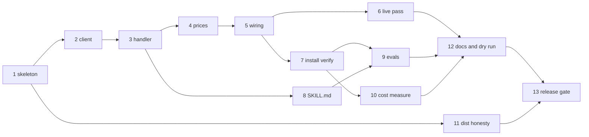

# Manabase Dev Roadmap — Phase 1 Action Plan

> **Reading this cold?** This document owns *sequencing only*. Every behavior, decision, and
> constraint it mentions is specified in `docs/MCP-PRD.md` or `docs/PLUGIN-PRD.md`, referenced
> by section. If this document and a PRD ever disagree, **the PRD wins** — fix this file.
> The boundary rule in `PLUGIN-PRD.md` §1 still governs which PRD owns which question.

**Document status:** created 2026-08-03; **Track A closed 2026-08-04**. Covers Phase 1 of both
PRDs as 13 slices, plus unscheduled slice packs for everything queued. Update slice statuses in
place as work lands.

---

## 1. How to use this document

- **One roadmap, not two.** The PRDs split *specification* by the §1 boundary rule, but the
  *work* is one sequence: one repo (P-02), plugin slices that cannot be verified until server
  slices exist, and two Phase 1s that were deliberately aligned (`PLUGIN-PRD.md` §6).
- **A slice is one bounded work session** — roughly an afternoon, matching both PRDs' stated
  success criterion that "adding the next capability is an afternoon." Each slice has a goal,
  the work, checkable done-when items (mapped to PRD acceptance criteria where they exist),
  and the traps already recorded in the research records so they are not rediscovered.
- **Slices that resolve an open question must update the owning PRD in the same session** —
  its §7 entry and a §9 revision-log row. This roadmap's status column is a progress tracker,
  not a substitute for the PRDs' own records.
- **Do not reorder past a dependency.** §5 has the graph. Within a track, order is the
  default; across tracks, parallelism is allowed where the graph permits it.

## 2. Current state (verified 2026-08-04)

**Track A is complete.** Slices 1–6 landed as PRs #2–#7, delivering
[CAP-01](./MCP-PRD.md#cap-01--card-search) end to end: all twelve acceptance criteria are
verified, nine of them live against real Scryfall (`docs/slices/TrackA-Slice6-results.md`).

**Tracks B and C have not started.** The server works; the thing a user installs does not exist
yet. `SKILL.md` is unwritten, the plugin has never been installed from a marketplace, and no
context-cost measurement has been taken — so every
[PC-01](./PLUGIN-PRD.md#pc-01--scryfall-query-craft) and
[PC-02](./PLUGIN-PRD.md#pc-02--bundled-mcp-server) acceptance criterion is still unverified.

| Area | State |
|---|---|
| Repo layout | `src/`, `tests/`, `dist/`, `skills/scryfall-query-craft/reference/` exist — per P-02. The skill directory is still an empty placeholder (Slice 8) |
| Toolchain | `package.json` with `esbuild` bundle build, `tsc --noEmit` typecheck, `node --test`; MCP SDK `^1.30.0` as a devDependency |
| `plugin.json` | present; **no `version`** (P-08), **no `userConfig`** (P-13), Fan Content disclaimer in `description` (§3.5) |
| `marketplace.json` | present; relative `./` source (P-11), disclaimer present |
| `.mcp.json` | present; server key `mtg`, `node ${CLAUDE_PLUGIN_ROOT}/dist/index.js` (P-09, P-12) |
| README | install instructions in `owner/repo` form with the raw-URL trap warning (P-11), version floor, disclaimer |
| Server source | `config.ts`, `index.ts`, `result.ts`, `scryfall/{client,prices,types}.ts`, `tools/{card-search,register}.ts` |
| Tests | 19 suites, **67 tests, 67 passing**; `tsc --noEmit` clean — re-run 2026-08-04 |
| `dist/index.js` | built and committed; verified 2026-08-04 to complete an initialize handshake and list `card_search` from a directory containing no `node_modules` |
| Acceptance harness | `scripts/cap01-live.mjs` (`npm run acceptance`) — 13 live checks, ≥600 ms apart, no 429 provoked |
| `SKILL.md` | **not written** — Slice 8 |

Two properties of the existing scaffold worth preserving on purpose:

- **The build bundles.** `esbuild --bundle` produces a self-contained `dist/index.js` with no
  runtime `node_modules` — this is what makes PC-02's offline-start criterion (no package
  fetch in the startup path, P-09) achievable. Keep the SDK a devDependency.
- **`package.json` `version` is independent of the plugin version** by design — it serves the
  future npm route (`MCP-PRD.md` D-02, kept as the secondary channel by P-09). Do not try to
  sync them.

## 3. Standing rules — apply to every slice, never restated per slice

1. Handlers never throw; every failure is a structured result (D-10).
2. Every outbound request carries the app-naming `User-Agent` and an `Accept` header; card
   endpoints at 2/sec; HTTP 429 backs off, never retries immediately (`MCP-PRD.md` §3.4).
3. Handlers are plain functions; config is read once at the entry point and passed down; no
   `process.env` below the entry point (D-03, `MCP-PRD.md` §3.2).
4. Skills carry instructions, never card facts (`PLUGIN-PRD.md` §3.6).
5. `dist/` is committed and must be rebuilt with every `src/` change until Slice 11 automates
   the check (P-09, PQ-06).
6. The verbatim Fan Content disclaimer stays on every user-facing surface (`PLUGIN-PRD.md`
   §3.5).
7. Run `claude plugin validate . --strict` before any push a friend might install from.

## 4. Phase 1 slices

Status legend: ☐ not started · ◐ in progress · ☑ done

| # | Slice | Track | Status |
|---|---|---|---|
| 1 | Server skeleton | A — server | ☑ PR #2 |
| 2 | Scryfall client | A — server | ☑ PR #3 |
| 3 | `card_search` handler | A — server | ☑ PR #4 |
| 4 | Price correctness | A — server | ☑ PR #5 |
| 5 | Tool registration & wiring | A — server | ☑ PR #6 |
| 6 | Live CAP-01 acceptance pass | A — server | ☑ PR #7 |
| 7 | Plugin install verification | B — plugin | ☐ |
| 8 | PC-01 `SKILL.md` authoring | B — plugin | ☐ |
| 9 | PC-01 evals | B — plugin | ☐ |
| 10 | Context-cost measurement | C — release | ☐ |
| 11 | `dist/` honesty mechanism | C — release | ☐ |
| 12 | Docs polish & friend dry-run | C — release | ☐ |
| 13 | Release gate — the P-08 switchover | C — release | ☐ |

---

### Track A — server (delivers `MCP-PRD.md` CAP-01)

#### Slice 1 — Server skeleton

- **Goal:** `dist/index.js` starts a stdio MCP server, answers the initialize handshake, and
  owns all config at the entry point. No tools yet.
- **Work:**
  - `src/index.ts` entry point: assemble one config object — the `User-Agent` string (name,
    version, and a way for Scryfall to contact the author, per `MCP-PRD.md` §4.1's
    mitigation), and the cache-directory rule: `CLAUDE_PLUGIN_DATA` when set, otherwise a
    platform user-cache directory (`PLUGIN-PRD.md` §4.5). Phase 1 writes no cache, but the
    resolution rule is entry-point config and this is the slice that fixes its shape.
  - Instantiate the SDK server with `StdioServerTransport`; connect; no tools registered.
  - `npm install`, `npm run build`, `npm run typecheck` all clean.
- **Done when:**
  - ☑ `node dist/index.js` completes an MCP initialize round-trip (MCP Inspector or a
    scripted stdio exchange).
  - ☑ `dist/index.js` runs from a directory with no `node_modules` (proves the bundle is
    self-contained).
- **Binding refs:** `MCP-PRD.md` D-02, D-03, §3.2; `PLUGIN-PRD.md` P-09, §4.5.
- **Landed:** PR #2 (`8465832`). Config resolution shipped in `src/config.ts` — the
  `CLAUDE_PLUGIN_DATA`-else-platform-cache rule of
  [`PLUGIN-PRD.md` §4.5](./PLUGIN-PRD.md#45-persistent-data), resolved once at the entry point
  and injectable for tests. Both done-when items re-verified 2026-08-04 against the committed
  bundle: handshake returned `manabase-mtg@0.0.0` on protocol `2025-06-18` from a directory
  containing only `index.js`.

#### Slice 2 — Scryfall client

- **Goal:** the one HTTP module every current and future capability reuses: required headers,
  enforced rate limits, never-throw structured results.
- **Work:**
  - Request function taking config explicitly; returns a success/failure union — failure
    carries a machine-usable code and, for Scryfall 4xx responses, **Scryfall's own `details`
    text verbatim** (it is the model's correction signal — D-10, CAP-01).
  - Rate limiting: 2/sec for `/cards/search`, `/cards/named`, `/cards/random`,
    `/cards/collection`; 10/sec elsewhere (`MCP-PRD.md` §3.4).
  - 429 handling: back off (the lockout is ~30 seconds), retry once after backoff, then
    return a structured failure. Never immediate retry.
  - Network errors and timeouts → structured failures, not exceptions.
- **Done when (unit tests, mocked fetch):**
  - ☑ Every request carries `User-Agent` and `Accept` (feeds CAP-01 criterion 10).
  - ☑ Two back-to-back card-endpoint calls are spaced to ≤2/sec (criterion 11).
  - ☑ A 429 produces backoff then a clear structured failure (criterion 12).
  - ☑ A 400 response's `details` text survives verbatim into the failure result.
- **Binding refs:** `MCP-PRD.md` §3.4, §4.1, D-10.
- **Landed:** PR #3 (`59fbd6a`). `src/scryfall/client.ts` plus `src/result.ts`'s success/failure
  union; evidence is `tests/scryfall/client.test.ts` against a mock transport. **No real 429 was
  ever provoked** — deliberately exceeding Scryfall's limit to observe the response is the thing
  [§3.4](./MCP-PRD.md#34-rate-limits-are-hard-constraints-not-guidance) forbids, so criterion 12
  rests on the mock and always will.

#### Slice 3 — `card_search` handler

- **Goal:** CAP-01's core behavior as a plain, directly-testable function.
- **Work:**
  - `handler(config, { q, unique = "cards", order?, dir?, page? })` → calls the client's
    `GET /cards/search`, full query passthrough (no parsing, no validation — Scryfall
    evaluates the syntax, D-07).
  - Shape each card to CAP-01's field list: name, mana cost, cmc, type line, oracle text,
    colors and color identity, power/toughness/loyalty where applicable, rarity, set, format
    legalities, price (price handling completed in Slice 4).
  - Pagination reporting: total count, whether more exist, current page — never silently
    truncate, never auto-fetch further pages.
  - Failures (including malformed queries) pass through as structured results.
- **Done when (direct invocation, fixture-based):**
  - ☑ The handler runs in a test with no server and no transport constructed (criterion 1).
  - ☑ A fixture with >175 matches reports total count and more-available (criterion 9).
  - ☑ A 400 fixture returns a structured failure carrying `details` (criterion 8).
- **Binding refs:** CAP-01 behavior bullets; D-03, D-07, D-11.
- **Watch out:** default `unique=cards` — one row per card, not per printing; the defaults
  are for deckbuilding, not collecting.
- **Landed:** PR #4 (`e6fa0d9`). Two shaping decisions worth carrying forward, neither of which
  the slice spec anticipated:
  - **Scryfall answers a valid query with zero matches as HTTP 404.** The handler maps that to a
    *successful, empty* search carrying Scryfall's own note, not a failure — no matches is a
    search outcome, not a dead end. Verified live in Slice 6 (check 13).
  - **Double-faced and split cards carry `oracle_text` / `mana_cost` on `card_faces`, not at the
    top level.** Faces are joined with ` // ` so those cards do not come back blank.
  - `legalities` passes through untrimmed, which is a deliberate deferral to
    [OQ-02](./MCP-PRD.md#oq-02--how-verbose-should-a-search-result-be) rather than a decision.

#### Slice 4 — Price correctness

- **Goal:** the three verified price traps of `MCP-PRD.md` §4.1.3 handled inside result
  shaping — this is part of CAP-01, not a later refinement.
- **Work:**
  - Price resolution order `usd` → `usd_foil` → `usd_etched`, with the finish labeled so
    "$3,999 (foil)" is distinguishable from a nonfoil price.
  - Constrain price reporting to paper printings; a card with genuinely no paper price says
    so *and says why* (digital-only).
  - Do not model `eur_etched` — documented but does not exist in the live API.
- **Done when (fixtures capture the real trap cards):**
  - ☑ Gaea's Cradle (`jgp`, foil-only) reports a `usd_foil` price, not "no price"
    (criterion 4).
  - ☑ An `is:etched` printing reports `usd_etched` (criterion 5).
  - ☑ Black Lotus resolves against a paper printing, not the all-null MTGO printing
    (criterion 6) — **see the caveat below; upstream data has since changed.**
  - ☑ A digital-only Arena card reports no paper price and states digital-only as the reason
    (criterion 7).
- **Binding refs:** `MCP-PRD.md` §4.1.3, D-06; CAP-01 criteria 4–7.
- **Landed:** PR #5 (`af319d1`). `src/scryfall/prices.ts` resolves `usd` → `usd_foil` →
  `usd_etched` and labels the finish; unavailability is always given a reason
  (`digital-only` / `no-price-data`), never a bare null.
- **Caveat on criterion 6.** Slice 6 found that **no paper Black Lotus printing carries a USD
  price any more** — all three are EUR-only. The fixture still proves paper-vs-digital selection,
  but Black Lotus can no longer evidence *paper USD resolution*; Slice 6 substitutes a
  `usd>=1 game:paper` probe for that half. `PriceInfo` models no EUR fallback, which is a live
  gap for Reserved List cards rather than a settled decision — see
  [§4.1.3](./MCP-PRD.md#413-price-fields--three-verified-traps).

#### Slice 5 — Tool registration & wiring

- **Goal:** `card_search` reachable over MCP; the server is now genuinely usable.
- **Work:**
  - Register `card_search` (D-11 naming) with its input schema and a **compact** tool
    description. The deep syntax teaching belongs to PC-01 (Slice 8) — OQ-01 stays open
    until Slice 9 measures whether that split works; resist front-loading syntax into the
    description before there is evidence it is needed.
  - Handler failures become structured tool *results*, never MCP protocol errors (D-10).
- **Done when:**
  - ☑ `tools/list` shows `card_search`; a live `tools/call` with a real query round-trips.
  - ☑ A malformed query over MCP returns the structured failure, not a protocol error.
- **Binding refs:** D-10, D-11; `MCP-PRD.md` OQ-01; `PLUGIN-PRD.md` P-12 (the scoped name
  `mcp__plugin_manabase_mtg__card_search` appears only when running as a plugin — Slice 7
  verifies that form).
- **Landed:** PR #6 (`0001115`). The compact description held — five lines naming the operator
  families and the pagination contract, with the deep syntax teaching left to PC-01. That is a
  bet, not a result: [OQ-01](./MCP-PRD.md#oq-01--how-should-scryfall-syntax-be-surfaced-to-the-model)
  stays open until Slice 9 measures whether the split works.
- **One protocol-level error survives by design:** an unknown tool name throws. That is harness
  misuse rather than a query the model should retry, so it is the single deliberate exception to
  D-10 — every *query* failure is still a structured result.
- **Watch out:** keep tool count and description length lean — PQ-01 has not yet established
  whether tool schemas are an unbudgetable always-on context cost.

#### Slice 6 — Live CAP-01 acceptance pass

- **Goal:** all 12 CAP-01 acceptance criteria exercised against live Scryfall, with results
  recorded — the research record is dated 2026-07-29 and reality may have drifted.
- **Work:**
  - A runnable checklist/script at polite rates covering criteria 1–12, including the live
    operator checks: `o:/^{T}: Add/`, `otag:ramp`, `function:removal`, `art:squirrel`,
    `atag:squirrel`, and the invalid `illustrationtag:dragon` failure path.
  - Record the pass (and any drift found in §4.1's claims) in `MCP-PRD.md` §9.
- **Done when:**
  - ☑ Criteria 1–12 each have a recorded pass with date.
  - ☑ `MCP-PRD.md` §9 has the revision-log row.
- **Binding refs:** CAP-01 acceptance criteria; `MCP-PRD.md` §3.4, §9.
- **Landed:** PR #7 (`14eadc1`). 13 of 13 checks pass, exit 0; full record in
  `docs/slices/TrackA-Slice6-results.md`. Criteria 2–9 are live; criteria 1, 10, 11 and 12 are
  unit-level by design — the last of those because provoking a real 429 is forbidden by
  [§3.4](./MCP-PRD.md#34-rate-limits-are-hard-constraints-not-guidance).
- **Two upstream drifts found, neither requiring a code change**, both now recorded in
  [`MCP-PRD.md` §4.1.3](./MCP-PRD.md#413-price-fields--three-verified-traps): `!"Black Lotus"`
  now rolls up to the MTGO printing by default, and no paper Lotus printing carries USD. Operator
  counts drifted upward as expected (regex 1,554→1,555; `otag:ramp` 2,260→2,274;
  `function:removal` 6,386→6,405; `art:squirrel` 192→194).

**Track A is closed.** The server delivers [CAP-01](./MCP-PRD.md#cap-01--card-search) and nothing
downstream is blocked on it: Slices 7 and 8 were waiting on Slices 5 and 3 respectively, and both
gates are open.

---

### Track B — plugin (delivers `PLUGIN-PRD.md` PC-01 and PC-02)

#### Slice 7 — Plugin install verification

- **Goal:** the two-command install proven end-to-end with the real repo — PC-02's criteria,
  which are install-surface criteria, not tool criteria.
- **Work:**
  - Push to the public GitHub repo. On a machine or profile that has never installed the
    plugin: `/plugin marketplace add <owner>/manabase`, `/plugin install manabase@manabase`.
  - Verify the update loop while `version` is unset: push a commit, confirm
    `/plugin update` picks it up (P-08's SHA fallback in action).
- **Done when (PC-02 criteria):**
  - ☐ `/mcp` shows the server connected with no extra command, file edit, or restart
    (criterion 1).
  - ☐ Enabling produced **zero** configuration prompts (criterion 2, P-13).
  - ☐ Tools callable as `mcp__plugin_manabase_mtg__*` (criterion 3, P-12).
  - ☐ Server starts and serves with no network access — no package fetch in the startup path
    (criterion 4, P-09).
  - ☐ No file created or modified under `${CLAUDE_PLUGIN_ROOT}` during a session
    (criterion 6, P-06).
  - ☐ Standalone run with `CLAUDE_PLUGIN_DATA` unset resolves the platform cache directory
    rather than failing (criterion 7 — resolution only; Phase 1 writes nothing).
  - ☐ `claude plugin validate . --strict` passes (criterion 9).
- **Binding refs:** PC-02 acceptance criteria; P-06, P-08, P-09, P-11, P-12, P-13;
  `PLUGIN-PRD.md` §4.2.
- **Watch out:** never demonstrate or document the raw-URL marketplace add — it downloads
  only `marketplace.json` and the relative source silently fails to resolve (P-11's trap).

#### Slice 8 — PC-01 `SKILL.md` authoring

- **Goal:** the query-craft skill written, satisfying PC-01's static criteria 1–4. Can start
  as soon as Slice 3 fixes the tool's shape.
- **Work:**
  - `skills/scryfall-query-craft/SKILL.md`, body targeting ≤2,000 tokens: the
    English-request-to-query strategy, high-frequency operators, the failure loop (read
    Scryfall's `details`, revise, retry — never report a dead end first), operators that
    plausibly don't exist (`illustrationtag:`), the meaning-changing parameters (`unique`,
    `order`, `dir`), and narrow-don't-page guidance.
  - Exhaustive operator catalog in `reference/` — read on demand, not loaded up front
    (progressive disclosure, `PLUGIN-PRD.md` §4.1).
  - `description` + `when_to_use` ≤1,536 characters, key use case first, phrased to match
    plain Magic questions that never say "Scryfall."
  - Tool references use the scoped name form (P-12).
- **Done when (static criteria):**
  - ☐ `description` + `when_to_use` ≤1,536 characters (criterion 1).
  - ☐ `SKILL.md` renders ≤5,000 tokens so compaction re-attach keeps the whole body
    (criterion 3).
  - ☐ A review of the files finds **no card facts** — no oracle text, prices, legality, or
    combo claims asserted as fact (criterion 4, §3.6).
- **Binding refs:** PC-01 behavior and criteria 1–4; `PLUGIN-PRD.md` §3.1, §3.6, §4.1.
- **Watch out:** bulk belongs in the reference files. A body past ~5,000 tokens silently
  loses its tail at the first compaction — the failure mode is invisible.

#### Slice 9 — PC-01 evals

- **Goal:** PC-01's behavioral criteria 5–13 *measured* against a without-skill baseline, in
  fresh sessions — and with them, the empirical half of `MCP-PRD.md` OQ-01 answered.
- **Work:**
  - Eval cases in `evals/evals.json` per the first-party `skill-creator` loop: should-trigger
    prompts (plain-English requests exercising legality+type+cost+price combinations, regex-
    shaped requests, function-shaped requests, artwork requests) and should-not-trigger
    prompts (non-Magic sessions).
  - Run with skill enabled and disabled; record both rates. Fresh sessions only — authoring
    context masks gaps.
  - Negative checks across the full set: `illustrationtag:` never emitted (criterion 10);
    card-fact questions produce tool calls, not answers from the skill (criterion 13); a
    structured failure produces a revised retry (criterion 12).
  - Tune the description on should-trigger vs. should-not-trigger hit rate.
  - Record results in `PLUGIN-PRD.md` §9; update `MCP-PRD.md` OQ-01 (§7) and §9 with the
    measured answer.
- **Done when:**
  - ☐ Criteria 5–13 each have a recorded result with the baseline comparison.
  - ☐ Both PRDs' §7/§9 updated.
- **Binding refs:** PC-01 criteria 5–13 and its eval-method preamble; `MCP-PRD.md` OQ-01.

---

### Track C — measurement and release

#### Slice 10 — Context-cost measurement

- **Goal:** the two open cost questions answered with numbers instead of estimates.
- **Work:**
  - `claude plugin details manabase` — record the full output in `PLUGIN-PRD.md` §9
    (PC-02 criterion 10). Check PC-01's always-on ≤250 tokens (PC-01 criterion 2).
  - **PQ-01 experiment:** temporarily remove `.mcp.json`, re-run `plugin details`, compare
    always-on totals — does an MCP server's tool schema count?
  - **PQ-02:** `/doctor` and `/context` with the author's full plugin load installed — is the
    shared skill-listing budget close to overflow?
  - Close or update PQ-01/PQ-02 in `PLUGIN-PRD.md` §7 and log in §9.
- **Done when:**
  - ☐ Baseline recorded; PC-01 criterion 2 checked.
  - ☐ PQ-01 and PQ-02 have measured answers in the PRD.
- **Binding refs:** `PLUGIN-PRD.md` §3.1, §4.6, PQ-01, PQ-02.

#### Slice 11 — `dist/` honesty mechanism

- **Goal:** PQ-06 decided and implemented — a committed `dist/` that can silently drift from
  `src/` is the one failure P-09 knowingly created.
- **Work:** implement a CI check that rebuilds and diffs `dist/` on every push
  (**recommended** — it catches every path including a friend's PR, and relies on no local
  hook discipline; the alternatives PQ-06 lists are a pre-commit hook or folding the build
  into `claude plugin tag`). Record the decision in `PLUGIN-PRD.md` §7 (close PQ-06) and §9.
- **Done when:**
  - ☐ A push with stale `dist/` fails the check, demonstrated once deliberately.
  - ☐ PQ-06 closed in the PRD.
- **Binding refs:** P-09, PQ-06.

#### Slice 12 — Docs polish & friend dry-run

- **Goal:** the README is sufficient for a non-author, proven by one real install.
- **Work:**
  - Troubleshooting section naming `/mcp` as where to look and `claude --debug` as where to
    read why — the server-fails-to-start case is nearly invisible and Phase 1 can only
    document it (PC-02 behavior).
  - A "run `/doctor` if the plugin stops firing" line — PQ-04's likely answer; record in the
    PRD that documentation is the chosen mitigation, confirmed rather than assumed.
  - Disclaimer surface check: `plugin.json` description, marketplace entry, README (§3.5).
  - One friend installs from scratch following only the README; capture every point of
    friction as an issue.
- **Done when:**
  - ☐ Friend install succeeds without author intervention.
  - ☐ PQ-04 recorded as answered (or reopened with what the dry run revealed).
- **Binding refs:** PC-02 "what the user sees when something is wrong"; PQ-04;
  `PLUGIN-PRD.md` §3.5.

#### Slice 13 — Release gate: the P-08 switchover

- **Goal:** declare the plugin public. This is a phase boundary, not a task inside Phase 1 —
  it happens when Slices 1–12 are done and stable, not merely done.
- **Work:**
  - Set explicit semver in `plugin.json` — and **only** there, never also in the marketplace
    entry (`plugin.json` wins silently, §4.3).
  - `claude plugin tag --push` for the release tag.
  - Verify the changed update semantics: a push without a version bump ships nothing — now
    correct behavior, previously wrong (P-08).
  - Decide PQ-05 (community-marketplace submission) explicitly, or record it as deliberately
    still open. Optional follow-up, unscheduled: npm publish as the secondary non-Claude
    route (D-02 survives P-09; its version is independent by design).
- **Done when:**
  - ☐ Version set, tag pushed, update semantics verified.
  - ☐ `PLUGIN-PRD.md` §9 records the switchover; PQ-05 has an explicit disposition.
- **Binding refs:** P-08, `PLUGIN-PRD.md` §4.3, PQ-05; `MCP-PRD.md` D-02.

## 5. Order and parallelism

The critical path is 1 → 2 → 3 → 4 → 5 → 7 → 9 → 12 → 13. Slice 8 (skill authoring) is the
main parallelism opportunity — it needs only Slice 3's tool shape. Slice 11 (CI) can land any
time after Slice 1 produces a real build.

**As of 2026-08-04, Slices 1–6 are done and the next item on the critical path is Slice 7.**
Three slices are unblocked and can run in parallel: **7** (install verification, needed Slice 5),
**8** (`SKILL.md`, needed only Slice 3), and **11** (`dist/` CI check, needed only Slice 1 —
and now more urgent than when it was scheduled, because `dist/index.js` is real committed build
output that can silently drift from `src/`).

## 6. Beyond Phase 1 — queued slice packs

Both PRDs deliberately refuse to schedule anything past Phase 1 (`MCP-PRD.md` §6,
`PLUGIN-PRD.md` §6), and this roadmap honors that: the packs below are *shapes of future
work*, not a schedule. Each pack starts with a **spec slice** — research plus appending the
CAP/PC block per the owning PRD's template — and only then build slices. Phase assignment
happens in those spec sessions.

| Pack | First slice (spec/research) | Blocking questions | Sequencing constraints |
|---|---|---|---|
| Combo discovery | Verify `/find-my-combos` and `/variants/` live; ask Commander Spellbook admins about rate limits and data licensing via their Discord | OQ-05, OQ-06 | Anonymous, stateless — a natural early pick |
| Archidekt deck reading | Read decks containing tokens, custom cards, spoilers to answer OQ-07; draft the three-way-ambiguous 404 error text per §3.6 | OQ-07 | Prerequisite for deck analysis, Arena export, and deck pricing workflows |
| Decklist pricing | Spec against `POST /cards/collection` (75/batch); inherits every §4.1.3 price trap | — | Pairs naturally with deck reading |
| Arena-format export | Pure transformation spec | — | After deck reading |
| Budget alternatives | Spec combining CAP-01 search + pricing | — | After pricing |
| Tag discovery | **The persistence decision:** storage layout under `${CLAUDE_PLUGIN_DATA}`, refresh trigger (lazy first-use vs. hook — PQ-03's recorded disagreement), whether first run blocks on download. Resolves OQ-03 and PQ-03 together | OQ-03, PQ-03 | First capability needing local persistence; sets the pattern rules lookup reuses. Bulk files are gzipped JSONL — read `jsonl_download_uri` from the API, never construct URLs (§4.2) |
| Comprehensive Rules lookup | Spec the landing-page URL scrape, the parser (BOM, CRLF, subrule letter-skipping `l`/`o`, glossary block), staleness reporting | OQ-08 (watch across a set boundary) | After or alongside the tag-discovery persistence decision (shares OQ-03's answer) |
| Archidekt deck writing | Authenticated research against a **disposable** deck: replace-vs-append, category/commander/companion preservation, partial-failure blast radius (OQ-04). Re-verify the `userConfig` mechanism (§4.4 says re-verify, not trust) and draft PQ-08's credential-failure wording | OQ-04, PQ-08 | **Strictly last** (D-09). Every read capability stable first |
| Deck analysis (plugin skill) | Blocked entirely — needs the deck-reading CAP to exist first (`PLUGIN-PRD.md` §1, consequence 3) | — | After Archidekt deck reading |
| Deck optimize (plugin skill or agent) | The skill-vs-agent call is a context-budget question (PQ-07) | PQ-07 | After deck analysis |

Standing reminders for whichever pack goes first: the first hook component owns the
exec-form/Windows-shell problem (`PLUGIN-PRD.md` §3.4); the first persistence component
should use the bundled-manifest-comparison pattern rather than testing for file existence
(`PLUGIN-PRD.md` §4.5); and any capability pricing a list uses `/cards/collection`, never a
loop over `/cards/named` (`MCP-PRD.md` §4.1.2).
