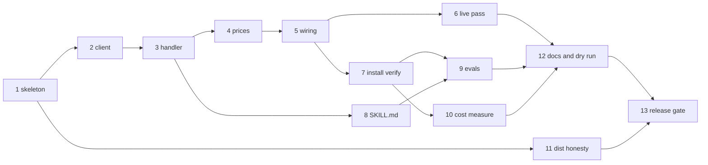

# Manabase Dev Roadmap — Phase 1 Action Plan

> **Reading this cold?** This document owns *sequencing only*. Every behavior, decision, and
> constraint it mentions is specified in `docs/MCP-PRD.md` or `docs/PLUGIN-PRD.md`, referenced
> by section. If this document and a PRD ever disagree, **the PRD wins** — fix this file.
> The boundary rule in `PLUGIN-PRD.md` [§1](./PLUGIN-PRD.md#1-overview) still governs which PRD owns which question.

**Document status:** created 2026-08-03; **Track A closed 2026-08-04**. Covers Phase 1 of both
PRDs as 13 slices, plus unscheduled slice packs for everything queued. Update slice statuses in
place as work lands.

---

## 1. How to use this document

- **One roadmap, not two.** The PRDs split *specification* by the [§1](./PLUGIN-PRD.md#1-overview) boundary rule, but the
  *work* is one sequence: one repo ([P-02](./PLUGIN-PRD.md#p-02--one-repo-manifest-at-the-root)), plugin slices that cannot be verified until server
  slices exist, and two Phase 1s that were deliberately aligned (`PLUGIN-PRD.md` [§6](./PLUGIN-PRD.md#6-roadmap)).
- **A slice is one bounded work session** — roughly an afternoon, matching both PRDs' stated
  success criterion that "adding the next capability is an afternoon." Each slice has a goal,
  the work, checkable done-when items (mapped to PRD acceptance criteria where they exist),
  and the traps already recorded in the research records so they are not rediscovered.
- **Slices that resolve an open question must update the owning PRD in the same session** —
  its §7 entry and a §9 revision-log row. This roadmap's status column is a progress tracker,
  not a substitute for the PRDs' own records.
- **Do not reorder past a dependency.** [§5](#5-order-and-parallelism) has the graph. Within a track, order is the
  default; across tracks, parallelism is allowed where the graph permits it.

## 2. Current state (verified 2026-08-04)

**Track A is complete.** Slices [1](./slices/TrackA-Slice1.md)–[6](./slices/TrackA-Slice6.md) landed as PRs #2–#7, delivering
[CAP-01](./MCP-PRD.md#cap-01--card-search) end to end: all twelve acceptance criteria are
verified, nine of them live against real Scryfall ([`docs/slices/TrackA-Slice6-results.md`](./slices/TrackA-Slice6-results.md)).

**Track B has started.** [Slice 7](./slices/TrackB-Slice7.md) landed 2026-08-04: the plugin **has** now been installed from a
marketplace, on a cold profile, and six of
[PC-02](./PLUGIN-PRD.md#pc-02--bundled-mcp-server)'s ten acceptance criteria (1, 2, 3, 4, 6, 7)
are verified against a real harness, with criterion 9 explicitly not met — see
[`docs/slices/TrackB-Slice7-results.md`](./slices/TrackB-Slice7-results.md). What remains: `SKILL.md` is still unwritten and no
context-cost measurement has been taken, so every
[PC-01](./PLUGIN-PRD.md#pc-01--scryfall-query-craft) acceptance criterion, and
[PC-02](./PLUGIN-PRD.md#pc-02--bundled-mcp-server)'s criteria 5, 8 and 10, are still unverified.

| Area | State |
|---|---|
| Repo layout | `src/`, `tests/`, `dist/`, `skills/scryfall-query-craft/reference/` exist — per [P-02](./PLUGIN-PRD.md#p-02--one-repo-manifest-at-the-root). The skill directory is still an empty placeholder ([Slice 8](./slices/TrackB-Slice8.md)) |
| Toolchain | `package.json` with `esbuild` bundle build, `tsc --noEmit` typecheck, `node --experimental-strip-types --test` (flag and quoted glob both required — [Slice 7](./slices/TrackB-Slice7.md) drift finding 4, fixed 2026-08-04); MCP SDK `^1.30.0` as a devDependency |
| `plugin.json` | present; **no `version`** ([P-08](./PLUGIN-PRD.md#p-08--version-scheme)), **no `userConfig`** ([P-13](./PLUGIN-PRD.md#p-13--no-user-configuration-in-phase-1)), Fan Content disclaimer in `description` ([§3.5](./PLUGIN-PRD.md#35-what-the-user-must-see-and-must-not)) |
| `marketplace.json` | present; relative `./` source ([P-11](./PLUGIN-PRD.md#p-11--the-repo-is-its-own-marketplace)), disclaimer present |
| `.mcp.json` | present; server key `mtg`, `node ${CLAUDE_PLUGIN_ROOT}/dist/index.js` ([P-09](./PLUGIN-PRD.md#p-09--server-ships-as-committed-built-javascript), [P-12](./PLUGIN-PRD.md#p-12--plugin-name-and-server-key)) |
| README | install instructions in `owner/repo` form with the raw-URL trap warning ([P-11](./PLUGIN-PRD.md#p-11--the-repo-is-its-own-marketplace)), version floor, disclaimer |
| Server source | `config.ts`, `index.ts`, `result.ts`, `scryfall/{client,prices,types}.ts`, `tools/{card-search,register}.ts` |
| Tests | 19 suites, **67 tests, 67 passing**; `tsc --noEmit` clean — re-run 2026-08-04 |
| `dist/index.js` | built and committed; verified 2026-08-04 to complete an initialize handshake and list `card_search` from a directory containing no `node_modules` |
| Acceptance harness | `scripts/cap01-live.mjs` (`npm run acceptance`) — 13 live checks, ≥600 ms apart, no 429 provoked |
| `SKILL.md` | **not written** — [Slice 8](./slices/TrackB-Slice8.md) |

Two properties of the existing scaffold worth preserving on purpose:

- **The build bundles.** `esbuild --bundle` produces a self-contained `dist/index.js` with no
  runtime `node_modules` — this is what makes [PC-02](./PLUGIN-PRD.md#pc-02--bundled-mcp-server)'s offline-start criterion (no package
  fetch in the startup path, [P-09](./PLUGIN-PRD.md#p-09--server-ships-as-committed-built-javascript)) achievable. Keep the SDK a devDependency.
- **`package.json` `version` is independent of the plugin version** by design — it serves the
  future npm route (`MCP-PRD.md` [D-02](./MCP-PRD.md#d-02--runtime-nodejs--typescript), kept as the secondary channel by [P-09](./PLUGIN-PRD.md#p-09--server-ships-as-committed-built-javascript)). Do not try to
  sync them.

## 3. Standing rules — apply to every slice, never restated per slice

1. Handlers never throw; every failure is a structured result ([D-10](./MCP-PRD.md#d-10--tool-handlers-never-throw)).
2. Every outbound request carries the app-naming `User-Agent` and an `Accept` header; card
   endpoints at 2/sec; HTTP 429 backs off, never retries immediately (`MCP-PRD.md` [§3.4](./MCP-PRD.md#34-rate-limits-are-hard-constraints-not-guidance)).
3. Handlers are plain functions; config is read once at the entry point and passed down; no
   `process.env` below the entry point ([D-03](./MCP-PRD.md#d-03--testability-handlers-callable-as-plain-functions), `MCP-PRD.md` [§3.2](./MCP-PRD.md#32-testability)).
4. Skills carry instructions, never card facts (`PLUGIN-PRD.md` [§3.6](./PLUGIN-PRD.md#36-skills-carry-instructions-never-facts)).
5. `dist/` is committed and must be rebuilt with every `src/` change until [Slice 11](./slices/TrackC-Slice11.md) automates
   the check ([P-09](./PLUGIN-PRD.md#p-09--server-ships-as-committed-built-javascript), [PQ-06](./PLUGIN-PRD.md#pq-06--what-keeps-the-committed-dist-honest)).
6. The verbatim Fan Content disclaimer stays on every user-facing surface (`PLUGIN-PRD.md`
   [§3.5](./PLUGIN-PRD.md#35-what-the-user-must-see-and-must-not)).
7. Run `claude plugin validate . --strict` before any push a friend might install from.

## 4. Phase 1 slices

Status legend: ☐ not started · ◐ in progress · ☑ done

| # | Slice | Track | Status |
|---|---|---|---|
| 1 | Server skeleton | A — server | ☑ PR #2 |
| 2 | Scryfall client | A — server | ☑ PR #3 |
| 3 | `card_search` handler | A — server | ☑ PR #4 |
| 4 | Price correctness | A — server | ☑ PR #5 |
| 5 | Tool registration & wiring | A — server | ☑ PR #6 |
| 6 | Live [CAP-01](./MCP-PRD.md#cap-01--card-search) acceptance pass | A — server | ☑ PR #7 |
| 7 | Plugin install verification | B — plugin | ☑ PRs #13, #14 |
| 8 | [PC-01](./PLUGIN-PRD.md#pc-01--scryfall-query-craft) `SKILL.md` authoring | B — plugin | ☐ |
| 9 | [PC-01](./PLUGIN-PRD.md#pc-01--scryfall-query-craft) evals | B — plugin | ☐ |
| 10 | Context-cost measurement | C — release | ☐ |
| 11 | `dist/` honesty mechanism | C — release | ☐ |
| 12 | Docs polish & friend dry-run | C — release | ☐ |
| 13 | Release gate — the [P-08](./PLUGIN-PRD.md#p-08--version-scheme) switchover | C — release | ☐ |

---

### Track A — server (delivers `MCP-PRD.md` [CAP-01](./MCP-PRD.md#cap-01--card-search))

#### Slice 1 — Server skeleton

- **Goal:** `dist/index.js` starts a stdio MCP server, answers the initialize handshake, and
  owns all config at the entry point. No tools yet.
- **Work:**
  - `src/index.ts` entry point: assemble one config object — the `User-Agent` string (name,
    version, and a way for Scryfall to contact the author, per `MCP-PRD.md` [§4.1](./MCP-PRD.md#41-scryfall-rest-api)'s
    mitigation), and the cache-directory rule: `CLAUDE_PLUGIN_DATA` when set, otherwise a
    platform user-cache directory (`PLUGIN-PRD.md` [§4.5](./PLUGIN-PRD.md#45-persistent-data)). Phase 1 writes no cache, but the
    resolution rule is entry-point config and this is the slice that fixes its shape.
  - Instantiate the SDK server with `StdioServerTransport`; connect; no tools registered.
  - `npm install`, `npm run build`, `npm run typecheck` all clean.
- **Done when:**
  - ☑ `node dist/index.js` completes an MCP initialize round-trip (MCP Inspector or a
    scripted stdio exchange).
  - ☑ `dist/index.js` runs from a directory with no `node_modules` (proves the bundle is
    self-contained).
- **Binding refs:** `MCP-PRD.md` [D-02](./MCP-PRD.md#d-02--runtime-nodejs--typescript), [D-03](./MCP-PRD.md#d-03--testability-handlers-callable-as-plain-functions), [§3.2](./MCP-PRD.md#32-testability); `PLUGIN-PRD.md` [P-09](./PLUGIN-PRD.md#p-09--server-ships-as-committed-built-javascript), [§4.5](./PLUGIN-PRD.md#45-persistent-data).
- **Landed:** PR #2 (`8465832`). Config resolution shipped in `src/config.ts` — the
  `CLAUDE_PLUGIN_DATA`-else-platform-cache rule of
  [`PLUGIN-PRD.md` §4.5](./PLUGIN-PRD.md#45-persistent-data), resolved once at the entry point
  and injectable for tests. Both done-when items re-verified 2026-08-04 against the committed
  bundle: handshake returned `manabase-mtg@0.0.0` on protocol `2025-06-18` from a directory
  containing only `index.js`.

#### Slice 2 — Scryfall client

- **Goal:** the one HTTP module every current and future capability reuses: required headers,
  enforced rate limits, never-throw structured results.
- **Work:**
  - Request function taking config explicitly; returns a success/failure union — failure
    carries a machine-usable code and, for Scryfall 4xx responses, **Scryfall's own `details`
    text verbatim** (it is the model's correction signal — [D-10](./MCP-PRD.md#d-10--tool-handlers-never-throw), [CAP-01](./MCP-PRD.md#cap-01--card-search)).
  - Rate limiting: 2/sec for `/cards/search`, `/cards/named`, `/cards/random`,
    `/cards/collection`; 10/sec elsewhere (`MCP-PRD.md` [§3.4](./MCP-PRD.md#34-rate-limits-are-hard-constraints-not-guidance)).
  - 429 handling: back off (the lockout is ~30 seconds), retry once after backoff, then
    return a structured failure. Never immediate retry.
  - Network errors and timeouts → structured failures, not exceptions.
- **Done when (unit tests, mocked fetch):**
  - ☑ Every request carries `User-Agent` and `Accept` (feeds [CAP-01](./MCP-PRD.md#cap-01--card-search) criterion 10).
  - ☑ Two back-to-back card-endpoint calls are spaced to ≤2/sec (criterion 11).
  - ☑ A 429 produces backoff then a clear structured failure (criterion 12).
  - ☑ A 400 response's `details` text survives verbatim into the failure result.
- **Binding refs:** `MCP-PRD.md` [§3.4](./MCP-PRD.md#34-rate-limits-are-hard-constraints-not-guidance), [§4.1](./MCP-PRD.md#41-scryfall-rest-api), [D-10](./MCP-PRD.md#d-10--tool-handlers-never-throw).
- **Landed:** PR #3 (`59fbd6a`). `src/scryfall/client.ts` plus `src/result.ts`'s success/failure
  union; evidence is `tests/scryfall/client.test.ts` against a mock transport. **No real 429 was
  ever provoked** — deliberately exceeding Scryfall's limit to observe the response is the thing
  [§3.4](./MCP-PRD.md#34-rate-limits-are-hard-constraints-not-guidance) forbids, so criterion 12
  rests on the mock and always will.

#### Slice 3 — `card_search` handler

- **Goal:** [CAP-01](./MCP-PRD.md#cap-01--card-search)'s core behavior as a plain, directly-testable function.
- **Work:**
  - `handler(config, { q, unique = "cards", order?, dir?, page? })` → calls the client's
    `GET /cards/search`, full query passthrough (no parsing, no validation — Scryfall
    evaluates the syntax, [D-07](./MCP-PRD.md#d-07--three-way-cache-split)).
  - Shape each card to [CAP-01](./MCP-PRD.md#cap-01--card-search)'s field list: name, mana cost, cmc, type line, oracle text,
    colors and color identity, power/toughness/loyalty where applicable, rarity, set, format
    legalities, price (price handling completed in [Slice 4](./slices/TrackA-Slice4.md)).
  - Pagination reporting: total count, whether more exist, current page — never silently
    truncate, never auto-fetch further pages.
  - Failures (including malformed queries) pass through as structured results.
- **Done when (direct invocation, fixture-based):**
  - ☑ The handler runs in a test with no server and no transport constructed (criterion 1).
  - ☑ A fixture with >175 matches reports total count and more-available (criterion 9).
  - ☑ A 400 fixture returns a structured failure carrying `details` (criterion 8).
- **Binding refs:** [CAP-01](./MCP-PRD.md#cap-01--card-search) behavior bullets; [D-03](./MCP-PRD.md#d-03--testability-handlers-callable-as-plain-functions), [D-07](./MCP-PRD.md#d-07--three-way-cache-split), [D-11](./MCP-PRD.md#d-11--tool-naming-convention).
- **Watch out:** default `unique=cards` — one row per card, not per printing; the defaults
  are for deckbuilding, not collecting.
- **Landed:** PR #4 (`e6fa0d9`). Two shaping decisions worth carrying forward, neither of which
  the slice spec anticipated:
  - **Scryfall answers a valid query with zero matches as HTTP 404.** The handler maps that to a
    *successful, empty* search carrying Scryfall's own note, not a failure — no matches is a
    search outcome, not a dead end. Verified live in [Slice 6](./slices/TrackA-Slice6.md) (check 13).
  - **Double-faced and split cards carry `oracle_text` / `mana_cost` on `card_faces`, not at the
    top level.** Faces are joined with ` // ` so those cards do not come back blank.
  - `legalities` passes through untrimmed, which is a deliberate deferral to
    [OQ-02](./MCP-PRD.md#oq-02--how-verbose-should-a-search-result-be) rather than a decision.

#### Slice 4 — Price correctness

- **Goal:** the three verified price traps of `MCP-PRD.md` [§4.1.3](./MCP-PRD.md#413-price-fields--three-verified-traps) handled inside result
  shaping — this is part of [CAP-01](./MCP-PRD.md#cap-01--card-search), not a later refinement.
- **Work:**
  - Price resolution order `usd` → `usd_foil` → `usd_etched`, with the finish labeled so
    "$3,999 (foil)" is distinguishable from a nonfoil price.
  - Constrain price reporting to paper printings; a card with genuinely no paper price says
    so *and says why* (digital-only).
  - Do not model `eur_etched` — documented but does not exist in the live API.
- **Done when (fixtures capture the real trap cards):**
  - ☑ Gaea's Cradle (`jgp`, foil-only) reports a `usd_foil` price, not "no price"
    (criterion 4).
  - ☑ An `is:etched` printing reports `usd_etched` (criterion 5).
  - ☑ Black Lotus resolves against a paper printing, not the all-null MTGO printing
    (criterion 6) — **see the caveat below; upstream data has since changed.**
  - ☑ A digital-only Arena card reports no paper price and states digital-only as the reason
    (criterion 7).
- **Binding refs:** `MCP-PRD.md` [§4.1.3](./MCP-PRD.md#413-price-fields--three-verified-traps), [D-06](./MCP-PRD.md#d-06--pricing-from-scryfall); [CAP-01](./MCP-PRD.md#cap-01--card-search) criteria 4–7.
- **Landed:** PR #5 (`af319d1`). `src/scryfall/prices.ts` resolves `usd` → `usd_foil` →
  `usd_etched` and labels the finish; unavailability is always given a reason
  (`digital-only` / `no-price-data`), never a bare null.
- **Caveat on criterion 6.** [Slice 6](./slices/TrackA-Slice6.md) found that **no paper Black Lotus printing carries a USD
  price any more** — all three are EUR-only. The fixture still proves paper-vs-digital selection,
  but Black Lotus can no longer evidence *paper USD resolution*; [Slice 6](./slices/TrackA-Slice6.md) substitutes a
  `usd>=1 game:paper` probe for that half. `PriceInfo` models no EUR fallback, which is a live
  gap for Reserved List cards rather than a settled decision — see
  [§4.1.3](./MCP-PRD.md#413-price-fields--three-verified-traps).

#### Slice 5 — Tool registration & wiring

- **Goal:** `card_search` reachable over MCP; the server is now genuinely usable.
- **Work:**
  - Register `card_search` ([D-11](./MCP-PRD.md#d-11--tool-naming-convention) naming) with its input schema and a **compact** tool
    description. The deep syntax teaching belongs to [PC-01](./PLUGIN-PRD.md#pc-01--scryfall-query-craft) ([Slice 8](./slices/TrackB-Slice8.md)) — [OQ-01](./MCP-PRD.md#oq-01--how-should-scryfall-syntax-be-surfaced-to-the-model) stays open
    until [Slice 9](./slices/TrackB-Slice9.md) measures whether that split works; resist front-loading syntax into the
    description before there is evidence it is needed.
  - Handler failures become structured tool *results*, never MCP protocol errors ([D-10](./MCP-PRD.md#d-10--tool-handlers-never-throw)).
- **Done when:**
  - ☑ `tools/list` shows `card_search`; a live `tools/call` with a real query round-trips.
  - ☑ A malformed query over MCP returns the structured failure, not a protocol error.
- **Binding refs:** [D-10](./MCP-PRD.md#d-10--tool-handlers-never-throw), [D-11](./MCP-PRD.md#d-11--tool-naming-convention); `MCP-PRD.md` [OQ-01](./MCP-PRD.md#oq-01--how-should-scryfall-syntax-be-surfaced-to-the-model); `PLUGIN-PRD.md` [P-12](./PLUGIN-PRD.md#p-12--plugin-name-and-server-key) (the scoped name
  `mcp__plugin_manabase_mtg__card_search` appears only when running as a plugin — [Slice 7](./slices/TrackB-Slice7.md)
  verifies that form).
- **Landed:** PR #6 (`0001115`). The compact description held — five lines naming the operator
  families and the pagination contract, with the deep syntax teaching left to [PC-01](./PLUGIN-PRD.md#pc-01--scryfall-query-craft). That is a
  bet, not a result: [OQ-01](./MCP-PRD.md#oq-01--how-should-scryfall-syntax-be-surfaced-to-the-model)
  stays open until [Slice 9](./slices/TrackB-Slice9.md) measures whether the split works.
- **One protocol-level error survives by design:** an unknown tool name throws. That is harness
  misuse rather than a query the model should retry, so it is the single deliberate exception to
  [D-10](./MCP-PRD.md#d-10--tool-handlers-never-throw) — every *query* failure is still a structured result.
- **Watch out:** keep tool count and description length lean — [PQ-01](./PLUGIN-PRD.md#pq-01--do-an-mcp-servers-tool-schemas-count-toward-the-always-on-cost-that-claude-plugin-details-reports) has not yet established
  whether tool schemas are an unbudgetable always-on context cost.

#### Slice 6 — Live [CAP-01](./MCP-PRD.md#cap-01--card-search) acceptance pass

- **Goal:** all 12 [CAP-01](./MCP-PRD.md#cap-01--card-search) acceptance criteria exercised against live Scryfall, with results
  recorded — the research record is dated 2026-07-29 and reality may have drifted.
- **Work:**
  - A runnable checklist/script at polite rates covering criteria 1–12, including the live
    operator checks: `o:/^{T}: Add/`, `otag:ramp`, `function:removal`, `art:squirrel`,
    `atag:squirrel`, and the invalid `illustrationtag:dragon` failure path.
  - Record the pass (and any drift found in [§4.1](./MCP-PRD.md#41-scryfall-rest-api)'s claims) in `MCP-PRD.md` [§9](./MCP-PRD.md#9-revision-log).
- **Done when:**
  - ☑ Criteria 1–12 each have a recorded pass with date.
  - ☑ `MCP-PRD.md` [§9](./MCP-PRD.md#9-revision-log) has the revision-log row.
- **Binding refs:** [CAP-01](./MCP-PRD.md#cap-01--card-search) acceptance criteria; `MCP-PRD.md` [§3.4](./MCP-PRD.md#34-rate-limits-are-hard-constraints-not-guidance), [§9](./MCP-PRD.md#9-revision-log).
- **Landed:** PR #7 (`14eadc1`). 13 of 13 checks pass, exit 0; full record in
  [`docs/slices/TrackA-Slice6-results.md`](./slices/TrackA-Slice6-results.md). Criteria 2–9 are live; criteria 1, 10, 11 and 12 are
  unit-level by design — the last of those because provoking a real 429 is forbidden by
  [§3.4](./MCP-PRD.md#34-rate-limits-are-hard-constraints-not-guidance).
- **Two upstream drifts found, neither requiring a code change**, both now recorded in
  [`MCP-PRD.md` §4.1.3](./MCP-PRD.md#413-price-fields--three-verified-traps): `!"Black Lotus"`
  now rolls up to the MTGO printing by default, and no paper Lotus printing carries USD. Operator
  counts drifted upward as expected (regex 1,554→1,555; `otag:ramp` 2,260→2,274;
  `function:removal` 6,386→6,405; `art:squirrel` 192→194).

**Track A is closed.** The server delivers [CAP-01](./MCP-PRD.md#cap-01--card-search) and nothing
downstream is blocked on it: Slices [7](./slices/TrackB-Slice7.md) and [8](./slices/TrackB-Slice8.md) were waiting on Slices [5](./slices/TrackA-Slice5.md) and [3](./slices/TrackA-Slice3.md) respectively, and both
gates are open.

---

### Track B — plugin (delivers `PLUGIN-PRD.md` [PC-01](./PLUGIN-PRD.md#pc-01--scryfall-query-craft) and [PC-02](./PLUGIN-PRD.md#pc-02--bundled-mcp-server))

#### Slice 7 — Plugin install verification

- **Goal:** the two-command install proven end-to-end with the real repo — [PC-02](./PLUGIN-PRD.md#pc-02--bundled-mcp-server)'s criteria,
  which are install-surface criteria, not tool criteria.
- **Work:**
  - Push to the public GitHub repo. On a machine or profile that has never installed the
    plugin: `/plugin marketplace add njohnb/Manabase`, `/plugin install manabase@manabase`.
  - Verify the update loop while `version` is unset: push a commit, confirm
    `/plugin update` picks it up ([P-08](./PLUGIN-PRD.md#p-08--version-scheme)'s SHA fallback in action).
- **Done when ([PC-02](./PLUGIN-PRD.md#pc-02--bundled-mcp-server) criteria):**
  - ☑ `/mcp` shows the server connected with no extra command, file edit, or restart
    (criterion 1).
  - ☑ Enabling produced **zero** configuration prompts (criterion 2, [P-13](./PLUGIN-PRD.md#p-13--no-user-configuration-in-phase-1)).
  - ☑ Tools callable as `mcp__plugin_manabase_mtg__*` (criterion 3, [P-12](./PLUGIN-PRD.md#p-12--plugin-name-and-server-key)).
  - ☑ Server starts and serves with no network access — no package fetch in the startup path
    (criterion 4, [P-09](./PLUGIN-PRD.md#p-09--server-ships-as-committed-built-javascript)).
  - ☑ No file created or modified under `${CLAUDE_PLUGIN_ROOT}` during a session
    (criterion 6, [P-06](./PLUGIN-PRD.md#p-06--cached-data-lives-in-the-plugin-data-directory)).
  - ☑ Standalone run with `CLAUDE_PLUGIN_DATA` unset resolves the platform cache directory
    rather than failing (criterion 7 — resolution only; Phase 1 writes nothing).
  - ☐ `claude plugin validate . --strict` passes (criterion 9). **Left unticked deliberately:**
    it fails on the single warning that is [P-08](./PLUGIN-PRD.md#p-08--version-scheme)'s
    deliberate unset `version`, so the criterion and the decision are in conflict until the
    [Slice 13](./slices/TrackC-Slice13.md) switchover. Re-run there.
- **Binding refs:** [PC-02](./PLUGIN-PRD.md#pc-02--bundled-mcp-server) acceptance criteria; [P-06](./PLUGIN-PRD.md#p-06--cached-data-lives-in-the-plugin-data-directory), [P-08](./PLUGIN-PRD.md#p-08--version-scheme), [P-09](./PLUGIN-PRD.md#p-09--server-ships-as-committed-built-javascript), [P-11](./PLUGIN-PRD.md#p-11--the-repo-is-its-own-marketplace), [P-12](./PLUGIN-PRD.md#p-12--plugin-name-and-server-key), [P-13](./PLUGIN-PRD.md#p-13--no-user-configuration-in-phase-1);
  `PLUGIN-PRD.md` [§4.2](./PLUGIN-PRD.md#42-marketplace-and-install-path).
- **Watch out:** never demonstrate or document the raw-URL marketplace add — it downloads
  only `marketplace.json` and the relative source silently fails to resolve ([P-11](./PLUGIN-PRD.md#p-11--the-repo-is-its-own-marketplace)'s trap).
- **Landed:** two PRs, as the slice's deliverable is the record rather than the code. PR #13
  (`77b7e83`) carried the `OWNER` fix mid-slice, so the update loop had a real commit to
  observe; PR #14 (`9cb1854`) carried the closeout, whose centerpiece is
  [`docs/slices/TrackB-Slice7-results.md`](./slices/TrackB-Slice7-results.md). Six of seven done-when boxes ticked from a **cold**
  profile — the install genuinely worked in two commands with no restart and no configuration
  prompt, which had never been observed before. The half worth carrying forward is the update
  loop: [P-08](./PLUGIN-PRD.md#p-08--version-scheme)'s SHA fallback resolved live, and
  `/plugin update` picked up a pushed commit **without** a prior marketplace refresh — the
  operational detail [`PLUGIN-PRD.md` §4.3](./PLUGIN-PRD.md#43-versioning-and-updates) leaves
  unstated, and the thing that makes "every commit is an update" true in practice today. All of
  it inverts at [Slice 13](./slices/TrackC-Slice13.md).
- **Four findings the spec did not predict**, all in the results doc's Drift section: the
  resolved version is a **12-character** abbreviated SHA, not the 40-character form assumed by
  this slice's own acceptance criteria; the installed plugin root contains a **fetched
  `node_modules/`** (3,759 files against 57 of repo content), so
  [P-09](./PLUGIN-PRD.md#p-09--server-ships-as-committed-built-javascript)'s no-fetch guarantee
  covers startup — proven offline — but not install; `${CLAUDE_PLUGIN_DATA}` is created by the
  harness **at install time**, not on first reference as
  [§4.5](./PLUGIN-PRD.md#45-persistent-data) states; and `npm test` as written **does not run on
  Node v22.17.1**, needing `--experimental-strip-types` (67/19 pass with it), which makes
  `package.json`'s `engines: >=18.0.0` an understatement.
- **The `npm test` finding is fixed (2026-08-04, `8f1fac8`).** The script is now
  `node --experimental-strip-types --test "tests/**/*.test.ts"`. The flag was the visible half; the
  quotes were the half nobody had seen — unquoted, `**` was shell-expanded to a single directory
  level, so the command ran 55 tests in 16 suites and **exited 0**, a partial run reporting
  success. Verified from Git Bash and PowerShell alike: 67 tests, 19 suites, 0 failures. `engines`
  stays `>=18.0.0` on purpose — it describes the consumer runtime, the plain-JavaScript `dist/`
  bundle built `--target=node18` — and the Node 22.6 floor, which is development-only, is now
  recorded in [`README.md`](../README.md). The other three findings stand as written.

#### Slice 8 — [PC-01](./PLUGIN-PRD.md#pc-01--scryfall-query-craft) `SKILL.md` authoring

- **Goal:** the query-craft skill written, satisfying [PC-01](./PLUGIN-PRD.md#pc-01--scryfall-query-craft)'s static criteria 1–4. Can start
  as soon as [Slice 3](./slices/TrackA-Slice3.md) fixes the tool's shape.
- **Work:**
  - `skills/scryfall-query-craft/SKILL.md`, body targeting ≤2,000 tokens: the
    English-request-to-query strategy, high-frequency operators, the failure loop (read
    Scryfall's `details`, revise, retry — never report a dead end first), operators that
    plausibly don't exist (`illustrationtag:`), the meaning-changing parameters (`unique`,
    `order`, `dir`), and narrow-don't-page guidance.
  - Exhaustive operator catalog in `reference/` — read on demand, not loaded up front
    (progressive disclosure, `PLUGIN-PRD.md` [§4.1](./PLUGIN-PRD.md#41-harness-features-relied-on)).
  - `description` + `when_to_use` ≤1,536 characters, key use case first, phrased to match
    plain Magic questions that never say "Scryfall."
  - Tool references use the scoped name form ([P-12](./PLUGIN-PRD.md#p-12--plugin-name-and-server-key)).
- **Done when (static criteria):**
  - ☐ `description` + `when_to_use` ≤1,536 characters (criterion 1).
  - ☐ `SKILL.md` renders ≤5,000 tokens so compaction re-attach keeps the whole body
    (criterion 3).
  - ☐ A review of the files finds **no card facts** — no oracle text, prices, legality, or
    combo claims asserted as fact (criterion 4, [§3.6](./PLUGIN-PRD.md#36-skills-carry-instructions-never-facts)).
- **Binding refs:** [PC-01](./PLUGIN-PRD.md#pc-01--scryfall-query-craft) behavior and criteria 1–4; `PLUGIN-PRD.md` [§3.1](./PLUGIN-PRD.md#31-context-budget), [§3.6](./PLUGIN-PRD.md#36-skills-carry-instructions-never-facts), [§4.1](./PLUGIN-PRD.md#41-harness-features-relied-on).
- **Watch out:** bulk belongs in the reference files. A body past ~5,000 tokens silently
  loses its tail at the first compaction — the failure mode is invisible.

#### Slice 9 — [PC-01](./PLUGIN-PRD.md#pc-01--scryfall-query-craft) evals

- **Goal:** [PC-01](./PLUGIN-PRD.md#pc-01--scryfall-query-craft)'s behavioral criteria 5–13 *measured* against a without-skill baseline, in
  fresh sessions — and with them, the empirical half of `MCP-PRD.md` [OQ-01](./MCP-PRD.md#oq-01--how-should-scryfall-syntax-be-surfaced-to-the-model) answered.
- **Work:**
  - Eval cases in `evals/evals.json` per the first-party `skill-creator` loop: should-trigger
    prompts (plain-English requests exercising legality+type+cost+price combinations, regex-
    shaped requests, function-shaped requests, artwork requests) and should-not-trigger
    prompts (non-Magic sessions).
  - Run with skill enabled and disabled; record both rates. Fresh sessions only — authoring
    context masks gaps.
  - Negative checks across the full set: `illustrationtag:` never emitted (criterion 10);
    card-fact questions produce tool calls, not answers from the skill (criterion 13); a
    structured failure produces a revised retry (criterion 12).
  - Tune the description on should-trigger vs. should-not-trigger hit rate.
  - Record results in `PLUGIN-PRD.md` [§9](./PLUGIN-PRD.md#9-revision-log); update `MCP-PRD.md` [OQ-01](./MCP-PRD.md#oq-01--how-should-scryfall-syntax-be-surfaced-to-the-model) ([§7](./MCP-PRD.md#7-open-questions)) and [§9](./MCP-PRD.md#9-revision-log) with the
    measured answer.
- **Done when:**
  - ☐ Criteria 5–13 each have a recorded result with the baseline comparison.
  - ☐ Both PRDs' §7/§9 updated.
- **Binding refs:** [PC-01](./PLUGIN-PRD.md#pc-01--scryfall-query-craft) criteria 5–13 and its eval-method preamble; `MCP-PRD.md` [OQ-01](./MCP-PRD.md#oq-01--how-should-scryfall-syntax-be-surfaced-to-the-model).

---

### Track C — measurement and release

#### Slice 10 — Context-cost measurement

- **Goal:** the two open cost questions answered with numbers instead of estimates.
- **Work:**
  - `claude plugin details manabase` — record the full output in `PLUGIN-PRD.md` [§9](./PLUGIN-PRD.md#9-revision-log)
    ([PC-02](./PLUGIN-PRD.md#pc-02--bundled-mcp-server) criterion 10). Check [PC-01](./PLUGIN-PRD.md#pc-01--scryfall-query-craft)'s always-on ≤250 tokens ([PC-01](./PLUGIN-PRD.md#pc-01--scryfall-query-craft) criterion 2).
  - **[PQ-01](./PLUGIN-PRD.md#pq-01--do-an-mcp-servers-tool-schemas-count-toward-the-always-on-cost-that-claude-plugin-details-reports) experiment:** temporarily remove `.mcp.json`, re-run `plugin details`, compare
    always-on totals — does an MCP server's tool schema count?
  - **[PQ-02](./PLUGIN-PRD.md#pq-02--what-is-this-plugins-measured-always-on-cost-and-does-it-fit-alongside-what-the-author-already-has-installed):** `/doctor` and `/context` with the author's full plugin load installed — is the
    shared skill-listing budget close to overflow?
  - Close or update [PQ-01](./PLUGIN-PRD.md#pq-01--do-an-mcp-servers-tool-schemas-count-toward-the-always-on-cost-that-claude-plugin-details-reports)/[PQ-02](./PLUGIN-PRD.md#pq-02--what-is-this-plugins-measured-always-on-cost-and-does-it-fit-alongside-what-the-author-already-has-installed) in `PLUGIN-PRD.md` [§7](./PLUGIN-PRD.md#7-open-questions) and log in [§9](./PLUGIN-PRD.md#9-revision-log).
- **Done when:**
  - ☐ Baseline recorded; [PC-01](./PLUGIN-PRD.md#pc-01--scryfall-query-craft) criterion 2 checked.
  - ☐ [PQ-01](./PLUGIN-PRD.md#pq-01--do-an-mcp-servers-tool-schemas-count-toward-the-always-on-cost-that-claude-plugin-details-reports) and [PQ-02](./PLUGIN-PRD.md#pq-02--what-is-this-plugins-measured-always-on-cost-and-does-it-fit-alongside-what-the-author-already-has-installed) have measured answers in the PRD.
- **Binding refs:** `PLUGIN-PRD.md` [§3.1](./PLUGIN-PRD.md#31-context-budget), [§4.6](./PLUGIN-PRD.md#46-context-cost-accounting), [PQ-01](./PLUGIN-PRD.md#pq-01--do-an-mcp-servers-tool-schemas-count-toward-the-always-on-cost-that-claude-plugin-details-reports), [PQ-02](./PLUGIN-PRD.md#pq-02--what-is-this-plugins-measured-always-on-cost-and-does-it-fit-alongside-what-the-author-already-has-installed).

#### Slice 11 — `dist/` honesty mechanism

- **Goal:** [PQ-06](./PLUGIN-PRD.md#pq-06--what-keeps-the-committed-dist-honest) decided and implemented — a committed `dist/` that can silently drift from
  `src/` is the one failure [P-09](./PLUGIN-PRD.md#p-09--server-ships-as-committed-built-javascript) knowingly created.
- **Work:** implement a CI check that rebuilds and diffs `dist/` on every push
  (**recommended** — it catches every path including a friend's PR, and relies on no local
  hook discipline; the alternatives [PQ-06](./PLUGIN-PRD.md#pq-06--what-keeps-the-committed-dist-honest) lists are a pre-commit hook or folding the build
  into `claude plugin tag`). Record the decision in `PLUGIN-PRD.md` [§7](./PLUGIN-PRD.md#7-open-questions) (close [PQ-06](./PLUGIN-PRD.md#pq-06--what-keeps-the-committed-dist-honest)) and [§9](./PLUGIN-PRD.md#9-revision-log).
  - **Also add a doc-link checker to the same CI workflow** — `scripts/check-doc-links.mjs`,
    run as `npm run lint:docs`: extract every `](…#anchor)`, slug every heading, diff the two
    sets. It is read-only, so CRLF is not at risk. It must **implement** GitHub's slug rules
    (em dash → doubled hyphen, backticks stripped, duplicate-heading `-1` suffixes), not
    approximate them; an approximation reports false failures on the anchors already in use.
- **Done when:**
  - ☐ A push with stale `dist/` fails the check, demonstrated once deliberately.
  - ☐ [PQ-06](./PLUGIN-PRD.md#pq-06--what-keeps-the-committed-dist-honest) closed in the PRD.
- **Binding refs:** [P-09](./PLUGIN-PRD.md#p-09--server-ships-as-committed-built-javascript), [PQ-06](./PLUGIN-PRD.md#pq-06--what-keeps-the-committed-dist-honest).

#### Slice 12 — Docs polish & friend dry-run

- **Goal:** the README is sufficient for a non-author, proven by one real install.
- **Work:**
  - Troubleshooting section naming `/mcp` as where to look and `claude --debug` as where to
    read why — the server-fails-to-start case is nearly invisible and Phase 1 can only
    document it ([PC-02](./PLUGIN-PRD.md#pc-02--bundled-mcp-server) behavior).
  - A "run `/doctor` if the plugin stops firing" line — [PQ-04](./PLUGIN-PRD.md#pq-04--how-would-the-author-detect-that-a-friends-skill-listing-has-been-budget-trimmed)'s likely answer; record in the
    PRD that documentation is the chosen mitigation, confirmed rather than assumed.
  - Disclaimer surface check: `plugin.json` description, marketplace entry, README ([§3.5](./PLUGIN-PRD.md#35-what-the-user-must-see-and-must-not)).
  - One friend installs from scratch following only the README; capture every point of
    friction as an issue.
- **Done when:**
  - ☐ Friend install succeeds without author intervention.
  - ☐ [PQ-04](./PLUGIN-PRD.md#pq-04--how-would-the-author-detect-that-a-friends-skill-listing-has-been-budget-trimmed) recorded as answered (or reopened with what the dry run revealed).
- **Binding refs:** [PC-02](./PLUGIN-PRD.md#pc-02--bundled-mcp-server) "what the user sees when something is wrong"; [PQ-04](./PLUGIN-PRD.md#pq-04--how-would-the-author-detect-that-a-friends-skill-listing-has-been-budget-trimmed);
  `PLUGIN-PRD.md` [§3.5](./PLUGIN-PRD.md#35-what-the-user-must-see-and-must-not).

#### Slice 13 — Release gate: the [P-08](./PLUGIN-PRD.md#p-08--version-scheme) switchover

- **Goal:** declare the plugin public. This is a phase boundary, not a task inside Phase 1 —
  it happens when Slices [1](./slices/TrackA-Slice1.md)–[12](./slices/TrackC-Slice12.md) are done and stable, not merely done.
- **Work:**
  - Set explicit semver in `plugin.json` — and **only** there, never also in the marketplace
    entry (`plugin.json` wins silently, [§4.3](./PLUGIN-PRD.md#43-versioning-and-updates)).
  - `claude plugin tag --push` for the release tag.
  - Verify the changed update semantics: a push without a version bump ships nothing — now
    correct behavior, previously wrong ([P-08](./PLUGIN-PRD.md#p-08--version-scheme)).
  - **Re-run `claude plugin validate . --strict` and expect a clean pass.** It fails today on
    the deliberate unset `version`, which is why [Slice 7](./slices/TrackB-Slice7.md) left
    [PC-02](./PLUGIN-PRD.md#pc-02--bundled-mcp-server) criterion 9 unticked; setting semver here
    is what resolves the conflict.
  - Decide [PQ-05](./PLUGIN-PRD.md#pq-05--should-the-plugin-be-submitted-to-the-community-marketplace-once-it-is-stable) (community-marketplace submission) explicitly, or record it as deliberately
    still open. Optional follow-up, unscheduled: npm publish as the secondary non-Claude
    route ([D-02](./MCP-PRD.md#d-02--runtime-nodejs--typescript) survives [P-09](./PLUGIN-PRD.md#p-09--server-ships-as-committed-built-javascript); its version is independent by design).
- **Done when:**
  - ☐ Version set, tag pushed, update semantics verified.
  - ☐ `claude plugin validate . --strict` passes cleanly, closing out
    [PC-02](./PLUGIN-PRD.md#pc-02--bundled-mcp-server) criterion 9 (left unticked by [Slice 7](./slices/TrackB-Slice7.md)).
  - ☐ `PLUGIN-PRD.md` [§9](./PLUGIN-PRD.md#9-revision-log) records the switchover; [PQ-05](./PLUGIN-PRD.md#pq-05--should-the-plugin-be-submitted-to-the-community-marketplace-once-it-is-stable) has an explicit disposition.
- **Binding refs:** [P-08](./PLUGIN-PRD.md#p-08--version-scheme), `PLUGIN-PRD.md` [§4.3](./PLUGIN-PRD.md#43-versioning-and-updates), [PQ-05](./PLUGIN-PRD.md#pq-05--should-the-plugin-be-submitted-to-the-community-marketplace-once-it-is-stable); `MCP-PRD.md` [D-02](./MCP-PRD.md#d-02--runtime-nodejs--typescript).

## 5. Order and parallelism

The critical path is 1 → 2 → 3 → 4 → 5 → 7 → 9 → 12 → 13. [Slice 8](./slices/TrackB-Slice8.md) (skill authoring) is the
main parallelism opportunity — it needs only [Slice 3](./slices/TrackA-Slice3.md)'s tool shape. [Slice 11](./slices/TrackC-Slice11.md) (CI) can land any
time after [Slice 1](./slices/TrackA-Slice1.md) produces a real build.

**As of 2026-08-04, Slices [1](./slices/TrackA-Slice1.md)–[7](./slices/TrackB-Slice7.md) are done and the next item on the critical path is [Slice 9](./slices/TrackB-Slice9.md)**,
which needs [Slice 8](./slices/TrackB-Slice8.md). Two slices are unblocked and can run in parallel: **[8](./slices/TrackB-Slice8.md)** (`SKILL.md`, needed
only [Slice 3](./slices/TrackA-Slice3.md)) and **[11](./slices/TrackC-Slice11.md)** (`dist/` CI check, needed only [Slice 1](./slices/TrackA-Slice1.md) — and now more urgent than when
it was scheduled, because `dist/index.js` is real committed build output that can silently drift
from `src/`; [Slice 7](./slices/TrackB-Slice7.md) hit the CRLF false-alarm form of exactly that). [Slice 10](./slices/TrackC-Slice10.md) (context cost) is
also unblocked now that [Slice 7](./slices/TrackB-Slice7.md) has landed, but it should wait for [Slice 8](./slices/TrackB-Slice8.md): a baseline measured
before `SKILL.md` exists is one [Slice 8](./slices/TrackB-Slice8.md) immediately invalidates.

## 6. Beyond Phase 1 — queued slice packs

Both PRDs deliberately refuse to schedule anything past Phase 1 (`MCP-PRD.md` [§6](./MCP-PRD.md#6-phases),
`PLUGIN-PRD.md` [§6](./PLUGIN-PRD.md#6-roadmap)), and this roadmap honors that: the packs below are *shapes of future
work*, not a schedule. Each pack starts with a **spec slice** — research plus appending the
CAP/PC block per the owning PRD's template — and only then build slices. Phase assignment
happens in those spec sessions.

| Pack | First slice (spec/research) | Blocking questions | Sequencing constraints |
|---|---|---|---|
| Combo discovery | Verify `/find-my-combos` and `/variants/` live; ask Commander Spellbook admins about rate limits and data licensing via their Discord | [OQ-05](./MCP-PRD.md#oq-05--do-commander-spellbook-or-archidekt-impose-rate-limits), [OQ-06](./MCP-PRD.md#oq-06--is-commander-spellbooks-combo-data-licensed-as-distinct-from-its-code) | Anonymous, stateless — a natural early pick |
| Archidekt deck reading | Read decks containing tokens, custom cards, spoilers to answer [OQ-07](./MCP-PRD.md#oq-07--how-is-intentionallyskippedcarddata-populated-in-archidekt-deck-payloads-and-what-does-its-presence-mean-for-a-deck-read); draft the three-way-ambiguous 404 error text per [§3.6](./MCP-PRD.md#36-error-surface) | [OQ-07](./MCP-PRD.md#oq-07--how-is-intentionallyskippedcarddata-populated-in-archidekt-deck-payloads-and-what-does-its-presence-mean-for-a-deck-read) | Prerequisite for deck analysis, Arena export, and deck pricing workflows |
| Decklist pricing | Spec against `POST /cards/collection` (75/batch); inherits every [§4.1.3](./MCP-PRD.md#413-price-fields--three-verified-traps) price trap | — | Pairs naturally with deck reading |
| Arena-format export | Pure transformation spec | — | After deck reading |
| Budget alternatives | Spec combining [CAP-01](./MCP-PRD.md#cap-01--card-search) search + pricing | — | After pricing |
| Tag discovery | **The persistence decision:** storage layout under `${CLAUDE_PLUGIN_DATA}`, refresh trigger (lazy first-use vs. hook — [PQ-03](./PLUGIN-PRD.md#pq-03--what-triggers-a-refresh-of-the-bulk-data-and-the-comprehensive-rules-cache-and-should-it-ever-be-a-sessionstart-hook)'s recorded disagreement), whether first run blocks on download. Resolves [OQ-03](./MCP-PRD.md#oq-03--what-is-the-bulk-data-storage-strategy-and-when-is-it-introduced) and [PQ-03](./PLUGIN-PRD.md#pq-03--what-triggers-a-refresh-of-the-bulk-data-and-the-comprehensive-rules-cache-and-should-it-ever-be-a-sessionstart-hook) together | [OQ-03](./MCP-PRD.md#oq-03--what-is-the-bulk-data-storage-strategy-and-when-is-it-introduced), [PQ-03](./PLUGIN-PRD.md#pq-03--what-triggers-a-refresh-of-the-bulk-data-and-the-comprehensive-rules-cache-and-should-it-ever-be-a-sessionstart-hook) | First capability needing local persistence; sets the pattern rules lookup reuses. Bulk files are gzipped JSONL — read `jsonl_download_uri` from the API, never construct URLs ([§4.2](./MCP-PRD.md#42-scryfall-bulk-data)) |
| Comprehensive Rules lookup | Spec the landing-page URL scrape, the parser (BOM, CRLF, subrule letter-skipping `l`/`o`, glossary block), staleness reporting | [OQ-08](./MCP-PRD.md#oq-08--does-the-cr-landing-page-ever-offer-more-than-one-date-stamped-txt-and-how-are-mid-cycle-corrections-handled) (watch across a set boundary) | After or alongside the tag-discovery persistence decision (shares [OQ-03](./MCP-PRD.md#oq-03--what-is-the-bulk-data-storage-strategy-and-when-is-it-introduced)'s answer) |
| Archidekt deck writing | Authenticated research against a **disposable** deck: replace-vs-append, category/commander/companion preservation, partial-failure blast radius ([OQ-04](./MCP-PRD.md#oq-04--what-is-the-behavior-and-blast-radius-of-archidekts-write-api)). Re-verify the `userConfig` mechanism ([§4.4](./PLUGIN-PRD.md#44-user-configuration) says re-verify, not trust) and draft [PQ-08](./PLUGIN-PRD.md#pq-08--what-does-a-user-see-when-the-archidekt-credential-is-missing-expired-or-rejected)'s credential-failure wording | [OQ-04](./MCP-PRD.md#oq-04--what-is-the-behavior-and-blast-radius-of-archidekts-write-api), [PQ-08](./PLUGIN-PRD.md#pq-08--what-does-a-user-see-when-the-archidekt-credential-is-missing-expired-or-rejected) | **Strictly last** ([D-09](./MCP-PRD.md#d-09--archidekt-writes-land-last)). Every read capability stable first |
| Deck analysis (plugin skill) | Blocked entirely — needs the deck-reading CAP to exist first (`PLUGIN-PRD.md` [§1](./PLUGIN-PRD.md#1-overview), consequence 3) | — | After Archidekt deck reading |
| Deck optimize (plugin skill or agent) | The skill-vs-agent call is a context-budget question ([PQ-07](./PLUGIN-PRD.md#pq-07--is-deck-optimization-a-skill-or-an-agent)) | [PQ-07](./PLUGIN-PRD.md#pq-07--is-deck-optimization-a-skill-or-an-agent) | After deck analysis |

Standing reminders for whichever pack goes first: the first hook component owns the
exec-form/Windows-shell problem (`PLUGIN-PRD.md` [§3.4](./PLUGIN-PRD.md#34-cross-platform-reach)); the first persistence component
should use the bundled-manifest-comparison pattern rather than testing for file existence
(`PLUGIN-PRD.md` [§4.5](./PLUGIN-PRD.md#45-persistent-data)); and any capability pricing a list uses `/cards/collection`, never a
loop over `/cards/named` (`MCP-PRD.md` [§4.1.2](./MCP-PRD.md#412-batch-resolution)).
